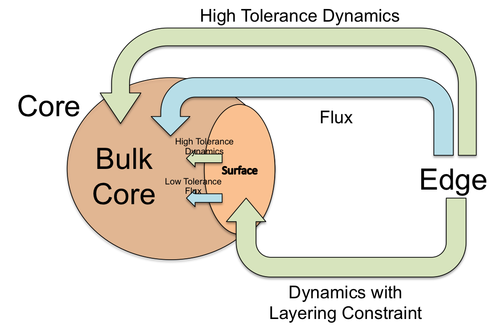

.. _dynamics:

*******************
Dynamics Criterion
*******************

When dealing with more complex chemical mechanisms the standard RMG flux criterion
has trouble picking up key chain branching reactions and has limited guarantees
that it accurately represents the concentrations of all species.  The dynamics
criterion is a measure of how much a given reaction affects core concentrations.
This allows it to pick up key low-flux chain branching reactions and better represent
species concentrations.

Calculating the Dynamics Criterion
==================================
Let us define rates of production :math:`P_i(t)` and consumption :math:`L_i(t)` for a given species
:math:`\frac{dc_i}{dt} = P_i(t) - L_i(t)`

Let us define a dimensionless concentration variable we will refer to as the
accumulation number Ac for a given species

:math:`Ac_{spc,i} = \frac{P_i}{L_i} \approx \frac{\bar{c_{i}}}{c_{i0}}`

where :math:`\bar{c_i}` is the steady state concentration or more specifically the
concentration at which :math:`P_i = L_i` assuming :math:`L_i` scales with :math:`c_i`
and :math:`c_{i0}` is the current concentration.

This species accumulation number is a measure of how far species i is from steady state.

Since this number can only be calculated for core species, by itself it is only a
measure of the behavior of species i within the reaction network.

However if we consider models with and without some edge reaction j we can define

:math:`\Pi_{Ac,i,j} = \frac{Ac_{spc,i,withj}}{Ac_{spc,i,withoutj}}`

Which is a measure of how much the concentration of species i is impacted by
reaction j.

In order to directly compare multiple reactions we can then sum over all
core species involved in reaction j to get our criterion the dynamics number.

:math:`\sum_{i\in core} |Ln(\Pi_{Ac,i,j})| = Dy > \epsilon`

Surface Algorithm
=================
One common issue with the dynamics criterion is that it treats all core species equally.  
Because of this, if the dynamics criterion is set too low it enters a feedback loop where 
it adds species and then since it can't get those species' concentrations right it adds 
more species and so on. In order to avoid this feedback loop the surface algorithm was developed.  
It creates a new partition called the *surface* that is considered part of the core.  We will
refer to the part of the core that is not part of the surface as the *bulk core*.  When
operating without the dynamics criterion everything moves from edge to the bulk core as usual;
however the dynamics criterion is managed differently.  When using the surface algorithm most
reactions pulled in by the dynamics criterion enter the surface instead of the bulk core.  
However, unlike movement to bulk core a constraint is placed on movement to the surface.  
Any reaction moved to the surface must have either both reactants or both products
in the bulk core.  This prevents the dynamics criterion from pulling in reactions
to get the concentrations of species in the surface right avoiding the feedback loop.  
To avoid important species being trapped in the surface we also add criteria
for movement from surface to bulk core based on flux or dynamics criterion.
However, to avoid important species being trapped in the surface we also add criteria
for movement from surface to bulk core based on flux or dynamics criterion.

Key Parameters for Dynamics Criterion and Surface Algorithm
===========================================================

* **toleranceMoveEdgeReactionToCore**

  An edge reaction will be pulled directly into the bulk core if its dynamics number
  ever exceeds this value.

* **toleranceMoveEdgeReactionToSurface**

  An edge reaction will be pulled into the surface if its dynamics number
  ever exceeds this value.

* **toleranceMoveEdgeReactionToCoreInterrupt**

  When any reaction's dynamics number exceeds this value the simulation will be interrupted.

* **toleranceMoveEdgeReactionToSurfaceInterrupt**

  When the dynamics number of any reaction that would be valid for movement to the surface
  exceeds this value the simulation will be interrupted

* **toleranceMoveSurfaceReactionToCore**

  A surface reaction will be pulled into the bulk core if its dynamics number
  ever exceeds this value.  Note this is done on the fly during simulation.

* **toleranceMoveSurfaceSpeciesToCore**

  A surface species will be pulled into the bulk core if it's rate ratio
  ever exceeds this value.  Note this is done on the fly during simulation.
