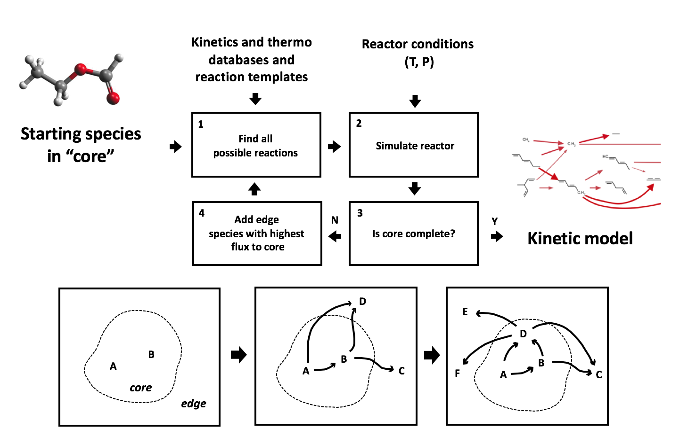
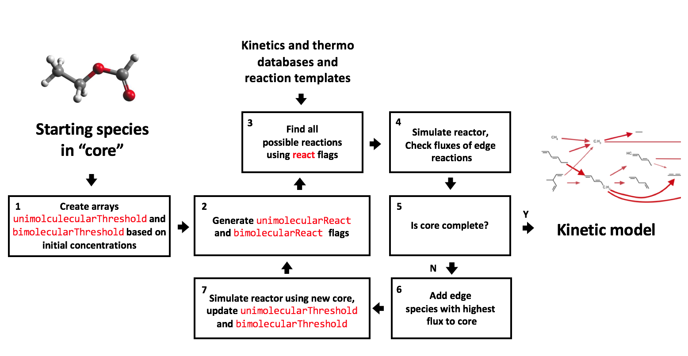

.. _ratebasedmodelenlarger:

Flux-based Algorithm
====================

To construct a mechanism, the user must specify an initial set of species and
the initial conditions (temperature, pressure, species concentrations, etc.).
RMG reacts the initial species in all possible ways according to its known
reaction families, and it integrates the model in time. RMG tracks the rate
(flux) at which each new "edge" species is produced, and species (and the
reactions producing them) that are produced with significant fluxes are
incorporated into the model (the "core"). These new core species are reacted
with all other core species in the model to generate a new set of edge species
and reactions. The time-integration restarts, and the expanded list of edge
species is monitored for significant species to be included in the core. The
process continues until all significant species and reactions have been
included in the model. The definition of a "significant" rate can be specified by the user
by taking the following definition for a single species rate:

:math:`R_i = \frac{dC_i}{dt}`

and the following definition for the reaction system's characteristic rate, which is the sum of
all **core** species rates:

:math:`R_{char} = \sqrt{\sum\limits_{j} R_{j}^2}\quad    \quad  \textrm{species $j$ $\in$  core}`

When a :math:`\textrm{species $i$ $\in$ edge}`  exceeds a "significant" rate equal to :math:`\epsilon R_{char}`,
it is added to the core. The parameter :math:`\epsilon` is the user-specified
``toleranceMoveToCore`` that can be adjusted under the :ref:`model tolerances <modeltolerances>`
in the :ref:`RMG Input File <input>`.

For more information on rate-based model enlargement, please refer to the papers [Gao2016]_ or [Susnow1997]_. 

.. [Gao2016] \ C. W. Gao, J. W. Allen, W. H. Green, R. H. West, "Reaction Mechanism Generator: automatic construction of chemical kinetic mechanisms." *Computer Physics Communications* (2016).
.. [Susnow1997] \ R. G. Susnow, A. M. Dean, W. H. Green, P. K. Peczak, and L. J. Broadbelt. "Rate-Based Construction of Kinetic Models for Complex Systems." *J. Phys. Chem. A* **101**, p. 3731-3740 (1997).

.. _filterReactionsTheory:

Filtering Reactions within the Flux-based Algorithm
---------------------------------------------------

Filtering reactions in the react step in the flux-based algorithm attempts to speed up model generation by attacking the pain point.  RMG has trouble 
converging when generating models for large molecules because it searches for reactions on the order of :math:`(n_{reaction\: sites})^{{n_{species}}}`.  

The original algorithm performs in the following manner:

1. Reacts species together (slow) 
2. Determines which reactions are negligible (fast)

By filtering reactions we add a pre-filtering step before step 1 which prevents species from reacting together when the reactions are expected to be negligible
throughout the simulation.

Here, ``unimolecularThreshold`` and ``bimolecularThreshold`` are binary arrays storing flag for whether a species or a pair of species are above a reaction threshold.  
For a unimolecular rate, this threshold is set to ``True`` if the unimolecular rate of :math:`\textrm{reaction $k$}` for a species A 

:math:`R_{unimolecular} = k_{threshold}C_A > \epsilon R_{char}` 

at any given time :math:`t` in the reaction system, where :math:`k_{threshold} = \frac{k_B T}{h}`

For a bimolecular reaction occuring between species A and B, this threshold is set to ``True`` if the bimolecular rate 

:math:`R_{bimolecular} = k_{threshold}C_A C_B > \epsilon R_{char}` 

at any given time :math:`t` in the reaction system, where :math:`k_{threshold} = 1 \times 10^{13} \frac{cm^3}{mol* s}` which is considered the diffusion limiting rate.

Two additional binary arrays ``unimolecularReact`` and ``bimolecularReact`` store flags for when the ``unimolecularThreshold`` or ``bimolecularThreshold`` flag
shifts from ``False`` to ``True``.  RMG reacts species when the flag is set to ``True``.