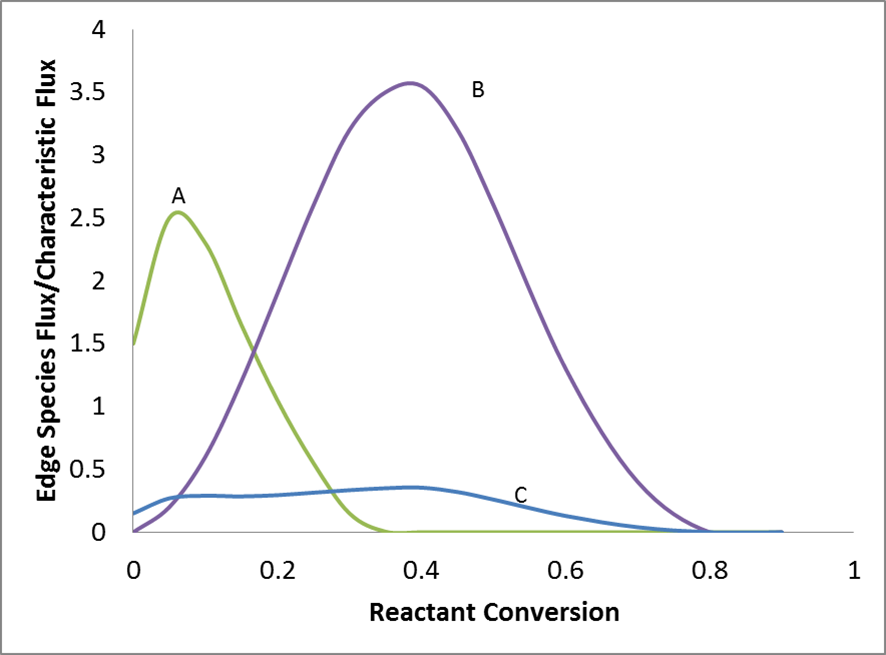
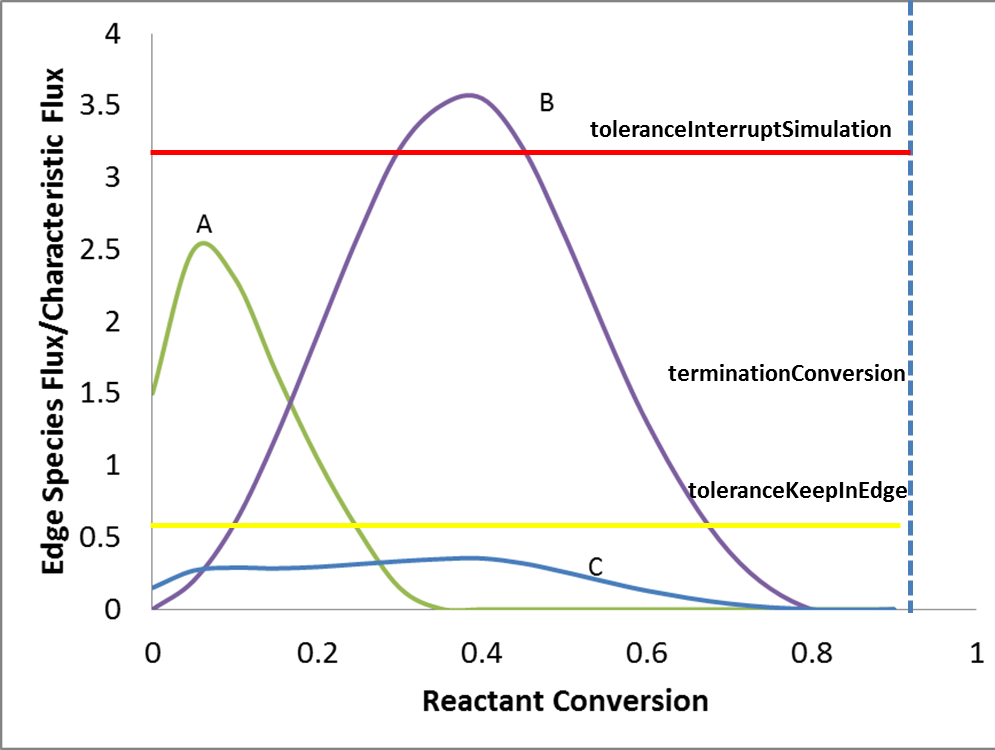

.. _prune:

******************
Prune Edge Species
******************

When dealing with complicated reaction systems, RMG calculation would easily hit the computer memory limitation. Memory profiling shows
most memory especially during memory limitation stage is occupied by edge species. However, most edge species in fact wouldn't
be included in the core (or final model). Thus, it's natural to get rid of some not "so useful" edge species during calculation 
in order to achieve both low memory consumption and mechanism accuracy. Pruning is such a way.

Key Parameters in Pruning
=========================

* toleranceKeepInEdge

  Any edge species to prune should have peak flux along the whole conversion course lower than toleranceKeepInEdge :math:`*` characteristic flux. Thus, larger values will lead to larger edge mechanisms.

* toleranceMoveToCore

  Any edge species to enter core model should have flux at some point larger than toleranceMoveToCore :math:`*` characteristic flux Thus, in general, smaller values will lead to larger core mechanisms.

* toleranceInterrupSimulation

  Once flux of any edge species exceeds toleranceInterruptSimulation :math:`*` characteristic flux, dynamic simulation will be stopped.
  Usually this tolerance will be set a very high value so that any flux's exceeding that means mechanism is too incomplete to continue 
  dynamic simulation.

* maximumEdgeSpecies

  If dynamic simulation isn't interrupted in half way and total number of the edge species whose peak fluxes are higher than 
  toleranceKeepInEdge :math:`*` characteristic flux exceeds maximumEdgeSpecies, such excessive amount of edge species with lowest peak fluxes will be pruned.
  
* minCoreSizeForPrune

  Ensures that a minimum number of species are in the core before pruning occurs, in order to avoid pruning the model when it is far away from completeness.  The default value is set to 50 species. 

* minSpeciesExistIterationsForPrune

  Set the number of iterations an edge species must stay in the job before it can be pruned.  The default value is 2 iterations.  

How Pruning Works
=================

  The goal of pruning is to delete those "useless" edge species. So "usefulness" should be defined and it's natural to have flux as a 
  criterion for "usefulness". Since flux changes with reactant conversion, peak flux is chosen here to make decision of pruning or not.
  Every time pruning is triggered, edge species with peak flux lower than toleranceKeepInEdge :math:`*` characteristic flux will be deleted.
  

  
  However, pruning is not always triggered because of toleranceInterruptSimulation. As mentioned above, in order to prune, RMG needs to figure out
  the peak flux of each edge species, which requires dynamic simulation to complete. If some run of dynamic simulation is terminated in half way
  by toleranceInterruptSimulation, pruning is rejected although there might be some edge species with peak fluxes lower than 
  toleranceKeepInEdge :math:`*` characteristic flux. Since pruning requires to complete dynamic simulation, setting toleranceInterruptSimulation to be positive infinity, 
  as an extreme case, means always enabling pruning. Another extreme case would be that it has same value as toleranceMoveToCore where 
  no pruning occurs.
  
  In summary, each run of dynamic simulation will proceed towards terminationConversion unless some flux exceeds 
  toleranceInterruptSimulation :math:`*` characteristic flux.Following complete simulation is the pruning of edge species whose flux is not high enough be kept
  in the edge, which is followed by pruning of excessive amount of edge species to make sure total edge species number is no greater than maximumEdgeSpecies.
  
  
  
   
