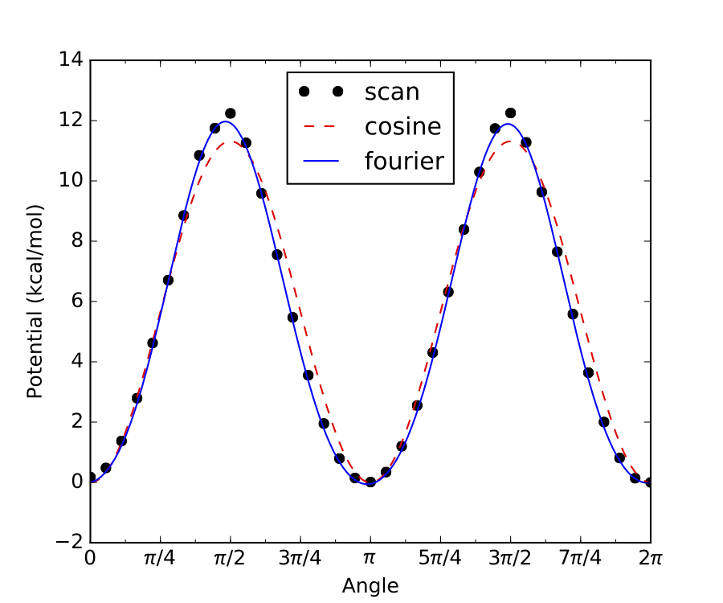
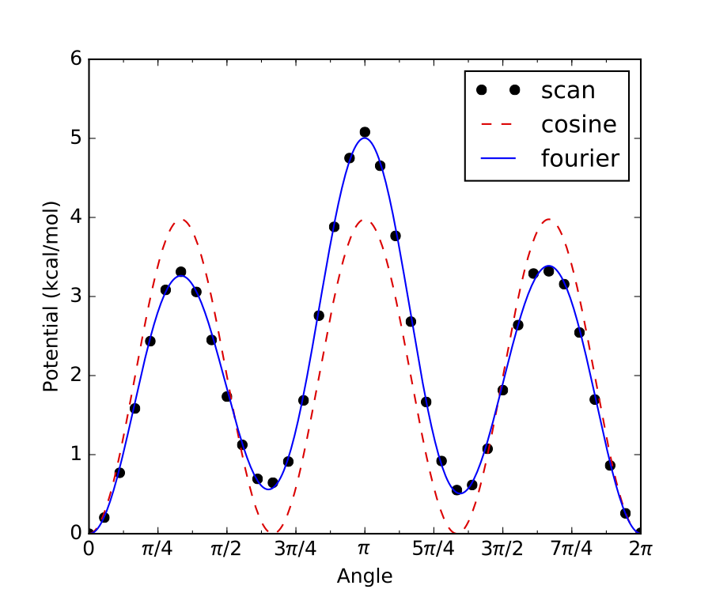
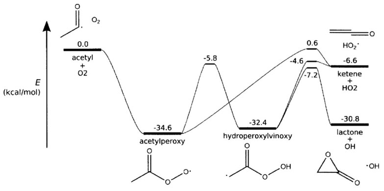

********************
Creating Input Files
********************

Syntax
======

The format of Arkane input files is based on Python syntax. In fact, Arkane
input files are valid Python source code, and this is used to facilitate
reading of the file.

Each section is made up of one or more function calls, where parameters are
specified as text strings, numbers, or objects. Text strings must be wrapped in
either single or double quotes.

The following is a list of all the components of a Arkane input file for thermodynamics and high-pressure limit kinetics
computations:

=========================== ============================================================================================
Component                   Description
=========================== ============================================================================================
``modelChemistry``          Level of theory from quantum chemical calculations, see ``Model Chemistry`` table below
``author``                  Author's name. Used when saving statistical mechanics properties as a .yml file.
``atomEnergies``            Dictionary of atomic energies at ``modelChemistry`` level
``frequencyScaleFactor``    A factor by which to scale all frequencies
``useHinderedRotors``       ``True`` (by default) if hindered rotors are used, ``False`` if not
``useAtomCorrections``      ``True`` (by default) if atom corrections are used, ``False`` if not
``useBondCorrections``      ``True`` if bond corrections are used, ``False`` (by default) if not
``bondCorrectionType``      ``'p'`` for Petersson-type (default) or ``'m'`` for Melius-type bond additivity corrections
``useIsodesmicReactions``   ``True`` if isodesmic reactions are used to apply corrections. Will automatically turn
                            on atom corrections and disable bond corrections
``referenceSets``           A list of reference sets to use for isodesmic reactions. By default if left blank only the
                            main reference set is used, which is the recommended. All reference sets are located at
                            RMG-database/input/reference_sets/
``species``                 Contains parameters for non-transition states
``transitionState``         Contains parameters for transition state(s)
``reaction``                Required for performing kinetic computations
``statmech``                Loads statistical mechanics parameters
``thermo``                  Performs a thermodynamics computation
``kinetics``                Performs a high-pressure limit kinetic computation
=========================== ============================================================================================

For pressure dependent kinetics output, the following components are necessary:

=========================== ============================================================================================
Component                   Description
=========================== ============================================================================================
``network``                 Divides species into reactants, isomers, products and bath gases
``pressureDependence``      Defines parameters necessary for solving master equation
=========================== ============================================================================================

Model Chemistry
===============
The first item in the input file should be a ``modelChemistry`` assignment with a string describing the model
chemistry. The ``modelChemistry`` could either be in a `single point // frequency` format, e.g.,
`CCSD(T)-F12a/aug-cc-pVTZ//B3LYP/6-311++G(3df,3pd)`, just the `single point`, e.g., `CCSD(T)-F12a/aug-cc-pVTZ`,
or a composite method, e.g., `CBS-QB3`.

Alternatively, ``modelChemistry`` can be specified using a ``LevelOfTheory`` or ``CompositeLevelOfTheory`` object. The
basic syntax for ``LevelOfTheory`` is::

    LevelOfTheory(
        method='B3LYP',
        basis='6-311++G(3df,3pd)'
    )

See ``arkane/modelchem.py`` for additional options (e.g., software, solvent). Note that the software generally does not
have to be specified because it is inferred from the provided quantum chemistry logs. An example
``CompositeLevelOfTheory`` is given by::

    CompositeLevelOfTheory(
        freq=LevelOfTheory(
            method='B3LYP',
            basis='6-311++G(3df,3pd)'
        )
        energy=LevelOfTheory(
            method='CCSD(T)-F12',
            basis='aug-cc-pVTZ'
        )
    )

There are some methods that require the software to be specified. Currently, it is not possible to infer the software
for such methods directly from the log files because Arkane requires the software prior to reading the log files. The
methods for which this is the case are listed in the RMG-database in ``input/quantum_corrections/lot_constraints.yml``.

Arkane uses the single point level to adjust the computed energies to the usual gas-phase reference
states by applying atom and spin-orbit coupling energy corrections. Additionally, bond additivity corrections OR
isodesmic reactions corrections can be applied (but not both). This is particularly
important for ``thermo()`` calculations (see below). Note that the user must specify under the
``species()`` function the type and number of bonds for Arkane to apply bond additivity corrections.
The frequency level is used to determine the frequency scaling factor if not given in the input file, and if it exists
in Arkane (see the below table for existing frequency scaling factors).
The example below specifies CBS-QB3 as the model chemistry::

    modelChemistry = "CBS-QB3"

Also, the atomic energies at the single point level of theory can be directly specified in the input file by providing
a dictionary of these energies in the following format::

    atomEnergies = {
        'H': -0.499818,
        'C': -37.78552,
        'N': -54.520543,
        'O': -74.987979,
        'S': -397.658253,
    }

The table below shows which model chemistries have atomization energy corrections (AEC), bond
corrections (BC), and spin orbit corrections (SOC). It also lists which elements are available
for a given model chemistry.

================================================ ===== ==== ==== ========== =========================
Model Chemistry                                  AEC   BC   SOC  Freq Scale Supported Elements
================================================ ===== ==== ==== ========== =========================
``'CBS-QB3'``                                     v    v    v    v (0.990)  H, C, N, O, P, S
``'CBS-QB3-Paraskevas'``                          v    v    v    v (0.990)  H, C, N, O, P, S
``'G3'``                                          v         v               H, C, N, O, P, S
``'M08SO/MG3S*'``                                 v         v               H, C, N, O, P, S
``'M06-2X/cc-pVTZ'``                              v         v    v (0.955)  H, C, N, O, P, S
``'Klip_1'``                                      v         v               H, C, N, O
``'Klip_2'`` *uses QCI(tz,qz) values*             v         v               H, C, N, O
``'Klip_3'`` *uses QCI(dz,qz) values*             v         v               H, C, N, O
``'Klip_2_cc'`` *uses CCSD(T)(tz,qz) values*      v         v               H, C, O
``'CCSD-F12/cc-pVDZ-F12'``                        v         v    v (0.947)  H, C, N, O
``'CCSD(T)-F12/cc-pVDZ-F12_H-TZ'``                v         v               H, C, N, O
``'CCSD(T)-F12/cc-pVDZ-F12_H-QZ'``                v         v               H, C, N, O
``'CCSD(T)-F12/cc-pVnZ-F12'``, *n = D,T*          v    v    v    v          H, C, N, O, F, S, Cl
``'CCSD(T)-F12/cc-pVQZ-F12'``                     v    v    v    v          H, C, N, O, S
``'CCSD(T)-F12/cc-pVDZ-F12_noscale'``             v         v               H, C, N, O
``'CCSD(T)-F12/cc-pCVnZ-F12'``, *n = D,T,Q*       v         v    v          H, C, N, O
``'CCSD(T)-F12/aug-cc-pVnZ'``, *n = D,T,Q*        v         v    v          H, C, N, O, S
``'CCSD(T)-F12/cc-pVTZ-f12(-pp)``,                v         v               H, C, N, O, S, I
``'CCSD(T)/aug-cc-pVTZ(-pp)``,                    v         v               H, C, O, S, I
``'B-CCSD(T)-F12/cc-pVnZ-F12'``, *n = D,T,Q*      v         v               H, C, N, O, S
``'B-CCSD(T)-F12/cc-pCVnZ-F12'``, *n = D,T,Q*     v         v               H, C, N, O
``'B-CCSD(T)-F12/aug-cc-pVnZ'``, *n = D,T,Q*      v         v               H, C, N, O
``'G03_PBEPBE_6-311++g_d_p'``                     v         v               H, C, N, O
``'MP2_rmp2_pVnZ'``, *n = D,T,Q*                  v         v    v          H, C, N, O
``'FCI/cc-pVnZ'``, *n = D,T,Q*                    v         v               C
``'BMK/cbsb7'``                                   v    v    v               H, C, N, O, P, S
``'BMK/6-311G(2d,d,p)'``                          v    v    v               H, C, N, O, P, S
``'B3LYP/6-311+G(3df,2p)'``                       v    v    v    v (0.967)  H, C, N, O, P, S
``'B3LYP/6-31G(d,p)'``                            v    v         v (0.961)  H, C, O, S
``'MRCI+Davidson/aug-cc-pV(T+d)Z'``               v         v               H, C, N, O, S
``'wb97x-d/aug-cc-pvtz'``                         v         v               H, C, N, O
``'wb97x-d3/def2-tzvp'``                          v    v    v    v (0.984)  H, C, N, O, F, S, Cl, Br
``'wb97m-v/def2-tzvpd'``                          v         v    v (1.002)  H, C, N, O, F, S, Cl, Br
``'b97d-3/def2-msvp'``                            v    v    v    v (1.014)  H, C, N, O, F, S, Cl, Br
================================================ ===== ==== ==== ========== =========================

Notes:

- The ``'CBS-QB3-Paraskevas'`` model chemistry is identical to ``'CBS-QB3'`` except for BCs for C/H/O bonds, which are from Paraskevas et al. (DOI: 10.1002/chem.201301381) instead of Petersson et al. (DOI: 10.1063/1.477794). Beware, combining BCs from different sources may lead to unforeseen results.
- In ``'M08SO/MG3S*'`` the grid size used in the [QChem] electronic structure calculation utilizes 75 radial points and 434 angular points.

- Refer to paper by Goldsmith et al. (*Goldsmith, C. F.; Magoon, G. R.; Green, W. H., Database of Small Molecule Thermochemistry for Combustion. J. Phys. Chem. A 2012, 116, 9033-9057*) for definition of ``'Klip_2'`` (*QCI(tz,qz)*) and ``'Klip_3'`` (*QCI(dz,qz)*).

If a model chemistry other than the ones in the above table is used, then the user should supply
the corresponding atomic energies (using ``atomEnergies``) to get meaningful results. Bond
corrections would not be applied in this case.

If a model chemistry or atomic energies are not available, then a kinetics job can still be run by
setting ``useAtomCorrections`` to ``False``, in which case Arkane will not raise an error for
unknown elements. The user should be aware that the resulting energies and thermodynamic quantities
in the output file will not be meaningful, but kinetics and equilibrium constants will still be
correct.

Frequency Scale Factor
======================

Frequency scale factors are empirically fit to experiment for different ``modelChemistry``.
Refer to NIST website for values (http://cccbdb.nist.gov/vibscalejust.asp).
For CBS-QB3, which is not included in the link above, ``frequencyScaleFactor = 0.99`` according to Montgomery et al.
(*J. Chem. Phys. 1999, 110, 2822–2827*).
The frequency scale factor is automatically assigned according to the supplied ``modelChemistry``, if available
(see above table). If not available automatically and not specified by the user, it will be assumed a unity value.

Species
=======

Each species of interest must be specified using a ``species()`` function, which can be input in three different ways,
discussed in the separate subsections below:

1. By pointing to the output files of quantum chemistry calculations, which Arkane will parse for the necessary
molecular properties.
2. By directly entering the molecular properties.
3. By pointing to an appropriate YAML file.

Within a single input file, any of the above options may be used for different species.

Option #1: Automatically Parse Quantum Chemistry Calculation Output
-------------------------------------------------------------------

For this option, the ``species()`` function only requires two parameters, as in the example below::

    species('C2H6', 'C2H6.py',
            structure = SMILES('CC'))

The first required parameter (``'C2H6'`` above) is the species label, which can be
referenced later in the input file and is used when constructing output files.
For chemkin output to run properly, limit names to alphanumeric characters
with approximately 13 characters or less.

The second parameter (``'C2H6.py'`` above) points to the location of another
python file containing details of the species. This file
will be referred to as the species input file. The third parameter (``'structure = SMILES('CC')'`` above)
gives the species structure (either SMILES, adjacencyList, or InChI could be used). The structure parameter isn't
necessary for the calculation, however if it is not specified a .yml file representing an ArkaneSpecies will not be
generated.

The species input file accepts the following parameters:

======================= =========================== ====================================
Parameter               Required?                   Description
======================= =========================== ====================================
``bonds``               optional                    Type and number of bonds in the species
``linear``              optional                    ``True`` if the molecule is linear, ``False`` if not
``externalSymmetry``    optional                    The external symmetry number for rotation
``spinMultiplicity``    yes                         The ground-state spin multiplicity (degeneracy)
``opticalIsomers``      optional                    The number of optical isomers of the species
``energy``              yes                         The ground-state 0 K atomization energy in Hartree
                                                    (without zero-point energy) **or**
                                                    The path to the quantum chemistry output file containing the energy
``geometry``            optional                    The path to the quantum chemistry output file containing the optimized geometry
``frequencies``         yes                         The path to the quantum chemistry output file containing the computed frequencies
``rotors``              optional                    A list of :class:`HinderedRotor()` and/or :class:`FreeRotor()` objects describing the hindered/free rotors
======================= =========================== ====================================

The types and number of atoms in the species are automatically inferred from the quantum chemistry output and are used
to apply atomization energy corrections (AEC) and spin orbit corrections (SOC) for a given ``modelChemistry``
(see `Model Chemistry`_). If not interested in accurate thermodynamics (e.g., if only using ``kinetics()``), then
atom corrections can be turned off by setting ``useAtomCorrections`` to ``False``.

The ``bonds`` parameter is used to apply bond additivity corrections (BACs) for a given ``modelChemistry`` if using
Petersson-type BACs (``bondCorrectionType = 'p'``).
If the species' structure is specified in the Arkane input file, then the `bonds` attribute
can be automatically populated. Including this parameter in this case will overwrite
the automatically generated bonds. When using Melius-type BACs (``bondCorrectionType = 'm'``),
specifying ``bonds`` is not required because the molecular connectivity is automatically inferred from the output of the
quantum chemistry calculation.
For a description of Petersson-type BACs, see Petersson et al., J. Chem. Phys. 1998, 109, 10570-10579.
For a description of Melius-type BACs, see Anantharaman and Melius, J. Phys. Chem. A 2005, 109, 1734-1747.

Allowed bond types for the ``bonds`` parameter are, e.g., ``'C-H'``, ``'C-C'``, ``'C=C'``, ``'N-O'``, ``'C=S'``,
``'O=O'``, ``'C#N'``...

``'O=S=O'`` is also allowed.

The order of elements in the bond correction label is important. The first atom
should follow this priority: 'C', 'N', 'O', 'S', 'P', and 'H'. For bonds, use ``-``/``=``/``#`` to denote a
single/double/triple bond, respectively. For example, for formaldehyde we would write::

    bonds = {'C=O': 1, 'C-H': 2}

The parameter ``linear`` only needs to be specified as either ``True`` or ``False``. The parameters ``externalSymmetry``,
``spinMultiplicity`` and ``opticalIsomers`` only accept integer values.
Note that ``externalSymmetry`` corresponds to the number of unique ways in which the species may be rotated about an
axis (or multiple axes) and still be indistinguishable from its starting orientation (reflection across a mirror plane
does not count as rotation about an axis).
For ethane, we would write::

    linear = False

    externalSymmetry = 6

    spinMultiplicity = 1

    opticalIsomers = 1

The ``energy`` parameter is a dictionary with entries for different ``modelChemistry``. The entries can consist of either
floating point numbers corresponding to the 0 K atomization energy in Hartree (without zero-point energy correction), or
they can specify the path to a quantum chemistry calculation output file that contains the species's energy. For example::

    energy = {
    'CBS-QB3': Log('ethane_cbsqb3.log'),
    'Klip_2': -79.64199436,
    }

In this example, the ``CBS-QB3`` energy is obtained from a Gaussian log file, while the ``Klip_2`` energy is specified
directly. The energy used will depend on what ``modelChemistry`` was specified in the input file. Arkane can parse the
energy from a Gaussian, Molpro, or QChem log file, all using the same ``Log`` class, as shown below. The first
(and required) argument for the ``Log`` class is the path to the log file. Optionally, a second keyword argument
``check_for_errors=False`` can be provided that will prevent Arkane from raising an exception if it finds an error
in the QM job based on common phrases from the log file.

The input to the remaining parameters, ``geometry``, ``frequencies`` and ``rotors``, will depend on if hindered/free
rotors are included. If ``geometry`` is not set, then Arkane will read the geometry from the ``frequencies`` file.
Both cases are described below.

Without Hindered/Free Rotors
~~~~~~~~~~~~~~~~~~~~~~~~~~~~
In this case, only ``geometry`` and ``frequencies`` need to be specified, and they can point to the same or different
quantum chemistry calculation output files. The ``geometry`` file contains the optimized geometry, while the
``frequencies`` file contains the harmonic oscillator frequencies of the species in its optimized geometry.
For example::

    geometry = Log('ethane_cbsqb3.log')

    frequencies = Log('ethane_freq.log')

In summary, in order to specify the molecular properties of a species by parsing the output of quantum chemistry
calculations, without any hindered/free rotors, the ``species()`` function in the input file should look like the
following example::

    species('C2H6', 'C2H6.py')

and the species input file (``C2H6.py`` in the example above) should look like the following::

    bonds = {
        'C-C': 1,
        'C-H': 6,
    }

    linear = False

    externalSymmetry = 6

    spinMultiplicity = 1

    opticalIsomers = 1

    energy = {
        'CBS-QB3': Log('ethane_cbsqb3.log'),
        'Klip_2': -79.64199436,
    }

    geometry = Log('ethane_cbsqb3.log')

    frequencies = Log('ethane_freq.log')

With Hindered/Free Rotors
~~~~~~~~~~~~~~~~~~~~~~~~~
In this case, ``geometry``, ``frequencies`` and ``rotors`` need to be specified. The ``geometry`` and ``frequencies``
parameters must point to the **same** quantum chemistry calculation output file in this case.
For example::

    geometry = Log('ethane_freq.log')

    frequencies = Log('ethane_freq.log')

The ``geometry/frequencies`` log file must contain both the optimized geometry and the Hessian (matrix of partial
second derivatives of potential energy surface, also referred to as the force constant matrix), which is used to
calculate the harmonic oscillator frequencies. If Gaussian is used to generate the ``geometry/frequencies`` log file,
the Gaussian input file must contain the keyword ``iop(7/33=1)``, which forces Gaussian to output the complete Hessian.
Because the ``iop(7/33=1)`` option is only applied to the first part of the Gaussian job, the job must be a ``freq``
job only (as opposed to an ``opt freq`` job or a composite method job like ``cbs-qb3``, which only do the ``freq``
calculation after the optimization).
Therefore, the proper workflow for generating the ``geometry/frequencies`` log file using Gaussian is:

1. Perform a geometry optimization.
2. Take the optimized geometry from step 1, and use it as the input to a ``freq`` job with the following input keywords: ``#method basis-set freq iop(7/33=1)``

The output of step 2 is the correct log file to use for ``geometry/frequencies``.

``rotors`` is a list of :class:`HinderedRotor()` and/or :class:`HinderedRotor1DArray()` and/or :class:`FreeRotor()` objects. Each :class:`HinderedRotor()`
object requires the following parameters:

======================= =========================== ====================================
Parameter               Required?                   Description
======================= =========================== ====================================
``scanLog``             yes                         The path to the Gaussian/Qchem log file, or a text/csv/yaml file containing the scan energies
``pivots``              yes                         The indices of the atoms in the hindered rotor torsional bond
``top``                 yes                         The indices of all atoms on one side of the torsional bond (including the pivot atom)
``symmetry``            optional                    The symmetry number for the torsional rotation (number of indistinguishable energy minima)
``fit``                 optional                    Fit to the scan data. Can be either ``fourier``, ``cosine`` or ``best`` (default).
======================= =========================== ====================================

``scanLog`` can either point to a ``Log`` file from a QM calculation, or simply a ``ScanLog``, with the path to a file summarizing the
scan. If a yaml file is feeded, it should satisfy the the following format::

    angle_unit: radians
    energy_unit: kJ/mol
    angles:
    - 0.0000000000
    - 0.1745329252
    - 0.3490658504
            .
            .
            .
    - 6.2831853072
    energies:
    - 0.0147251160
    - 0.7223109804
    - 2.6856059517
            .
            .
            .
    - 0.0000000000

If a csv file is feeded, it should satisfy the following format::

    Angle (radians),Energy (kJ/mol)
    0.0000000000,0.0147251160
    0.1745329252,0.7223109804
    0.3490658504,2.6856059517
        .       ,    .
        .       ,    .
        .       ,    .
    6.2831853072,0.0000000000

If a text file is feeded, it should satisfy the the following format::

          Angle (radians)          Energy (kJ/mol)
           0.0000000000            0.0147251160
           0.1745329252            0.7223109804
           0.3490658504            2.6856059517
                 .                       .
                 .                       .
                 .                       .
           6.2831853072            0.0000000000

For all above options, the ``Energy`` can be in units of ``kJ/mol``, ``J/mol`` (default), ``cal/mol``, ``kcal/mol``, ``cm^-1`` or ``hartree``,
and the ``Angle`` can be either in ``radians`` (default) or in ``degrees``. If ``angle_unit`` or ``energy_unit`` is not provided in the yaml file,
the default unit will be used. If a header is included in either the csv file or the text file, units must be specified in parenthesis; otherwise,
the column sequence will be assumed to be [angles, energies], and the default units will be used.

:class:`HinderedRotor1DArray()` is an alternative way to define a hindered rotor without the need of a scan log file.
The object requires the following parameters:

======================= =========================== ====================================
Parameter               Required?                   Description
======================= =========================== ====================================
``angles``              yes                         The angle values of the PES scan in unit of radians.
``energies``            yes                         The energy values of the PES scan in unit of J/mol.
``pivots``              yes                         The indices of the atoms in the hindered rotor torsional bond
``top``                 yes                         The indices of all atoms on one side of the torsional bond (including the pivot atom)
``symmetry``            optional                    The symmetry number for the torsional rotation (number of indistinguishable energy minima)
``fit``                 optional                    Fit to the scan data. Can be either ``fourier``, ``cosine`` or ``best`` (default).
======================= =========================== ====================================

For the above two objects, ``symmetry`` parameter will usually equal either 1, 2 or 3. It could be determined automatically by Arkane
(by simply not specifying it altogether), however it is always better to explicitly specify it if it is known. If it is
determined by Arkane, the log file will specify the determined value and what it was based on. Below are examples of
internal rotor scans with these commonly encountered symmetry numbers. First, ``symmetry = 3``:

.. image:: symmetry_3_example.png

Internal rotation of a methyl group is a common example of a hindered rotor with ``symmetry = 3``, such as the one
above. As shown, all three minima (and maxima) have identical energies, hence ``symmetry = 3``.

Similarly, if there are only two minima along the internal rotor scan, and both have identical energy, then
``symmetry = 2``, as in the example below:

If any of the energy minima in an internal rotor scan are not identical, then the rotor has no symmetry
(``symmetry = 1``), as in the example below:

For the example above there are 3 local energy minima, 2 of which are identical to each other. However, the 3rd minima
is different from the other 2, therefore this internal rotor has no symmetry.

For practical purposes, when determining the symmetry number for a given hindered rotor simply check if the internal
rotor scan looks like the ``symmetry = 2`` or ``3`` examples above. If it doesn’t, then most likely ``symmetry = 1``.

Each :class:`FreeRotor()` object requires the following parameters:

====================== =========================================================
Parameter              Description
====================== =========================================================
``pivots``             The indices of the atoms in the free rotor torsional bond
``top``                The indices of all atoms on one side of the torsional bond (including the pivot atom)
``symmetry``           The symmetry number for the torsional rotation (number of indistinguishable energy minima)
====================== =========================================================

Note that a ``scanLog`` is not needed for :class:`FreeRotor()` because it is assumed that there is no barrier to
internal rotation. Modeling an internal rotation as a :class:`FreeRotor()` puts an upper bound on the impact of that
rotor on the species's overall partition function. Modeling the same internal rotation as a Harmonic Oscillator
(default if it is not specifed as either a :class:`FreeRotor()` or  :class:`HinderedRotor()`) puts a lower bound on the
impact of that rotor on the species's overall partition function. Modeling the internal rotation as a
:class:`HinderedRotor()` should fall in between these two extremes.

To summarize, the species input file with hindered/free rotors should look like the following example (different options
for specifying the same ``rotors`` entry are commented out)::

    bonds = {
        'C-C': 1,
        'C-H': 6,
    }

    linear = False

    externalSymmetry = 6

    spinMultiplicity = 1

    opticalIsomers = 1

    energy = {
        'CBS-QB3': Log('ethane_cbsqb3.log'),
        'Klip_2': -79.64199436,
    }

    geometry = Log('ethane_freq.log')

    frequencies = Log('ethane_freq.log')

    rotors = [
        HinderedRotor(scanLog=Log('ethane_scan_1.log'), pivots=[1,5], top=[1,2,3,4], symmetry=3, fit='best'),
        #HinderedRotor(scanLog=ScanLog('C2H6_rotor_1.txt'), pivots=[1,5], top=[1,2,3,4], symmetry=3, fit='best'),
        #FreeRotor(pivots=[1,5], top=[1,2,3,4], symmetry=3),
    ]

Note that the atom labels identified within the rotor section should correspond to the indicated geometry.

Multidimensional Hindered Rotors
~~~~~~~~~~~~~~~~~~~~~~~~~~~~~~~~
For multidimensional hindered rotors, ``geometry``, ``frequencies`` need to be specified in the same way described
in detail in the last section. However, rotor files may be specified by either a 1D rotor scan file as in the last
section (1D rotors only) or as a directory. The directory must contain a list of energy files in the format
``something_name_rotorAngle1_rotorAngle2_rotorAngle3(...).log``.

For HinderedRotor2D (Quantum Mechanical 2D using Q2DTor):

======================= ====================================
Parameter               Description
======================= ====================================
``scandir``             file or directory containing scan energies
``pivots1``             The indices of the atoms in the first rotor torsional bond
``top1``                The indices of all atoms on one side of the first torsional bond (including the pivot atom)
``symmetry1``           The symmetry number of the first rotor 
``pivots2``             The indices of the atoms in the second rotor torsional bond
``top2``                The indices of all atoms on one side of the second torsional bond (including the pivot atom)
``symmetry2``           The symmetry number of the second rotor 
``symmetry``            Q2DTor simplifying symmetry code, default is ``none``
======================= ====================================

For HinderedRotorClassicalND (Classical and Semiclassical ND rotors):

======================= ====================================
Parameter               Description
======================= ====================================
``scandir``             file or directory containing scan energies
``pivots``              The list of the indices of the atoms in each rotor torsional bond
``tops``                The list of the indices of all atoms on one side of each torsional bond (including the pivot atom)
``sigmas``              The list of symmetry numbers for each torsional bond 
``semiclassical``       Indicates whether to use the semiclassical rotor correction (highly recommended)
======================= ====================================

The inputs are mostly the same as the last section except that HinderedRotorClassicalND takes lists of pivots,
tops and sigmas instead of individual values. These rotor objects enable calculation of partition functions for
multidimensional torsions that are particularly important for QOOH molecules and molecules involving intramolecular
hydrogen bonding. It is worth noting that HinderedRotor2D can take on the order of hours to run. To mitigate this the
.evals file in the directories Q2DTor directories are searched for automatically and used if present to reduce runtime
to seconds. This means if you have run a system with HinderedRotor2D and wish to rerun the system and recalculate the
HinderedRotor2D you should delete the .evals file. HinderedRotorClassicalND usually runs quickly for lower
dimensional torsions.

Additional parameters for pressure dependent networks
~~~~~~~~~~~~~~~~~~~~~~~~~~~~~~~~~~~~~~~~~~~~~~~~~~~~~

Additional parameters apply only to molecules in pressure dependent networks

======================= =================================== ====================================
Parameter               Required?                           Description
======================= =================================== ====================================
``structure``           all species except bath gas         A chemical structure for the species defined using either SMILES, adjacencyList, or InChI
``molecularWeight``     optional for all species            The molecular weight, if not given it is calculated based on the structure
``reactive``            only bath gases                     Boolean indicating whether the molecule reacts, set to ``False`` for bath gases. default is ``True``
``collisionModel``      unimolecular isomers and bath gases Transport data for the species
``energyTransferModel`` unimolecular isomers                Assigned with ``SingleExponentialDown`` model
======================= =================================== ====================================

The ``structure`` parameter is defined by SMILES, adjList, or InChI.  For instance, either representation is
acceptable for the acetone molecule: ::

    structure = SMILES('CC(C)=O')

    structure = adjacencyList("""1  C u0 p0 c0 {2,S} {5,S} {6,S} {7,S}
                                 2  C u0 p0 c0 {1,S} {3,S} {4,D}
                                 3  C u0 p0 c0 {2,S} {8,S} {9,S} {10,S}
                                 4  O u0 p2 c0 {2,D}
                                 5  H u0 p0 c0 {1,S}
                                 6  H u0 p0 c0 {1,S}
                                 7  H u0 p0 c0 {1,S}
                                 8  H u0 p0 c0 {3,S}
                                 9  H u0 p0 c0 {3,S}
                                 10 H u0 p0 c0 {3,S}""")

    structure = InChI('InChI=1S/C3H6O/c1-3(2)4/h1-2H3')

The ``molecularWeight`` parameter should be defined in the quantity format ``(value, 'units')``
, for example: ::

    molecularWeight = (44.04, 'g/mol')

If the ``molecularWeight`` parameter is not given, it is calculated by Arkane based
on the chemical structure.

The ``collisionModel`` is defined for unimolecular isomers with the transport data using a
``TransportData`` object: ::

    collisionModel = TransportData(sigma=(3.70,'angstrom'), epsilon=(94.9,'K'))

``sigma`` and ``epsilon`` are Lennard-Jones parameters, which can be estimated using the Joback method on the
`RMG website <https://rmg.mit.edu/molecule_search>`_.

The ``energyTransferModel`` model available is a ``SingleExponentialDown``.

* ``SingleExponentialDown`` - Specify ``alpha0``, ``T0`` and ``n`` for the
  average energy transferred in a deactiving collision

  .. math :: \left< \Delta E_\mathrm{down} \right> = \alpha_0 \left( \frac{T}{T_0} \right)^n

An example of a typical ``energyTransferModel`` function is: ::

    energyTransferModel = SingleExponentialDown(
            alpha0 = (0.5718,'kcal/mol'),
            T0 = (300,'K'),
            n = 0.85,
        )

Parameters for the single exponential down model of collisional energy transfer are usually obtained from analogous
systems in literature. For example, if the user is interested in a pressure-dependent network with overall molecular
formula C7H8, the single exponential down parameters for toluene in helium availabe from literature could be used for
all unimolecular isomers in the network (assuming helium is the bath gas). One helpful literature source for calculated
exponential down parameters is the following paper:
http://www.sciencedirect.com/science/article/pii/S1540748914001084#s0060

Option #2: Directly Enter Molecular Properties
----------------------------------------------
While it is usually more convenient to have Arkane parse molecular properties from the output of quantum chemistry
calculations (see `Option #1: Automatically Parse Quantum Chemistry Calculation Output`_) there are instances where an
output file is not available and it is more convenient for the user to directly enter the molecular properties. This is
the case,  for example, if the user would like to use calculations from literature, where the final calculated molecular
properties are often reported in a table (e.g., vibrational frequencies, rotational constants), but the actual output
files of the underlying quantum chemistry calculations are rarely provided.

For this option, there are a number of required parameters associated with the ``species()`` function

======================= =========================== ====================================
Parameter               Required?                   Description
======================= =========================== ====================================
``label``               yes                         A unique string label used as an identifier
``E0``                  yes                         The ground-state 0 K enthalpy of formation (including zero-point energy)
``modes``               yes                         The molecular degrees of freedom (see below)
``spinMultiplicity``    yes                         The ground-state spin multiplicity (degeneracy), sets to 1 by default if not used
``opticalIsomers``      yes                         The number of optical isomers of the species, sets to 1 by default if not used
======================= =========================== ====================================

The ``label`` parameter should be set to a string with the desired name for the species, which can be reference later in
the input file. ::

    label = 'C2H6'

The ``E0`` ground state 0 K enthalpy of formation (including zero-point energy) should be given in the quantity format
``(value, 'units')``, using units of either ``kJ/mol``, ``kcal/mol``, ``J/mol``, or ``cal/mol``: ::

    E0 = (100.725, 'kJ/mol')

Note that if Arkane is being used to calculate the thermochemistry of the species, it is critical that the value of
``E0`` is consistent with the definition above (0 K enthalpy of formation with zero-point energy). However, if the user
is only interested in kinetics, ``E0`` can be defined on any arbitrary absolute energy scale, as long as the correct
relative energies between various ``species()`` and ``transitionState()`` are maintained. For example, it is common in
literature for the energy of some reactant(s) to be arbitrarily defined as zero, and the energies of all transition
states, intermediates and products are reported relative to that.

Also note that the value of ``E0`` provided here will be used directly, i.e., no atom or bond corrections will be applied.

If you want Arkane to correct for zero point energy, you can either just place
the raw units in Hartree (as if it were read directly from quantum): ::

    E0 = 547.6789753223456

Or you can add a third argument to the Quantity specified whether zero-point
energy is included or not: ::

    E0 = (95.1, 'kJ/mol', 'e_electronic')  # when zero point energy (ZPE) is not included - Arkane will add it
    E0 = (95.1, 'kJ/mol', 'E0')  # when ZPE is already included - Arkane will not add it

When specifying the ``modes`` parameter, define a list with the following types of degrees of freedom.
To understand how to define these degrees of freedom, please click on the links below:

**Translational degrees of freedom**

.. currentmodule:: rmgpy.statmech

=============================== ================================================
Class                           Description
=============================== ================================================
:class:`IdealGasTranslation`    A model of three-dimensional translation of an ideal gas
=============================== ================================================

**Rotational degrees of freedom**

.. currentmodule:: rmgpy.statmech

=========================== ====================================================
Class                       Description
=========================== ====================================================
:class:`LinearRotor`        A model of two-dimensional rigid rotation of a linear molecule
:class:`NonlinearRotor`     A model of three-dimensional rigid rotation of a nonlinear molecule
:class:`KRotor`             A model of one-dimensional rigid rotation of a K-rotor
:class:`SphericalTopRotor`  A model of three-dimensional rigid rotation of a spherical top molecule
=========================== ====================================================

**Vibrational degrees of freedom**

.. currentmodule:: rmgpy.statmech

=========================== ====================================================
Class                       Description
=========================== ====================================================
:class:`HarmonicOscillator` A model of a set of one-dimensional harmonic oscillators
=========================== ====================================================

Note that the ``frequencies`` provided here will be used directly, i.e., the ``frequencyScaleFactor`` will not be applied.

**Torsional degrees of freedom**

.. currentmodule:: rmgpy.statmech

=========================== ====================================================
Class                       Description
=========================== ====================================================
:class:`HinderedRotor`      A model of a one-dimensional hindered rotation
:class:`FreeRotor`          A model of a one-dimensional free rotation
=========================== ====================================================

The ``spinMultiplicity`` is defined using an integer, and is set to 1 if not indicated
in the ``species()`` function. ::

    spinMultiplicity = 1

Similarly, the ``opticalIsomers`` is also defined using an integer, and is set to 1
if not used in the ``species()`` function. ::

    opticalIsomers = 1

The following is an example of a typical ``species()`` function, based on ethane (different options for specifying the
same internal rotation are commented out)::

    species(
        label = 'C2H6',
        E0 = (100.725, 'kJ/mol'),
        modes = [
            IdealGasTranslation(mass=(30.0469, 'amu')),
            NonlinearRotor(
                inertia = ([6.27071, 25.3832, 25.3833], 'amu*angstrom^2'),
                symmetry = 6,
            ),
            HarmonicOscillator(
                frequencies = ([818.917, 819.48, 987.099, 1206.81, 1207.06, 1396, 1411.35, 1489.78, 1489.97, 1492.49, 1492.66, 2995.36, 2996.06, 3040.83, 3041, 3065.86, 3066.02], 'cm^-1'),
            ),
            HinderedRotor(
                inertia = (1.56768, 'amu*angstrom^2'),
                symmetry = 3,
                barrier = (11.2717, 'kJ/mol'),
            ),
            #HinderedRotor(
            #inertia = (1.56768, 'amu*angstrom^2'),
            #symmetry = 3,
            #fourier = (
            #    [
            #        [0.00458375, 0.000841648, -5.70271, 0.00602657, 0.0047446],
            #        [0.000726951, -0.000677255, 0.000207033, 0.000553307, -0.000503303],
            #    ],
            #    'kJ/mol',
            #),
            #),
            #FreeRotor(
            #    inertia = (1.56768, 'amu*angstrom^2'),
            #    symmetry = 3,
            #),
        ],
        spinMultiplicity = 1,
        opticalIsomers = 1,
    )

Note that the format of the ``species()`` function above is identical to the ``conformer()`` function output by Arkane
in ``output.py``. Therefore, the user could directly copy the ``conformer()`` output of an Arkane job to another Arkane
input file, change the name of the function to ``species()`` (or ``transitionState()``, if appropriate, see next
section) and run a new Arkane job in this manner. This can be useful if the user wants to easily switch a ``species()``
function from `Option #1: Automatically Parse Quantum Chemistry Calculation Output`_ to
`Option #2: Directly Enter Molecular Properties`_.

Additional parameters for pressure dependent networks
~~~~~~~~~~~~~~~~~~~~~~~~~~~~~~~~~~~~~~~~~~~~~~~~~~~~~

Additional parameters apply only to molecules in pressure depedent networks

======================= =================================== ====================================
Parameter               Required?                           Description
======================= =================================== ====================================
``structure``           all species except bath gas         A chemical structure for the species defined using either SMILES, adjacencyList, or InChI
``reactive``            only bath gases                     Boolean indicating whether the molecule reacts, set to ``False`` for bath gases. default is ``True``
``collisionModel``      unimolecular isomers and bath gases Transport data for the species
``energyTransferModel`` unimolecular isomers                Assigned with ``SingleExponentialDown`` model
``thermo``              optional                            Thermo data for the species
======================= =================================== ====================================

The parameters ``structure``, ``molecularWeight``, ``collisionModel`` and ``energyTransferModel`` were already discussed
above in `Option #1: Automatically Parse Quantum Chemistry Calculation Output`_.

When the ``thermo`` parameter is specified, Arkane will approximate the modes
of vibration and energy from the thermodynamic parameters, and will utilize this
in its solution of the pressure dependent network. This is analygous to how RMG
calculates thermodynamic parameters for pressure dependent mechanisms.

The ``thermo`` parameter has the following synatx::

    thermo = NASA(polynomials=[
                        NASAPolynomial(coeffs=[3.81543,0.0114632,0.000281868,
                                         -5.70609e-07,3.57113e-10,45814.7,14.9594],
                                  Tmin=(10,'K'), Tmax=(510.16,'K')),
                        NASAPolynomial(coeffs=[-1.32176,0.0893697,-5.78295e-05,
                                         1.78722e-08,-2.11223e-12,45849.2,31.4869],
                                  Tmin=(510.16,'K'), Tmax=(3000,'K'))
                              ],
                  Tmin=(10,'K'), Tmax=(3000,'K')),

Option #3: Automatically Parse YAML files
-----------------------------------------
Arkane automatically saves a .yml file representing an ArkaneSpecies in an ``ArkaneSpecies`` folder under the run
directory with the statistical mechanics properties of a species along with additional useful metadata. This process is
triggered whenever a ``thermo`` calculation is ran for a species with a specified structure. To automatically generate
such file in the first place, a species has to be defined using one of the other options above. The generated .yml file
could conveniently be used when referring to this species in subsequent Arkane jobs. We intend to create an online
repository of Arkane .yml files, from which users would be able to pick the desired species calculated at an appropriate
level of theory (if available), and directly use them for kinetic or pressure-dependent calculations. Once such
repository becomes available, a full description will be added to these pages.

Transition State
================

Transition state(s) are only required when performing kinetics computations.
Each transition state of interest must be specified using a ``transitionState()``
function, which is analogous to the ``species()`` function described above. Therefore, the ``transitionState()``
function may also be specified in two ways: `Option #1: Automatically Parse Quantum Chemistry Calculation Output`_ and
`Option #2: Directly Enter Molecular Properties`_. Note that currently a transitions state cannot be specified
using a YAML file (Option #3).

The following is an example of a typical ``transitionState()`` function using Option #1::

    transitionState('TS', 'TS.py')

Just as for a ``species()`` function, the first parameter is the label for that transition state, and the second
parameter points to the location of another python file containing details of the transition state. This file will be
referred to as the transition state input file, and it accepts the same parameters as the species input file described
in `Option #1: Automatically Parse Quantum Chemistry Calculation Output`_.

The following is an example of a typical  ``transitionState()`` function using Option #2::

    transitionState(
        label = 'TS',
        E0 = (267.403, 'kJ/mol'),
        modes = [
            IdealGasTranslation(mass=(29.0391, 'amu')),
            NonlinearRotor(
                inertia = ([6.78512, 22.1437, 22.2114], 'amu*angstrom^2'),
                symmetry = 1,
            ),
            HarmonicOscillator(
                frequencies = ([412.75, 415.206, 821.495, 924.44, 982.714, 1024.16, 1224.21, 1326.36, 1455.06, 1600.35, 3101.46, 3110.55, 3175.34, 3201.88], 'cm^-1'),
            ),
        ],
        spinMultiplicity = 2,
        opticalIsomers = 1,
        frequency = (-750.232, 'cm^-1'),
    )

The only additional parameter required for a ``transitionState()`` function as compared to a ``species()`` function is
``frequency``, which is the imaginary frequency of the transition state needed to account for tunneling. Refer to
`Option #2: Directly Enter Molecular Properties`_ for a more detailed description of the other parameters.

Reaction
========

This is only required if you wish to perform a kinetics computation.
Each reaction of interest must be specified using a ``reaction()`` function,
which accepts the following parameters:

====================== ==================== ============================================================================================================
Parameter              Required?            Description
====================== ==================== ============================================================================================================
``label``              All reactions        A name for the reaction
``reactants``          All reactions        A list of reactant species
``products``           All reactions        A list of product species
``transitionState``    All reactions        The transition state
``kinetics``           Optional             The high pressure-limit kinetics for the reaction, for pdep calculations
``tunneling``          Optional             The type of tunneling model (either 'Eckhart' or 'Wigner') to use for tunneling through the reaction barrier
====================== ==================== ============================================================================================================

The following is an example of a typical reaction function::

    reaction(
        label = 'H + C2H4 <=> C2H5',
        reactants = ['H', 'C2H4'],
        products = ['C2H5'],
        transitionState = 'TS',
        tunneling='Eckart'
    )

Note that the reactants and products must have been previously declared using a ``species()`` function,
using the same name labels. Transition states must also be previously declared using a
``transitionState()`` function.
The quantum tunneling factor method that may be assigned is either ``'Eckart'`` or ``'Wigner'``.

The ``kinetics`` parameter is only useful in pressure dependent calculations.
If the optional ``kinetics`` parameter is specified, Arkane will perform an inverse
Laplace transform (ILT) on the high pressure-limit kinetics provided to estimate
the microcanonical rate coefficients, :math:`k(E)`, needed for the master
equation (refer to Theory manual for more detail). This feature is useful for
barrierless reactions, such as radical recombinations, which don't have an
obvious transition state. If the ILT approach to calculating :math:`k(E)` is taken,
a placeholder ``transitionState`` must still be defined with an ``E0`` equal
to the energy of the higher energy species
it is connecting.
If the optional ``kinetics`` entry is not specified, Arkane will calculate the required kinetic
coefficients on its own. The ``kinetics`` entry is particularly useful to specify rates of barrierless
reactions (for which Arkane cannot yet calculate high-pressure limit rates).
The ``kinetics`` argument has the following syntax::

    kinetics = Arrhenius(A=(2.65e6,'m^3/(mol*s)'), n=0.0, Ea=(0.0,'kcal/mol'), T0=(1,"K")),

For high pressure limit kinetics calculations, specifying the ``kinetics``
parameter will just output the value specified by the ``kinetics`` parameter,
without using transition state theory.

Thermodynamics
==============

Use a ``thermo()`` function to make Arkane execute the thermodynamic
parameters computatiom for a species. Pass the string label of the species
you wish to compute the  thermodynamic parameters for and the type of
thermodynamics polynomial to generate (either ``'Wilhoit'`` or ``'NASA'``).
A table of relevant thermodynamic parameters will also be displayed in the
output file.

Below is a typical ``thermo()`` execution function::

    thermo('ethane', 'NASA')

High Pressure Limit Kinetics
============================

Use a ``kinetics()`` function to make Arkane execute the high-pressure limit kinetic
parameters computation for a reaction. The ``'label'`` string must correspond to that of
a defined ``reaction()`` function.

By default, Arkane outputs high pressure kinetic rate coefficients in the modified three-parameter Arrhenius equation
format:

  .. math :: k(T) = A \left( \frac{T}{T_0} \right)^n \exp \left( -\frac{E_a}{RT} \right)

Alternatively, the user may request to output the rate in the classical two-parameter Arrhenius format:

  .. math :: k(T) = A \exp \left( -\frac{E_a}{RT} \right)

by passing ``three_params = False`` in the ``kinetics()`` function::

    kinetics(
    label = 'H + C2H4 <=> C2H5',
    three_params = False,
    )

You have three options for specifying the temperature to which a modified/classical Arrhenius
expression will be fit.

Give an explicit list of temperatures to fit::

    kinetics(
    label = 'H + C2H4 <=> C2H5',
    Tlist = ([400,500,700,900,1100,1200],'K'),
    )

Give minimmum and maximum temperatures to fit::

    kinetics(
    label = 'H + C2H4 <=> C2H5',
    Tmin = (400,'K'), Tmax = (1200,'K'), Tcount = 6,
    )

Use the default range to fit (298 K to 2500 K at 50 points spaced equally in 1/T space)::

    kinetics(label = 'H + C2H4 <=> C2H5')

If a sensitivity analysis is desired, simply add the conditions at which to calculate sensitivity coefficients
in the following format, e.g.::

    kinetics(
        label = 'HSOO <=> HOOS',
        Tmin = (500,'K'), Tmax = (3000,'K'), Tcount = 15,
        sensitivity_conditions = [(1000, 'K'), (2000, 'K')]
    )

The ``output.py`` file will show the rates at various temperatures including the quantum tunneling factor.
Kinetic rates will also be added to the ``chem.inp`` file.

The output of a sensitivity analysis is saved into a ``sensitivity`` folder in the output directory. A text file, named
with the reaction label, delineates the semi-normalized sensitivity coefficients ``dln(k)/dE0`` in units of ``mol/J``
at all requested conditions. A horizontal bar figure is automatically generated per reaction with subplots for both the
forward and reverse direction at all conditions.

Pressure Dependent Network Specification
========================================

To obtain pressure dependent rates, you need to add two different sections to
the file. First, a declaration for the overall network must be given using the
``network()`` function, which specifies which spiecies are contained in this
reaction network. After that you will need to create a ``pressureDependence()``
block that indicates how the pressure dependence calculation should be conducted.

This section will go over the first of these sections, the ``network()`` function.
This includes setting the following paramters:

====================== ================================================================================
Parameter              Description
====================== ================================================================================
``label``              A name for the network
``isomers``            A list of species participating in unimolecular reaction channels
``reactants``          A list of the species that participate in bimolecular reactant channels
``bathGas``            A dictionary of bath gases and their respective mole fractions, adding up to 1.0
====================== ================================================================================

Arkane is largely able to determine the molecular configurations that define
the potential energy surface for your reaction network simply by inspecting the
path reactions. However, you must indicate which unimolecular and bimolecular
configurations you wish to include in the master equation formulation; all
others will be treated as irreversible sinks.

Note that all species and bath gases used in the ``network`` function must have been
previously declared with the same name labels in a previous ``species`` function in the
input file.

You do not need to specify the product channels (infinite sinks) in this
manner, as any configuration not marked as an isomer or reactant channel will
be treated as a product channel.

An example of the ``network`` function is given below along with a scheme of the network::

    network(
        label = 'acetyl + O2',
        isomers = [
            'acetylperoxy',
            'hydroperoxylvinoxy',
        ],
        reactants = [
            ('acetyl', 'oxygen'),
        ],
        bathGas = {
            'nitrogen': 0.4,
            'argon': 0.6,
        }
    )

Image source: `J.W. Allen, PhD dissertation, MIT 2013 <http://hdl.handle.net/1721.1/81677>`_,
calculated at the RQCISD(T)/CBS//B3LYP/6-311++G(d,p) level of theory

Pressure Dependent Rate Calculation
===================================

The overall parameters for the pressure-dependence calculation must be defined in a
``pressureDependence()`` function at the end of the input file. The parameters are:

============================================= ==================== ============================================================================================================
Parameter                                     Required?            Description
============================================= ==================== ============================================================================================================
``label``                                     Yes                  Use the name for the ``network`` declared previously
``method``                                    Yes                  Method to use for calculating the pdep network. Use either ``'modified strong collision'``, ``'reservoir state'``, or ``'chemically-significant eigenvalues'``
``interpolationModel``                        Yes                  Select the output type for the pdep kinetics, either in ``'chebyshev'`` or ``'pdeparrhenius'`` (plog) format
``activeKRotor``                              No                   A flag indicating whether to treat the K-rotor as active or adiabatic (default ``True``)
``activeJRotor``                              No                   A flag indicating whether to treat the J-rotor as active or adiabatic (default ``True``)
``Tmin``/``Tmax``/``Tcount`` **or** ``Tlist`` Yes                  Define temperatures at which to compute (and output) :math:`k(T,P)`
``Pmin``/``Pmax``/``Pcount`` **or** ``Plist`` Yes                  Define pressures at which to compute (and output) :math:`k(T,P)`
``maximumGrainSize``                          Yes                  Defines the upper bound on grain spacing in master equation calculations.
``minimumGrainCount``                         Yes                  Defines the minimum number of grains in master equation calculation.
``sensitivity_conditions``                    No                   Specifies the conditions at which to run a network sensitivity analysis.
============================================= ==================== ============================================================================================================

An example of the Pressure-dependent algorithm parameters function for the acetyl + O2 network is shown below::

    pressureDependence(
        label='acetyl + O2',
        Tmin=(300.0,'K'), Tmax=(2000.0,'K'), Tcount=8,
        Pmin=(0.01,'bar'), Pmax=(100.0,'bar'), Pcount=5,
        #Tlist = ([300, 400, 600, 800, 1000, 1250, 1500, 1750, 2000],'K')
        #Plist = ([0.01, 0.1, 1.0, 10.0, 100.0],'bar')
        maximumGrainSize = (1.0,'kcal/mol'),
        minimumGrainCount = 250,
        method = 'modified strong collision',
        #method = 'reservoir state',
        #method = 'chemically-significant eigenvalues',
        interpolationModel = ('chebyshev', 6, 4),
        #interpolationModel = ('pdeparrhenius'),
        #activeKRotor = True,
        activeJRotor = True,
        sensitivity_conditions = [[(1000, 'K'), (1, 'bar')], [(1500, 'K'), (10, 'bar')]]
    )

Temperature and Pressure Ranges
-------------------------------

Arkane will compute the :math:`k(T,P)` values on a grid of temperature and
pressure points. ``Tmin``, ``Tmax``, and ``Tcount`` values, as well as ``Pmin``, ``Pmax``, and ``Pcount`` parameter
values must be provided. Arkane will automatically choose the intermediate temperatures based on the interpolation model
you wish to fit. This is the recommended approach.

Alternatively, the grid of temperature and pressure points can be specified explicitly using ``Tlist`` and/or ``Plist``.

Energy Grains
-------------

Determine the fineness of the energy grains to be used in the master equation calculations.  Dictate
the ``maximumGrainSize``, and the ``minimumGrainCount``.

Sensitivity analysis
--------------------

Arkane also has the ability to vary barrier heights and generate sensitivity coefficients as a function of changes
in ``E0`` with the ``sensitivity_conditions`` argument. For each desired condition, place its corresponding temperature
and pressure within the list of ``sensitivity_conditions``. See the example above for syntax.

The output of a sensitivity analysis is saved into a ``sensitivity`` folder in the output directory. A text file, named
with the network label, delineates the semi-normalized sensitivity coefficients ``dln(k)/dE0`` in units of ``mol/J``
for all network reactions (both directions if reversible) at all requested conditions. Horizontal bar figures are
automatically generated per network reaction, showing the semi-normalized sensitivity coefficients at all conditions.

Atom Energy Fitting
==================================

Atom energies can be fitted using a small selection of species (see ``SPECIES_LABELS`` in ``arkane/encorr/ae.py``). To
do this, the single-point electronic energies calculated using the experimental geometries from the reference database
of each of the species should be provided as a dictionary of the species labels and their energies in Hartree.
Zero-point energies should not be included in the electronic energies. Each atom energy fitting calculation must be
specified using a ``ae()`` function, which accepts the following parameters:

====================== ==================== =========================================================================================
Parameter              Required?            Description
====================== ==================== =========================================================================================
``species_energies``   Yes                  Dictionary of species labels and single-point energies
``level_of_theory``    No                   Level of theory used as key if writing to the database dictionary
``write_to_database``  No                   Write the atom energies to the database; requires ``level_of_theory`` (default: False)
``overwrite``          No                   If atom energies already exist, overwrite them (default: False)
====================== ==================== =========================================================================================

Bond Additivity Correction Fitting
==================================

If calculated data is available in the reference database, Arkane can fit and save bond additivity corrections (BACs).
There are two different types available: Petersson-type (Petersson et al., J. Chem. Phys. 1998, 109, 10570-10579), which
fits one parameter for each bond type, and Melius-type (Anantharaman and Melius, J. Phys. Chem. A 2005, 109, 1734-1747),
which fits three parameters per atom type and an optional molecular parameter. Each BAC fitting calculation must be
specified using a ``bac()`` function, which accepts the following parameters:

====================== ============ =============================================================================================================================
Parameter              Required?    Description
====================== ============ =============================================================================================================================
``level_of_theory``    Yes          Calculated data will be extracted from the reference database using this level of theory
``bac_type``           No           BAC type: 'p' for Petersson (default), 'm' for Melius
``train_names``        No           Names of training data folders in the RMG database (default: 'main')
``crossval_n_folds``   No           If 1, perform no cross-validation. If -1, perform leave-one-out cross-validation. If any other positive integer, perfrom k-fold cross-validation. (default: 1)
``idxs``               No           Only include reference species with these indices in the training data (default: None)
``exclude_idxs``       No           Exclude reference species with these indices from the training data (default: None)
``exclude_elements``   No           Exclude molecules with the elements in this list from the training data (default: None)
``charge``             No           Set the allowed charges ('neutral', 'positive', 'negative', or integers) for molecules in the training data (default: 'all')
``multiplicity``       No           Set the allowed multiplicities for molecules in the training data (default: 'all')
``weighted``           No           Weight the data to diversify substructures (default: False)
``write_to_database``  No           Write the BACs to the database; has no effect if doing cross-validation (default: False)
``overwrite``          No           If BACs already exist, overwrite them (default: False)
``fit_mol_corr``       No           Fit the optional molecular correction term (Melius only, default: True)
``global_opt``         No           Perform a global optimization (Melius only, default: True)
``global_opt_iter``    No           Number of global optimization iterations (Melius only, default: 10)
====================== ============ =============================================================================================================================

Examples
========

Perhaps the best way to learn the input file syntax is by example. To that end,
a number of example input files and their corresponding output have been given
in the ``examples/arkane`` directory.

Troubleshooting and FAQs
========================

1) The network that Arkane generated and the resulting pdf file show abnormally large
absolute values. What's going on?

    This can happen if the number of atoms and atom types is not properly defined or consistent in your input file(s).

Arkane User Checklist
=====================

Using Arkane, or any rate theory package for that matter, requires careful consideration and management of a large
amount of data, files, and input parameters. As a result, it is easy to make a mistake somewhere. This checklist was
made to minimize such mistakes for users:

- Do correct paths exist for pointing to the files containing the electronic energies, molecular geometries and
  vibrational frequencies?

For calculations involving pressure dependence:

- Does the network pdf look reasonable? That is, are the relative energies what you expect based on the input?

For calculations using internal hindered rotors:

- Did you check to make sure the rotor has a reasonable potential (e.g., visually inspect the automatically generated
  rotor pdf files)?
- Within your input files, do all specified rotors point to the correct files?
- Do all of the atom label indices correspond to those in the file that is read by ``Log``?
- Why do the fourier fits look so much different than the results of the ab initio potential energy scan calculations?
  This is likely because the initial scan energy is not at a minimum. One solution is to simply shift the potential with
  respect to angle so that it starts at zero and, instead of having Arkane read a Qchem or Gaussian output file, have
  Arkane point to a 'ScanLog' file. Another problem can arise when the potential at 2*pi is also not [close] to zero.
