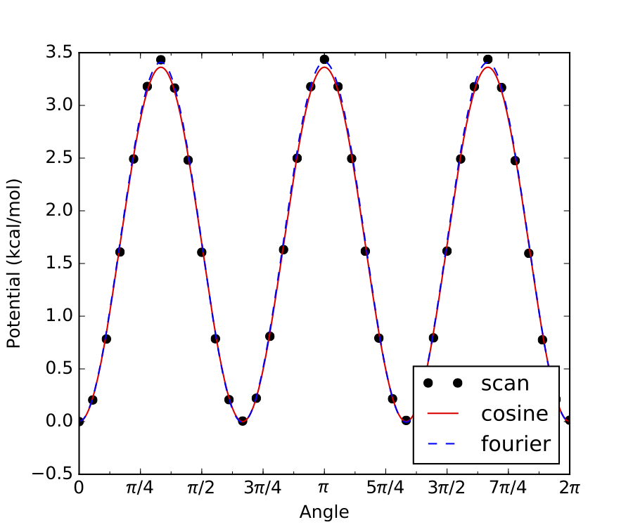

*************************************************************************************
Creating Input Files for Thermodynamics and High-Pressure Limit Kinetics Computations
*************************************************************************************

Syntax
======

The format of CanTherm input files is based on Python syntax. In fact, CanTherm
input files are valid Python source code, and this is used to facilitate 
reading of the file. 

Each section is made up of one or more function calls, where parameters are 
specified as text strings, numbers, or objects. Text strings must be wrapped in
either single or double quotes.

The following is a list of all the components of a CanTherm input file for thermodynamics and high-pressure limit kinetics computations:

=========================== ====================================================================
Component                   Description
=========================== ====================================================================
``modelChemistry``          Level of theory from quantum chemical calculations
``atomEnergies``            Dictionary of atomic energies at ``modelChemistry`` level
``frequencyScaleFactor``    A factor by which to scale all frequencies
``useHinderedRotors``       ``True`` (by default) if hindered rotors are used, ``False`` if not
``useAtomCorrections``      ``True`` (by default) if atom corrections are used, ``False`` if not
``useBondCorrections``      ``True`` if bond corrections are used, ``False`` (by default) if not
``species``                 Contains parameters for non-transition states
``transitionState``         Contains parameters for transition state(s)
``reaction``                Required for performing kinetic computations
``statmech``                Loads statistical mechanics parameters
``thermo``                  Performs a thermodynamics computation
``kinetics``                Performs a high-pressure limit kinetic computation
=========================== ====================================================================

Model Chemistry
===============

The first item in the input file should be a ``modelChemistry`` assignment
with a string describing the model chemistry.

CanTherm uses this information to adjust the computed energies to the usual gas-phase reference
states by applying atom, bond and spin-orbit coupling energy corrections. This is particularly
important for ``thermo()`` calculations (see below). Note that the user must specify under the
``species()`` function the type and number of bonds for CanTherm to apply these corrections.
The example below specifies CBS-QB3 as the model chemistry::

    modelChemistry = "CBS-QB3"

Alternatively, the atomic energies at the ``modelChemistry`` level of theory can be directly
specified in the input file by providing a dictionary of these energies in the following format::

    atomEnergies = {
        'H': -0.499818,
        'C': -37.78552,
        'N': -54.520543,
        'O': -74.987979,
        'S': -397.658253,
    }

The table below shows which model chemistries have atomization energy corrections (AEC), bond
corrections (BC), and spin orbit corrections (SOC). It also lists which elements are available
for a given model chemistry.

================================================ ===== ==== ==== ========== ====================
Model Chemistry                                  AEC   BC   SOC  Freq Scale Supported Elements
================================================ ===== ==== ==== ========== ====================
``'CBS-QB3'``                                     v    v    v    v (0.990)  H, C, N, O, P, S
``'G3'``                                          v         v               H, C, N, O, P, S
``'M08SO/MG3S*'``                                 v         v               H, C, N, O, P, S
``'M06-2X/cc-pVTZ'``                              v         v    v (0.955)  H, C, N, O, P, S
``'Klip_1'``                                      v         v               H, C, N, O
``'Klip_2'`` *uses QCI(tz,qz) values*             v         v               H, C, N, O
``'Klip_3'`` *uses QCI(dz,qz) values*             v         v               H, C, N, O
``'Klip_2_cc'`` *uses CCSD(T)(tz,qz) values*      v         v               H, C, O
``'CCSD-F12/cc-pVDZ-F12'``                        v         v    v (0.947)  H, C, N, O
``'CCSD(T)-F12/cc-pVDZ-F12_H-TZ'``                v         v               H, C, N, O
``'CCSD(T)-F12/cc-pVDZ-F12_H-QZ'``                v         v               H, C, N, O
``'CCSD(T)-F12/cc-pVnZ-F12'``, *n = D,T,Q*        v    v    v    v          H, C, N, O, S
``'CCSD(T)-F12/cc-pVDZ-F12_noscale'``             v         v               H, C, N, O
``'CCSD(T)-F12/cc-pCVnZ-F12'``, *n = D,T,Q*       v         v    v          H, C, N, O
``'CCSD(T)-F12/aug-cc-pVnZ'``, *n = D,T,Q*        v         v    v          H, C, N, O, S
``'CCSD(T)-F12/cc-pVTZ-f12(-pp)``,                v         v               H, C, N, O, S, I
``'CCSD(T)/aug-cc-pVTZ(-pp)``,                    v         v               H, C, O, S, I
``'B-CCSD(T)-F12/cc-pVnZ-F12'``, *n = D,T,Q*      v         v               H, C, N, O, S
``'B-CCSD(T)-F12/cc-pCVnZ-F12'``, *n = D,T,Q*     v         v               H, C, N, O
``'B-CCSD(T)-F12/aug-cc-pVnZ'``, *n = D,T,Q*      v         v               H, C, N, O
``'G03_PBEPBE_6-311++g_d_p'``                     v         v               H, C, N, O
``'MP2_rmp2_pVnZ'``, *n = D,T,Q*                  v         v    v          H, C, N, O
``'FCI/cc-pVnZ'``, *n = D,T,Q*                    v         v               C
``'BMK/cbsb7'``                                   v    v    v               H, C, N, O, P, S
``'BMK/6-311G(2d,d,p)'``                          v    v    v               H, C, N, O, P, S
``'B3LYP/6-311+G(3df,2p)'``                       v    v    v    v (0.967)  H, C, N, O, P, S
``'B3LYP/6-31G**'``                               v    v         v (0.961)  H, C, O, S
``'MRCI+Davidson/aug-cc-pV(T+d)Z'``               v         v               H, C, N, O, S
================================================ ===== ==== ==== ========== ====================

Notes:

- In ``'M08SO/MG3S*'`` the grid size used in the [QChem] electronic structure calculation utilizes 75 radial points and 434 angular points.
- Refer to paper by Goldsmith et al. (*Goldsmith, C. F.; Magoon, G. R.; Green, W. H., Database of Small Molecule Thermochemistry for Combustion. J. Phys. Chem. A 2012, 116, 9033-9057*) for definition of ``'Klip_2'`` (*QCI(tz,qz)*) and ``'Klip_3'`` (*QCI(dz,qz)*).

If a model chemistry other than the ones in the above table is used, then the user should supply
the corresponding atomic energies (using ``atomEnergies``) to get meaningful results. Bond
corrections would not be applied in this case.

If a model chemistry or atomic energies are not available, then a kinetics job can still be run by
setting ``useAtomCorrections`` to ``False``, in which case Cantherm will not raise an error for
unknown elements. The user should be aware that the resulting energies and thermodynamic quantities
in the output file will not be meaningful, but kinetics and equilibrium constants will still be
correct.

Frequency Scale Factor
======================

Frequency scale factors are empirically fit to experiment for different ``modelChemistry``.
Refer to NIST website for values (http://cccbdb.nist.gov/vibscalejust.asp).
For CBS-QB3, which is not included in the link above, ``frequencyScaleFactor = 0.99`` according to Montgomery et al.
(*J. Chem. Phys. 1999, 110, 2822–2827*).
The frequency scale factor is automatically assigned according to the supplied ``modelChemistry``, if available
(see above table). If not available automatically and not specified by the user, it will be assumed a unity value.

Species
=======

Each species of interest must be specified using a ``species()`` function, which can be input in two different ways,
discussed in the separate subsections below:

1. By pointing to the output files of quantum chemistry calculations, which CanTherm will parse for the necessary molecular properties
2. By directly entering the molecular properties

Within a single input file, both Option #1 and #2 may be used for different species.

Option #1: Automatically Parse Quantum Chemistry Calculation Output
-------------------------------------------------------------------

For this option, the ``species()`` function only requires two parameters, as in the example below::

    species('C2H6', 'C2H6.py')

The first parameter (``'C2H6'`` above) is the species label, which can be referenced later in the input file. The second
parameter (``'C2H6.py'`` above) points to the location of another python file containing details of the species. This file
will be referred to as the species input file.

The species input file accepts the following parameters:

======================= =========================== ====================================
Parameter               Required?                   Description
======================= =========================== ====================================
``bonds``               optional                    Type and number of bonds in the species
``linear``              yes                         ``True`` if the molecule is linear, ``False`` if not
``externalSymmetry``    yes                         The external symmetry number for rotation
``spinMultiplicity``    yes                         The ground-state spin multiplicity (degeneracy)
``opticalIsomers``      yes                         The number of optical isomers of the species
``energy``              yes                         The ground-state 0 K atomization energy in Hartree
                                                    (without zero-point energy) **or**
                                                    The path to the quantum chemistry output file containing the energy
``geometry``            yes                         The path to the quantum chemistry output file containing the optimized geometry
``frequencies``         yes                         The path to the quantum chemistry output file containing the computed frequencies
``rotors``              optional                    A list of :class:`HinderedRotor()` and/or :class:`FreeRotor()` objects describing the hindered/free rotors
======================= =========================== ====================================

The types and number of atoms in the species are automatically inferred from the quantum chemistry output and are used
to apply atomization energy corrections (AEC) and spin orbit corrections (SOC) for a given ``modelChemistry``
(see `Model Chemistry`_). If not interested in accurate thermodynamics (e.g., if only using ``kinetics()``), then
atom corrections can be turned off by setting ``useAtomCorrections`` to ``False``.

The ``bond`` parameter is used to apply bond corrections (BC) for a given ``modelChemistry``.

Allowed bond types for the ``bonds`` parameter are, e.g., ``'C-H'``, ``'C-C'``, ``'C=C'``, ``'N-O'``, ``'C=S'``, ``'O=O'``, ``'C#N'``...

``'O=S=O'`` is also allowed.

The order of elements in the bond correction label is not important. Use ``-``/``=``/``#`` to denote a single/double/triple bond, respectively. For example, for formaldehyde we would write::

    bonds = {'C=O': 1, 'C-H': 2}

The parameter ``linear`` only needs to be specified as either ``True`` or ``False``. The parameters ``externalSymmetry``,
``spinMultiplicity`` and ``opticalIsomers`` only accept integer values.
Note that ``externalSymmetry`` corresponds to the number of unique ways in which the species may be rotated about an axis (or multiple axes)
and still be indistinguishable from its starting orientation (reflection across a mirror plane does not count as rotation about an axis).
For ethane, we would write::

    linear = False

    externalSymmetry = 6

    spinMultiplicity = 1

    opticalIsomers = 1

The ``energy`` parameter is a dictionary with entries for different ``modelChemistry``. The entries can consist of either
floating point numbers corresponding to the 0 K atomization energy in Hartree (without zero-point energy correction), or
they can specify the path to a quantum chemistry calculation output file that contains the species's energy. For example::

    energy = {
    'CBS-QB3': Log('ethane_cbsqb3.log'),
    'Klip_2': -79.64199436,
    }

In this example, the ``CBS-QB3`` energy is obtained from a Gaussian log file, while the ``Klip_2`` energy is specified directly.
The energy used will depend on what ``modelChemistry`` was specified in the input file. CanTherm can parse the energy from
a Gaussian, Molpro, or QChem log file, all using the same ``Log`` class, as shown below.

The input to the remaining parameters, ``geometry``, ``frequencies`` and ``rotors``, will depend on if hindered/free rotors are included.
Both cases are described below.

Without Hindered/Free Rotors
~~~~~~~~~~~~~~~~~~~~~~~~~~~~
In this case, only ``geometry`` and ``frequencies`` need to be specified, and they can point to the same or different
quantum chemistry calculation output files. The ``geometry`` file contains the optimized geometry, while the
``frequencies`` file contains the harmonic oscillator frequencies of the species in its optimized geometry.
For example::

    geometry = Log('ethane_cbsqb3.log')

    frequencies = Log('ethane_freq.log')

In summary, in order to specify the molecular properties of a species by parsing the output of quantum chemistry calculations, without any hindered/free rotors,
the ``species()`` function in the input file should look like the following example::

    species('C2H6', 'C2H6.py')

and the species input file (``C2H6.py`` in the example above) should look like the following::

    bonds = {
        'C-C': 1,
        'C-H': 6,
    }

    linear = False

    externalSymmetry = 6

    spinMultiplicity = 1

    opticalIsomers = 1

    energy = {
        'CBS-QB3': Log('ethane_cbsqb3.log'),
        'Klip_2': -79.64199436,
    }

    geometry = Log('ethane_cbsqb3.log')

    frequencies = Log('ethane_freq.log')

With Hindered/Free Rotors
~~~~~~~~~~~~~~~~~~~~~~~~~
In this case, ``geometry``, ``frequencies`` and ``rotors`` need to be specified. The ``geometry`` and ``frequencies`` parameters
must point to the **same** quantum chemistry calculation output file in this case.
For example::

    geometry = Log('ethane_freq.log')

    frequencies = Log('ethane_freq.log')

The ``geometry/frequencies`` log file must contain both the optimized geometry and the Hessian (matrix of partial second derivatives of potential energy surface,
also referred to as the force constant matrix), which is used to calculate the harmonic oscillator frequencies. If Gaussian is used
to generate the ``geometry/frequencies`` log file, the Gaussian input file must contain the keyword ``iop(7/33=1)``, which forces Gaussian to
output the complete Hessian. Because the ``iop(7/33=1)`` option is only applied to the first part of the Gaussian job, the job
must be a ``freq`` job only (as opposed to an ``opt freq`` job or a composite method job like ``cbs-qb3``, which only do the ``freq`` calculation after the optimization).
Therefore, the proper workflow for generating the ``geometry/frequencies`` log file using Gaussian is:

1. Perform a geometry optimization.
2. Take the optimized geometry from step 1, and use it as the input to a ``freq`` job with the following input keywords: ``#method basis-set freq iop(7/33=1)``

The output of step 2 is the correct log file to use for ``geometry/frequencies``.

``rotors`` is a list of :class:`HinderedRotor()` and/or :class:`FreeRotor()` objects. Each :class:`HinderedRotor()` object requires the following parameters:

====================== ==========================================================================================
Parameter              Description
====================== ==========================================================================================
``scanLog``            The path to the Gaussian/Qchem log file, or a text file containing the scan energies
``pivots``             The indices of the atoms in the hindered rotor torsional bond
``top``                The indices of all atoms on one side of the torsional bond (including the pivot atom)
``symmetry``           The symmetry number for the torsional rotation (number of indistinguishable energy minima)
``fit``                Fit to the scan data. Can be either ``fourier``, ``cosine`` or ``best`` (default).
====================== ==========================================================================================

``scanLog`` can either point to a ``Log`` file, or simply a ``ScanLog``, with the path to a text file summarizing the
scan in the following format::

          Angle (radians)          Energy (kJ/mol)
           0.0000000000            0.0147251160
           0.1745329252            0.7223109804
           0.3490658504            2.6856059517
                 .                       .
                 .                       .
                 .                       .
           6.2831853072            0.0000000000

The ``Energy`` can be in units of ``kJ/mol``, ``J/mol``, ``cal/mol``, ``kcal/mol``, ``cm^-1`` or ``hartree``.

The ``symmetry`` parameter will usually equal either 1, 2 or 3. Below are examples of internal rotor scans with these commonly encountered symmetry numbers. First, ``symmetry = 3``:

Internal rotation of a methyl group is a common example of a hindered rotor with ``symmetry = 3``, such as the one above. As shown, all three minima (and maxima) have identical energies, hence ``symmetry = 3``.

Similarly, if there are only two minima along the internal rotor scan, and both have identical energy, then ``symmetry = 2``, as in the example below: 

.. image:: symmetry_2_example.png

If any of the energy minima in an internal rotor scan are not identical, then the rotor has no symmetry (``symmetry = 1``), as in the example below:

.. image:: symmetry_1_example.png

For the example above there are 3 local energy minima, 2 of which are identical to each other. However, the 3rd minima is different from the other 2, therefore this internal rotor has no symmetry. 

For practical purposes, when determining the symmetry number for a given hindered rotor simply check if the internal rotor scan looks like the ``symmetry = 2`` or ``3`` examples above. If it doesn’t, then most likely ``symmetry = 1``.

Each :class:`FreeRotor()` object requires the following parameters:

====================== =========================================================
Parameter              Description
====================== =========================================================
``pivots``             The indices of the atoms in the free rotor torsional bond
``top``                The indices of all atoms on one side of the torsional bond (including the pivot atom)
``symmetry``           The symmetry number for the torsional rotation (number of indistinguishable energy minima)
====================== =========================================================

Note that a ``scanLog`` is not needed for :class:`FreeRotor()` because it is assumed that there is no barrier to internal rotation.
Modeling an internal rotation as a :class:`FreeRotor()` puts an upper bound on the impact of that rotor on the species's overall partition function.
Modeling the same internal rotation as a Harmonic Oscillator (default if it is not specifed as either a :class:`FreeRotor()` or  :class:`HinderedRotor()`)
puts a lower bound on the impact of that rotor on the species's overall partition function. Modeling the internal rotation as a :class:`HinderedRotor()` should fall
in between these two extremes.

To summarize, the species input file with hindered/free rotors should look like the following example (different options for specifying the same ``rotors`` entry are commented out)::

    bonds = {
        'C-C': 1,
        'C-H': 6,
    }

    linear = False

    externalSymmetry = 6

    spinMultiplicity = 1

    opticalIsomers = 1

    energy = {
        'CBS-QB3': Log('ethane_cbsqb3.log'),
        'Klip_2': -79.64199436,
    }

    geometry = Log('ethane_freq.log')

    frequencies = Log('ethane_freq.log')

    rotors = [
        HinderedRotor(scanLog=Log('ethane_scan_1.log'), pivots=[1,5], top=[1,2,3,4], symmetry=3, fit='best'),
        #HinderedRotor(scanLog=ScanLog('C2H6_rotor_1.txt'), pivots=[1,5], top=[1,2,3,4], symmetry=3, fit='best'),
        #FreeRotor(pivots=[1,5], top=[1,2,3,4], symmetry=3),
    ]

Note that the atom labels identified within the rotor section should correspond to the indicated geometry.

Option #2: Directly Enter Molecular Properties
----------------------------------------------
While it is usually more convenient to have CanTherm parse molecular properties from the output of quantum chemistry calculations
(see `Option #1: Automatically Parse Quantum Chemistry Calculation Output`_) there are instances where an output file is not available
and it is more convenient for the user to directly enter the molecular properties. This is the case,  for example, if the user would like to use
calculations from literature, where the final calculated molecular properties are often reported in a table (e.g., vibrational frequencies, rotational constants),
but the actual output files of the underlying quantum chemistry calculations are rarely provided.

For this option, there are a number of required parameters associated with the ``species()`` function

======================= =========================== ====================================
Parameter               Required?                   Description
======================= =========================== ====================================
``label``               yes                         A unique string label used as an identifier
``E0``                  yes                         The ground-state 0 K enthalpy of formation (including zero-point energy)
``modes``               yes                         The molecular degrees of freedom (see below)
``spinMultiplicity``    yes                         The ground-state spin multiplicity (degeneracy), sets to 1 by default if not used
``opticalIsomers``      yes                         The number of optical isomers of the species, sets to 1 by default if not used
======================= =========================== ====================================

The ``label`` parameter should be set to a string with the desired name for the species, which can be reference later in the input file. ::

    label = 'C2H6'

The ``E0`` ground state 0 K enthalpy of formation (including zero-point energy) should be given in the quantity format ``(value, 'units')``, using units of either ``kJ/mol``, ``kcal/mol``, ``J/mol``, or ``cal/mol``: ::

    E0 = (100.725, 'kJ/mol')

Note that if CanTherm is being used to calculate the thermochemistry of the species, it is critical that the value of ``E0`` is consistent with the
definition above (0 K enthalpy of formation with zero-point energy). However, if the user is only interested in kinetics, ``E0`` can be defined on any
arbitrary absolute energy scale, as long as the correct relative energies between various ``species()`` and ``transitionState()`` are maintained. For example,
it is common in literature for the energy of some reactant(s) to be arbitrarily defined as zero, and the energies of all transition states, intermediates and products
are reported relative to that.

Also note that the value of ``E0`` provided here will be used directly, i.e., no atom or bond corrections will be applied.

If you want Cantherm to correct for zero point energy, you can either just place
the raw units in Hartree (as if it were read directly from quantum):

    E0 = 547.6789753223456

Or you can add a third argument to the Quantity specified whether zero-point
energy is included or not:

    E0 = (95.1, 'kJ/mol', 'E0') # when ZPE is not included
    E0 = (95.1, 'kJ/mol', 'E0-ZPE') # when ZPE is already included

When specifying the ``modes`` parameter, define a list
with the following types of degrees of freedom.  To understand how to define these
degrees of freedom, please click on the links below:

**Translational degrees of freedom**

.. currentmodule:: rmgpy.statmech

=============================== ================================================
Class                           Description
=============================== ================================================
:class:`IdealGasTranslation`    A model of three-dimensional translation of an ideal gas
=============================== ================================================

**Rotational degrees of freedom**

.. currentmodule:: rmgpy.statmech

=========================== ====================================================
Class                       Description
=========================== ====================================================
:class:`LinearRotor`        A model of two-dimensional rigid rotation of a linear molecule
:class:`NonlinearRotor`     A model of three-dimensional rigid rotation of a nonlinear molecule
:class:`KRotor`             A model of one-dimensional rigid rotation of a K-rotor
:class:`SphericalTopRotor`  A model of three-dimensional rigid rotation of a spherical top molecule
=========================== ====================================================

**Vibrational degrees of freedom**

.. currentmodule:: rmgpy.statmech

=========================== ====================================================
Class                       Description
=========================== ====================================================
:class:`HarmonicOscillator` A model of a set of one-dimensional harmonic oscillators
=========================== ====================================================

Note that the ``frequencies`` provided here will be used directly, i.e., the ``frequencyScaleFactor`` will not be applied.

**Torsional degrees of freedom**

.. currentmodule:: rmgpy.statmech

=========================== ====================================================
Class                       Description
=========================== ====================================================
:class:`HinderedRotor`      A model of a one-dimensional hindered rotation
:class:`FreeRotor`          A model of a one-dimensional free rotation
=========================== ====================================================

The ``spinMultiplicity`` is defined using an integer, and is set to 1 if not indicated
in the ``species()`` function. ::

    spinMultiplicity = 1

Similarly, the ``opticalIsomers`` is also defined using an integer, and is set to 1
if not used in the ``species()`` function. ::

    opticalIsomers = 1

The following is an example of a typical ``species()`` function, based on ethane (different options for specifying the same internal rotation are commented out)::

    species(
        label = 'C2H6',
        E0 = (100.725, 'kJ/mol'),
        modes = [
            IdealGasTranslation(mass=(30.0469, 'amu')),
            NonlinearRotor(
                inertia = ([6.27071, 25.3832, 25.3833], 'amu*angstrom^2'),
                symmetry = 6,
            ),
            HarmonicOscillator(
                frequencies = ([818.917, 819.48, 987.099, 1206.81, 1207.06, 1396, 1411.35, 1489.78, 1489.97, 1492.49, 1492.66, 2995.36, 2996.06, 3040.83, 3041, 3065.86, 3066.02], 'cm^-1'),
            ),
            HinderedRotor(
                inertia = (1.56768, 'amu*angstrom^2'),
                symmetry = 3,
                barrier = (11.2717, 'kJ/mol'),
            ),
            #HinderedRotor(
            #inertia = (1.56768, 'amu*angstrom^2'),
            #symmetry = 3,
            #fourier = (
            #    [
            #        [0.00458375, 0.000841648, -5.70271, 0.00602657, 0.0047446],
            #        [0.000726951, -0.000677255, 0.000207033, 0.000553307, -0.000503303],
            #    ],
            #    'kJ/mol',
            #),
            #),
            #FreeRotor(
            #    inertia = (1.56768, 'amu*angstrom^2'),
            #    symmetry = 3,
            #),
        ],
        spinMultiplicity = 1,
        opticalIsomers = 1,
    )

Note that the format of the ``species()`` function above is identical to the ``conformer()`` function output by CanTherm in ``output.py``.
Therefore, the user could directly copy the ``conformer()`` output of a CanTherm job to another CanTherm input file, change the name of the function to
``species()`` (or ``transitionState()``, if appropriate, see next section) and run a new CanTherm job in this manner.
This can be useful if the user wants to easily switch a ``species()`` function from  Option #1 (parsing  quantum chemistry calculation output)
to Option #2 (directly enter molecular properties).

Transition State
================

Transition state(s) are only required when performimg kinetics computations.
Each transition state of interest must be specified using a ``transitionState()``
function, which is analogous to the ``species()`` function described above. Therefore, the ``transitionState()`` function
may also be specified in two ways: `Option #1: Automatically Parse Quantum Chemistry Calculation Output`_ and
`Option #2: Directly Enter Molecular Properties`_

The following is an example of a typical ``transitionState()`` function using Option #1::

    transitionState('TS', 'TS.py')

Just as for a ``species()`` function, the first parameter is the label for that transition state, and the second parameter
points to the location of another python file containing details of the transition state. This file
will be referred to as the transition state input file, and it accepts the same parameters as the species input file described in
`Option #1: Automatically Parse Quantum Chemistry Calculation Output`_.

The following is an example of a typical  ``transitionState()`` function using Option #2::

    transitionState(
        label = 'TS',
        E0 = (267.403, 'kJ/mol'),
        modes = [
            IdealGasTranslation(mass=(29.0391, 'amu')),
            NonlinearRotor(
                inertia = ([6.78512, 22.1437, 22.2114], 'amu*angstrom^2'),
                symmetry = 1,
            ),
            HarmonicOscillator(
                frequencies = ([412.75, 415.206, 821.495, 924.44, 982.714, 1024.16, 1224.21, 1326.36, 1455.06, 1600.35, 3101.46, 3110.55, 3175.34, 3201.88], 'cm^-1'),
            ),
        ],
        spinMultiplicity = 2,
        opticalIsomers = 1,
        frequency = (-750.232, 'cm^-1'),
    )

The only additional parameter required for a ``transitionState()`` function as compared to a ``species()`` function is ``frequency``,
which is the imaginary frequency of the transition state needed to account for tunneling. Refer to `Option #2: Directly Enter Molecular Properties`_
for a more detailed description of the other parameters.

Reaction
========

This is only required if you wish to perform a kinetics computation.
Each reaction of interest must be specified using a ``reaction()`` function,
which accepts the following parameters: 

====================== =========================================================
Parameter              Description
====================== =========================================================
``label``              A unique string label used as an identifier
``reactants``          A list of strings indicating the labels of the reactant species
``products``           A list of strings indicating the labels of the product species
``transitionState``    The string label of the transition state
``tunneling``          Method of estimating the quantum tunneling factor (optional)
====================== =========================================================

The following is an example of a typical reaction function::

    reaction(
        label = 'H + C2H4 <=> C2H5',
        reactants = ['H', 'C2H4'],
        products = ['C2H5'],
        transitionState = 'TS',
        tunneling='Eckart'        
    )

Note: the quantum tunneling factor method that may be assigned is either ``'Eckart'`` or ``'Wigner'``.

Thermodynamics Computations
===========================

Use a ``thermo()`` function to make CanTherm execute the thermodynamic
parameters computatiom for a species. Pass the string label of the species
you wish to compute the  thermodynamic parameters for and the type of
thermodynamics polynomial to generate (either ``'Wilhoit'`` or ``'NASA'``).
A table of relevant thermodynamic parameters will also be displayed in the
output file.

Below is a typical ``thermo()`` execution function::

    thermo('ethane', 'NASA')

Kinetics Computations
=====================

Use a ``kinetics()`` function to make CanTherm execute the high-pressure limit kinetic
parameters computation for a reaction. The ``'label'`` string must correspond to that of
a defined ``reaction()`` function. If desired, define a temperature range and number
of temperatures at which the high-pressure rate coefficient will be tabulated and saved to 
the outupt file. The 3-parameter modified Arrhenius coefficients will automatically be fit 
to the computed rate coefficients. The quantum tunneling factor will also be displayed.

Below is a typical ``kinetics()`` function::

    kinetics(    
    label = 'H + C2H4 <=> C2H5',
    Tmin = (400,'K'), Tmax = (1200,'K'), Tcount = 6,
    )

If specific temperatures are desired, you may specify a list
(``Tlist = ([400,500,700,900,1100,1200],'K')``) instead of Tmin, Tmax, and Tcount.

This is also acceptable::

    kinetics('H + C2H4 <=> C2H5')

If a sensitivity analysis is desired, simply add the conditions at which to calculate sensitivity coefficients
in the following format, e.g.::

    kinetics(
        label = 'HSOO <=> HOOS',
        Tmin = (500,'K'), Tmax = (3000,'K'), Tcount = 15,
        sensitivity_conditions = [(1000, 'K'), (2000, 'K')]
    )

The output of a sensitivity analysis is saved into a ``sensitivity`` folder in the output directory. A text file, named
with the reaction label, delineates the semi-normalized sensitivity coefficients ``dln(k)/dE0`` in units of ``mol/J``
at all requested conditions. A horizontal bar figure is automatically generated per reaction with subplots for both the
forward and reverse direction at all conditions.

Examples
========

Perhaps the best way to learn the input file syntax is by example. To that end,
a number of example input files and their corresponding output have been given
in the ``examples`` directory.

Troubleshooting and FAQs
========================

1) The network that CanTherm generated and the resulting pdf file show abnormally large
absolute values. What's going on?

    This can happen if the number of atoms and atom types is not properly defined or consistent in your input file(s).

CanTherm User Checklist
========================

Using cantherm, or any rate theory package for that matter, requires careful consideration and management of a large amount of data, files, and input parameters. As a result, it is easy to make a mistake somewhere. This checklist was made to minimize such mistakes for users:

- Do correct paths exist for pointing to the files containing the electronic energies, molecular geometries and vibrational frequencies?

For calculations involving pressure dependence:

- Does the network pdf look reasonable? That is, are the relative energies what you expect based on the input?

For calculations using internal hindered rotors:

- Did you check to make sure the rotor has a reasonable potential (e.g., visually inspect the automatically generated rotor pdf files)?
- Within your input files, do all specified rotors point to the correct files?
- Do all of the atom label indices correspond to those in the file that is read by ``Log``?
- Why do the fourier fits look so much different than the results of the ab initio potential energy scan calculations? This is likely because the initial scan energy is not at a minimum. One solution is to simply shift the potential with respect to angle so that it starts at zero and, instead of having CanTherm read a Qchem or Gaussian output file, have CanTherm point to a 'ScanLog' file. Another problem can arise when the potential at 2*pi is also not [close] to zero.
