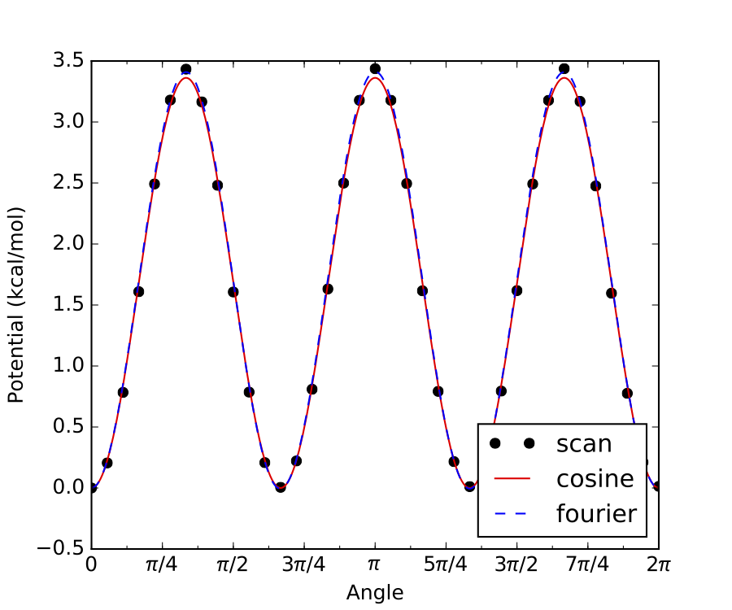
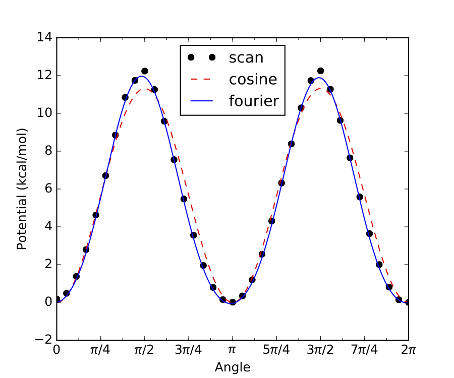
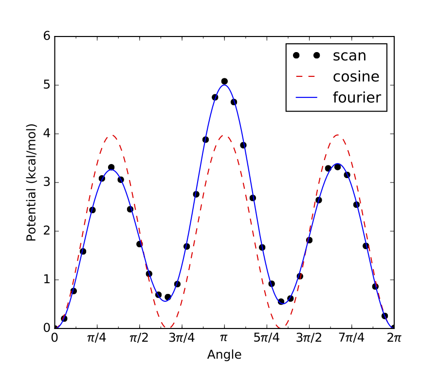
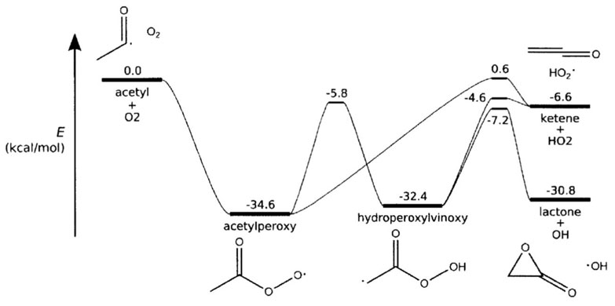

********************************************************
Creating Input Files for Pressure Dependent Calculations
********************************************************

Syntax
======

There are four parts to a pressure-dependent calculation input file, giving the species, transition states,
path reactions, reaction network, and algorithm
parameters. The species section must come before the reaction section. Before
discussing each of these sections, a brief word on the general input file
syntax will be given.

The format of CanTherm input files is based on Python syntax. In fact, CanTherm
input files are valid Python source code, and this is used to facilitate
reading of the file.

Each section is made up of one or more function calls, where parameters are
specified as text strings, numbers, or objects. Text strings must be wrapped in
either single or double quotes.

The following is a list of all the components of a CanTherm input file for pressure-dependent calculations:

=========================== ================================================================
Component                   Description
=========================== ================================================================
``modelChemistry``          Level of theory from quantum chemical calculations
``atomEnergies``            Dictionary of atomic energies at ``modelChemistry`` level
``frequencyScaleFactor``    A factor by which to scale all frequencies
``useHinderedRotors``       ``True`` if hindered rotors are used, ``False`` if not
``useAtomCorrections``      ``True`` if atom corrections are used, ``False`` if not
``useBondCorrections``      ``True`` if bond corrections are used, ``False`` if not
``species``                 Contains parameters for non-transition states
``transitionState``         Contains parameters for transition state(s)
``reaction``                Required for performing kinetic computations
``network``                 Divides species into reactants, isomers, products and bath gases
``pressureDependence``      Defines parameters necessary for solving master equation
``statmech``                Loads statistical mechanics parameters
``thermo``                  Performs a thermodynamics computation
``kinetics``                Performs a high-pressure limit kinetic computation
=========================== ================================================================

Note that many of the functions in the table above overlap with the functions available for
`thermodynamics and high-pressure limit kinetics computations <input.html#syntax>`_. For most of these overlapping functions, the input is identical.
Important differences are mentioned in the sections below.

Model Chemistry
===============

The first item in the input file should be a ``modelChemistry`` assignment
with a string describing the model chemistry.

CanTherm uses this information to adjust the computed energies to the usual gas-phase reference
states by applying atom, bond and spin-orbit coupling energy corrections. This is particularly
important for ``thermo()`` calculations (see below). Note that the user must specify under the
``species()`` function the type and number of bonds for CanTherm to apply these corrections.
The example below specifies CBS-QB3 as the model chemistry::

    modelChemistry = "CBS-QB3"

Alternatively, the atomic energies at the ``modelChemistry`` level of theory can be directly
specified in the input file by providing a dictionary of these energies in the following format::

    atomEnergies = {
        'H': -0.499818,
        'C': -37.78552,
        'N': -54.520543,
        'O': -74.987979,
        'S': -397.658253,
    }

Whether or not atomization energy corrections (AEC), bond corrections (BC), and spin orbit
corrections (SOC); and which elements are available for a given model chemistry is described
under `High-Pressure Limit: Model Chemistry <input.html#model-chemistry>`_

Frequency Scale Factor
======================

Frequency scale factors are empirically fit to experiment for different ``modelChemistry``. Refer to NIST website for values (http://cccbdb.nist.gov/vibscalejust.asp).
For CBS-QB3, which is not included  in the link above, ``frequencyScaleFactor = 0.99`` according to Montgomery et al. (*J. Chem. Phys. 1999, 110, 2822–2827*).

Species Parameters
==================

Each species in the network must be specified using a ``species()`` function.
This includes all unimolecular isomers, bimolecular reactants and products,
and the bath gas(es). A species that appears in multiple bimolecular channels
need only be specified with a single ``species()`` function.

The input to the ``species()`` function for a pressure-dependent calculation is the same as for a `thermodynamic or high-pressure limit kinetics calculation <input.html#species>`_,
with the addition of a few extra parameters needed to describe collisional energy transfer. There are two options for providing input to the ``species()`` function, which are described in the subsections below:

1. By pointing to the output files of quantum chemistry calculations, which CanTherm will parse for the necessary molecular properties
2. By directly entering the molecular properties

Within a single input file, both Option #1 and #2 may be used.

Regardless of which option is used to specify molecular properties (e.g., vibrational frequencies, rotational constants) in the ``species()`` function, the four parameters
listed below (mostly relating to the collisional energy transfer model) are always specified in the same way.

======================= =================================== ====================================
Parameter               Required?                           Description
======================= =================================== ====================================
``structure``           all species except bath gases       A chemical structure for the species defined using either SMILES or InChI
``molecularWeight``     all species                         The molecular weight, if not given it is calculated based on the structure
``collisionModel``      unimolecular isomers and bath gases Transport data for the species
``energyTransferModel`` unimolecular isomers                Assigned with ``SingleExponentialDown`` model
======================= =================================== ====================================

The ``structure`` parameter is defined by either SMILES or InChI.  For instance, either representation is
acceptable for the acetone molecule: ::

    structure = SMILES('CC(C)=O')

    structure = adjacencyList("""1  C u0 p0 c0 {2,S} {5,S} {6,S} {7,S}
                                 2  C u0 p0 c0 {1,S} {3,S} {4,D}
                                 3  C u0 p0 c0 {2,S} {8,S} {9,S} {10,S}
                                 4  O u0 p2 c0 {2,D}
                                 5  H u0 p0 c0 {1,S}
                                 6  H u0 p0 c0 {1,S}
                                 7  H u0 p0 c0 {1,S}
                                 8  H u0 p0 c0 {3,S}
                                 9  H u0 p0 c0 {3,S}
                                 10 H u0 p0 c0 {3,S}""")

    structure = InChI('InChI=1S/C3H6O/c1-3(2)4/h1-2H3')

The ``molecularWeight`` parameter should be defined in the quantity format ``(value, 'units')``
, for example: ::

    molecularWeight = (44.04, 'g/mol')

If the ``molecularWeight`` parameter is not given, it is calculated by CanTherm based
on the chemical structure.

The ``collisionModel`` is defined for unimolecular isomers with the transport data using a
``TransportData`` object: ::

    collisionModel = TransportData(sigma=(3.70,'angstrom'), epsilon=(94.9,'K'))

``sigma`` and ``epsilon`` are Lennard-Jones parameters, which can be estimated using the Joback method on the `RMG website <http://rmg.mit.edu/molecule_search>`_.

The ``energyTransferModel`` model available is a ``SingleExponentialDown``.

* ``SingleExponentialDown`` - Specify ``alpha0``, ``T0`` and ``n`` for the
  average energy transferred in a deactiving collision

  .. math :: \left< \Delta E_\mathrm{down} \right> = \alpha_0 \left( \frac{T}{T_0} \right)^n

An example of a typical ``energyTransferModel`` function is: ::

    energyTransferModel = SingleExponentialDown(
            alpha0 = (0.5718,'kcal/mol'),
            T0 = (300,'K'),
            n = 0.85,
        )

Parameters for the single exponential down model of collisional energy transfer are usually obtained from analogous systems in literature.
For example, if the user is interested in a pressure-dependent network with overall molecular formula  C7H8,
the single exponential down parameters for toluene in helium availabe from literature could be used for all unimolecular isomers in the network
(assuming helium is the bath gas). One helpful literature source for calculated exponential down parameters is the following paper:
http://www.sciencedirect.com/science/article/pii/S1540748914001084#s0060

The following subsections describe how the remaining molecular properties can be input to the ``species()`` function using either
Option #1 or #2 mentioned above.

Option #1: Automatically Parse Quantum Chemistry Calculation Output
-------------------------------------------------------------------

For this option, the ``species()`` function only requires two parameters in addition to the four parameters in the table above, as shown in the example below::

    species('acetylperoxy',''acetylperoxy.py',
            structure = SMILES('CC(=O)O[O]'),
            molecularWeight = (75.04,"g/mol"),
            collisionModel = TransportData(sigma=(5.09,'angstrom'), epsilon=(473,'K')),
            energyTransferModel = SingleExponentialDown(
                alpha0 = (0.5718,'kcal/mol'),
                T0 = (300,'K'),
                n = 0.85,
            ),
    )

The first parameter (``'acetylperoxy'`` above) is the species label, which can be referenced later in the input file. The second
parameter (``'acetylperoxy.py'`` above) points to the location of another python file containing details of the species. This file
will be referred to as the species input file.

The species input file accepts the following parameters:

======================= =========================== ====================================
Parameter               Required?                   Description
======================= =========================== ====================================
``bonds``               optional                    Type and number of bonds in the species
``linear``              yes                         ``True`` if the molecule is linear, ``False`` if not
``externalSymmetry``    yes                         The external symmetry number for rotation
``spinMultiplicity``    yes                         The ground-state spin multiplicity (degeneracy)
``opticalIsomers``      yes                         The number of optical isomers of the species
``energy``              yes                         The ground-state 0 K atomization energy in Hartree
                                                    (without zero-point energy) **or**
                                                    The path to the quantum chemistry output file containing the energy
``geometry``            yes                         The path to the quantum chemistry output file containing the optimized geometry
``frequencies``         yes                         The path to the quantum chemistry output file containing the computed frequencies
``rotors``              optional                    A list of :class:`HinderedRotor()` and/or :class:`FreeRotor()` objects describing the hindered/free rotors
======================= =========================== ====================================

The types and number of atoms in the species are automatically inferred from the quantum chemistry output and are used
to apply atomization energy corrections (AEC) and spin orbit corrections (SOC) for a given ``modelChemistry``
(see `Model Chemistry`_). If not interested in accurate thermodynamics (e.g., if only using ``kinetics()``), then
atom corrections can be turned off by setting ``useAtomCorrections`` to ``False``.

The ``bond`` parameter is used to apply bond corrections (BC) for a given ``modelChemistry``.

Allowed bond types for the ``bonds`` parameter are, e.g., ``'C-H'``, ``'C-C'``, ``'C=C'``, ``'N-O'``, ``'C=S'``, ``'O=O'``, ``'C#N'``...

``'O=S=O'`` is also allowed.

The order of elements in for the bond correction is not important. Use ``-``/``=``/``#`` to denote a single/double/triple bond, respectively. For example, for acetylperoxy radical we would write::

    bonds = {'C-C': 1, 'C=O': 1, 'C-O': 1, 'O-O': 1, 'C-H': 3}

The parameter ``linear`` only needs to be specified as either ``True`` or ``False``. The parameters ``externalSymmetry``,
``spinMultiplicity`` and ``opticalIsomers`` only accept integer values.
Note that ``externalSymmetry`` corresponds to the number of unique ways in which the species may be rotated about an axis (or multiple axes)
and still be indistinguishable from its starting orientation (reflection across a mirror plane does not count as rotation about an axis).
For acetylperoxy radical, we would write::

    linear = False

    externalSymmetry = 1

    spinMultiplicity = 2

    opticalIsomers = 1

The ``energy`` parameter is a dictionary with entries for different ``modelChemistry``. The entries can consist of either
floating point numbers corresponding to the 0 K atomization energy in Hartree (without zero-point energy correction), or
they can specify the path to a quantum chemistry calculation output file that contains the species's energy. For example::

    energy = {
    'CBS-QB3': Log('acetylperoxy_cbsqb3.log'),
    'Klip_2': -79.64199436,
    }

In this example, the ``CBS-QB3`` energy is obtained from a Gaussian log file, while the ``Klip_2`` energy is specified directly.
The energy used will depend on what ``modelChemistry`` was specified in the input file. CanTherm can parse the energy from
a Gaussian, Molpro, or QChem log file, all using the same ``Log`` class, as shown below.

The input to the remaining parameters, ``geometry``, ``frequencies`` and ``rotors``, will depend on if hindered/free rotors are included.
Both cases are described below.

Without Hindered/Free Rotors
~~~~~~~~~~~~~~~~~~~~~~~~~~~~
In this case, only ``geometry`` and ``frequencies`` need to be specified, and they can point to the same or different
quantum chemistry calculation output files. The ``geometry`` file contains the optimized geometry, while the
``frequencies`` file contains the harmonic oscillator frequencies of the species in its optimized geometry.
For example::

    geometry = Log('acetylperoxy_cbsqb3.log')

    frequencies = Log('acetylperoxy_freq.log')

In summary, in order to specify the molecular properties of a species by parsing the output of quantum chemistry calculations, without any hindered/free rotors,
the species input file should look like the following (using acetylperoxy as an example)::

    bonds = {
    'C-C': 1,
    'C=O': 1,
    'C-O': 1,
    'O-O': 1,
    'C-H': 3,
    }

    linear = False

    externalSymmetry = 1

    spinMultiplicity = 2

    opticalIsomers = 1

    energy = {
        'CBS-QB3': Log('acetylperoxy_cbsqb3.log'),
        'Klip_2': -79.64199436,
    }

    geometry = Log('acetylperoxy_cbsqb3.log')

    frequencies = Log('acetylperoxy_freq.log')

With Hindered/Free Rotors
~~~~~~~~~~~~~~~~~~~~~~~~~
In this case, ``geometry``, ``frequencies`` and ``rotors`` need to be specified. Note that the ``geometry`` and
``frequencies`` parameters must point to the **same** quantum chemistry calculation output file.
For example::

    geometry = Log('acetylperoxy_freq.log')

    frequencies = Log('acetylperoxy_freq.log')

The ``geometry/frequencies`` log file must contain both the optimized geometry and the Hessian (matrix of partial second derivatives of potential energy surface,
also referred to as the force constant matrix), which is used to calculate the harmonic oscillator frequencies. If Gaussian is used
to generate the ``geometry/frequencies`` log file, the Gaussian input file must contain the keyword ``iop(7/33=1)``, which forces Gaussian to
output the complete Hessian. Because the ``iop(7/33=1)`` option is only applied to the first part of the Gaussian job, the job
must be a ``freq`` job only (as opposed to an ``opt freq`` job or a composite method job like ``cbs-qb3``, which only do the ``freq`` calculation after the optimization).
Therefore, the proper workflow for generating the ``geometry/frequencies`` log file using Gaussian is:

1. Perform a geometry optimization.
2. Take the optimized geometry from step 1, and use it as the input to a ``freq`` job with the following input keywords: ``#method basis-set freq iop(7/33=1)``

The output of step 2 is the correct log file to use for ``geometry/frequencies``.

``rotors`` is a list of :class:`HinderedRotor()` and/or :class:`FreeRotor()` objects. Each :class:`HinderedRotor()` object requires the following parameters:

====================== =========================================================
Parameter              Description
====================== =========================================================
``scanLog``            The path to the Gaussian/Qchem log file or text file containing the scan
``pivots``             The indices of the atoms in the hindered rotor torsional bond
``top``                The indices of all atoms on one side of the torsional bond (including the pivot atom)
``symmetry``           The symmetry number for the torsional rotation (number of indistinguishable energy minima)
``fit``                Fit to the scan data. Can be either ``fourier``, ``cosine`` or ``best`` (default).
====================== =========================================================

``scanLog`` can either point to a ``Log`` file, or simply a ``ScanLog``, with the path to a text file summarizing the
scan in the following format::

          Angle (radians)          Energy (kJ/mol)
           0.0000000000            0.0147251160
           0.1745329252            0.7223109804
           0.3490658504            2.6856059517
                 .                       .
                 .                       .
                 .                       .
           6.2831853072            0.0000000000

The ``Energy`` can be in units of ``kJ/mol``, ``J/mol``, ``cal/mol``, ``kcal/mol``, ``cm^-1`` or ``hartree``.

The ``symmetry`` parameter will usually equal either 1, 2 or 3. Below are examples of internal rotor scans with these commonly encountered symmetry numbers. First, ``symmetry = 3``:

Internal rotation of a methyl group is a common example of a hindered rotor with ``symmetry = 3``, such as the one above. As shown, all three minima (and maxima) have identical energies, hence ``symmetry = 3``.

Similarly, if there are only two minima along the internal rotor scan, and both have identical energy, then ``symmetry = 2``, as in the example below: 

If any of the energy minima in an internal rotor scan are not identical, then the rotor has no symmetry (``symmetry = 1``), as in the example below:

For the example above there are 3 local energy minima, 2 of which are identical to each other. However, the 3rd minima is different from the other 2, therefore this internal rotor has no symmetry. 

For practical purposes, when determining the symmetry number for a given hindered rotor simply check if the internal rotor scan looks like the ``symmetry = 2`` or ``3`` examples above. If it doesn’t, then most likely ``symmetry = 1``.

Each :class:`FreeRotor()` object requires the following parameters:

====================== =========================================================
Parameter              Description
====================== =========================================================
``pivots``             The indices of the atoms in the free rotor torsional bond
``top``                The indices of all atoms on one side of the torsional bond (including the pivot atom)
``symmetry``           The symmetry number for the torsional rotation (number of indistinguishable energy minima)
====================== =========================================================

Note that a ``scanLog`` is not needed for :class:`FreeRotor()` because it is assumed that there is no barrier to internal rotation.
Modeling an internal rotation as a :class:`FreeRotor()` puts an upper bound on the impact of that rotor on the species's overall partition function.
Modeling the same internal rotation as a Harmonic Oscillator (default if it is not specifed as either a :class:`FreeRotor()` or  :class:`HinderedRotor()`)
puts a lower bound on the impact of that rotor on the species's overall partition function. Modeling the internal rotation as a :class:`HinderedRotor()` should fall
in between these two extremes.

To summarize, the species input file with hindered/free rotors should look like the following example (different options for specifying the same ``rotors`` entry are commented out)::

    bonds = {
    'C-C': 1,
    'C=O': 1,
    'C-O': 1,
    'O-O': 1,
    'C-H': 3,
    }

    linear = False

    externalSymmetry = 1

    spinMultiplicity = 2

    opticalIsomers = 1

    energy = {
        'CBS-QB3': Log('acetylperoxy_cbsqb3.log'),
        'Klip_2': -79.64199436,
    }

    geometry = Log('acetylperoxy_freq.log')

    frequencies = Log('acetylperoxy_freq.log')

    rotors = [
        HinderedRotor(scanLog=Log('acetylperoxy_scan_1.log'), pivots=[1,5], top=[1,2,3,4], symmetry=3, fit='best'),
        #HinderedRotor(scanLog=ScanLog('acetylperoxy_rotor_1.txt'), pivots=[1,5], top=[1,2,3,4], symmetry=3, fit='best'),
        #FreeRotor(pivots=[1,5], top=[1,2,3,4], symmetry=3),
    ]

Note that the atom labels identified within the rotor section should correspond to the indicated geometry.

Option #2: Directly Enter Molecular Properties
----------------------------------------------
While it is usually more convenient to have CanTherm parse molecular properties from the output of quantum chemistry calculations
(see `Option #1: Automatically Parse Quantum Chemistry Calculation Output`_) there are instances where an output file is not available
and it is more convenient for the user to directly enter the molecular properties. This is the case,  for example, if the user would like to use
calculations from literature, where the final calculated molecular properties are often reported in a table (e.g., vibrational frequencies, rotational constants),
but the actual output file of the underlying quantum chemistry calculation is rarely provided.

For this option, there are a number of required and optional parameters associated with a ``species()``
function:

======================= =================================== ====================================
Parameter               Required?                           Description
======================= =================================== ====================================
``label``               all species                         A unique string label used as an identifier
``structure``           all species except bath gas         A chemical structure for the species defined using either SMILES, adjacencyList, or InChI
``E0``                  all species                         The ground-state 0 K enthalpy of formation (including zero-point energy)
``modes``               all species                         The molecular degrees of freedom (see below)
``spinMultiplicity``    all species                         The ground-state spin multiplicity (degeneracy), sets to 1 by default if not used
``opticalIsomers``      all species                         The number of optical isomers of the species, sets to 1 by default if not used
``molecularWeight``     all species                         The molecular weight, if not given it is calculated based on the structure
``collisionModel``      unimolecular isomers and bath gases Transport data for the species
``energyTransferModel`` unimolecular isomers                Assigned with ``SingleExponentialDown`` model
``thermo``              optional                            Thermo data for the species
======================= =================================== ====================================

The parameters ``structure``, ``molecularWeight``, ``collisionModel`` and ``energyTransferModel`` were already discussed above in `Species Parameters`_.

The ``label`` parameter should be set to a string with the desired name for the species, which can be reference later in the input file. ::

    label = 'acetylperoxy'

The ``E0`` ground state 0 K enthalpy of formation (including zero-point energy) should be given in the quantity format ``(value, 'units')``, using units of either ``kJ/mol``, ``kcal/mol``, ``J/mol``, or ``cal/mol``: ::

    E0 = (-34.6,'kcal/mol')

Note that if CanTherm is being used to calculate the thermochemistry of the species, it is critical that the value of ``E0`` is consistent with the
definition above (0 K enthalpy of formation with zero-point energy). However, if the user is only interested in kinetics, ``E0`` can be defined on any
arbitrary absolute energy scale, as long as the correct relative energies between various ``species()`` and ``transitionState()`` are maintained. For example,
it is common in literature for the energy of some reactant(s) to be arbitrarily defined as zero, and the energies of all transition states, intermediates and products
are reported relative to that.

Also note that the value of ``E0`` provided here will be used directly, i.e., no atom or bond corrections will be applied.

When specifying the ``modes`` parameter, define a list
with the following types of degrees of freedom.  To understand how to define these
degrees of freedom, please click on the links below:

**Translational degrees of freedom**

.. currentmodule:: rmgpy.statmech

=============================== ================================================
Class                           Description
=============================== ================================================
:class:`IdealGasTranslation`    A model of three-dimensional translation of an ideal gas
=============================== ================================================

**Rotational degrees of freedom**

.. currentmodule:: rmgpy.statmech

=========================== ====================================================
Class                       Description
=========================== ====================================================
:class:`LinearRotor`        A model of two-dimensional rigid rotation of a linear molecule
:class:`NonlinearRotor`     A model of three-dimensional rigid rotation of a nonlinear molecule
:class:`KRotor`             A model of one-dimensional rigid rotation of a K-rotor
:class:`SphericalTopRotor`  A model of three-dimensional rigid rotation of a spherical top molecule
=========================== ====================================================

**Vibrational degrees of freedom**

.. currentmodule:: rmgpy.statmech

=========================== ====================================================
Class                       Description
=========================== ====================================================
:class:`HarmonicOscillator` A model of a set of one-dimensional harmonic oscillators
=========================== ====================================================

Note that the ``frequencies`` provided here will be used directly, i.e., the ``frequencyScaleFactor`` will not be applied.

**Torsional degrees of freedom**

.. currentmodule:: rmgpy.statmech

=========================== ====================================================
Class                       Description
=========================== ====================================================
:class:`HinderedRotor`      A model of a one-dimensional hindered rotation
:class:`FreeRotor`          A model of a one-dimensional free rotation
=========================== ====================================================

The ``spinMultiplicity`` is defined using an integer, and is set to 1 if not indicated
in the ``species()`` function. ::

    spinMultiplicity = 2

Similarly, the ``opticalIsomers`` is also defined using an integer, and is set to 1
if not used in the ``species()`` function. ::

    opticalIsomers = 1

The following is an example of a typical species item, based on the acetylperoxy
radical :math:`\ce{CH3C(=O)OO.}` (different options for specifying the same internal rotation are commented out)::

    species(
        label = 'acetylperoxy',
        structure = SMILES('CC(=O)O[O]'),
        E0 = (-34.6,'kcal/mol'),
        modes = [
            IdealGasTranslation(mass=(75.04,"g/mol")),
            NonlinearRotor(inertia=([54.2977,104.836,156.05],"amu*angstrom^2"), symmetry=1),
            HarmonicOscillator(frequencies=([319.695,500.474,536.674,543.894,727.156,973.365,1037.77,1119.72,1181.55,1391.11,1449.53,1454.72,1870.51,3037.12,3096.93,3136.39],"cm^-1")),
            HinderedRotor(inertia=(7.38359,"amu*angstrom^2"), symmetry=1, fourier=([[-1.95191,-11.8215,0.740041,-0.049118,-0.464522],[0.000227764,0.00410782,-0.000805364,-0.000548218,-0.000266277]],"kJ/mol")),
            HinderedRotor(inertia=(2.94723,"amu*angstrom^2"), symmetry=3, fourier=([[0.130647,0.0401507,-2.54582,-0.0436065,-0.120982],[-0.000701659,-0.000989654,0.00783349,-0.00140978,-0.00145843]],"kJ/mol")),
            #FreeRotor(inertia=(7.38359,"amu*angstrom^2"), symmetry=1),
            #FreeRotor(inertia=(2.94723,"amu*angstrom^2"), symmetry=3),
        ],
        spinMultiplicity = 2,
        opticalIsomers = 1,
        molecularWeight = (75.04,"g/mol"),
        collisionModel = TransportData(sigma=(5.09,'angstrom'), epsilon=(473,'K')),
        energyTransferModel = SingleExponentialDown(
            alpha0 = (0.5718,'kcal/mol'),
            T0 = (300,'K'),
            n = 0.85,
        ),
    )

Note that the format of the ``species()`` function above is identical to the ``conformer()`` function output by CanTherm in ``output.py``.
Therefore, the user could directly copy the ``conformer()`` output of a CanTherm job to another CanTherm input file, change the name of the function to
``species()`` (or ``transitionState()``, if appropriate, see next section) and run a new CanTherm job in this manner.
This can be useful if the user wants to easily switch a ``species()`` function from  Option #1 (parsing  quantum chemistry calculation output)
to Option #2 (directly enter molecular properties).

Transition States
=================

Transition states for reactions in the pressure dependent network should be defined very similarly to ``species``
using a ``transitionState()`` function, however it has less parameters (``structure``, ``molecularWeight``, ``collisionModel`` and ``energyTransferModel`` aren't specified for a transition state).
Like the ``species()`` function, the ``transitionState()`` function may also be specified in two ways: `Option #1: Automatically Parse Quantum Chemistry Calculation Output`_ and
`Option #2: Directly Enter Molecular Properties`_

The following is an example of a typical ``transitionState()`` function using Option #1::

    transitionState('isom1', 'isom1.py')

Just as for a ``species()`` function, the first parameter is the label for that transition state, and the second parameter
points to the location of another python file containing details of the transition state. This file
will be referred to as the transition state input file, and it accepts the same parameters as the species input file described in
`Option #1: Automatically Parse Quantum Chemistry Calculation Output`_.

The following is an example of a typical ``transitionState()`` function using Option #2::

    transitionState(
        label = 'isom1',
        E0 = (-5.8,'kcal/mol'),
        modes = [
            IdealGasTranslation(mass=(75.04,"g/mol")),
            NonlinearRotor(inertia=([49.3418,103.697,149.682],"u*angstrom**2"), symmetry=1, quantum=False),
            HarmonicOscillator(frequencies=([148.551,306.791,484.573,536.709,599.366,675.538,832.594,918.413,1022.28,1031.45,1101.01,1130.05,1401.51,1701.26,1844.17,3078.6,3163.07],"cm^-1"), quantum=True),
        ],
        spinMultiplicity = 2,
        opticalIsomers = 1,
        frequency = (-1679.04,'cm^-1'),
    )

The only additional parameter required for a ``transitionState()`` function as compared to a ``species()`` function is ``frequency``,
which is the imaginary frequency of the transition state needed to account for tunneling. Refer to `Option #2: Directly Enter Molecular Properties`_
for a more detailed description of the other parameters.

Path Reactions
==============

Each path reaction - a reaction directly connecting two molecular configurations
in the network - is specified using a ``reaction()`` function. The following
parameters are available:

====================== ==================== ============================================================================================================
Parameter              Required?            Description
====================== ==================== ============================================================================================================
``label``              All reactions        A name for the reaction 
``reactants``          All reactions        A list of reactant species
``products``           All reactions        A list of product species
``transitionState``    All reactions        The transition state
``kinetics``           Optional             The high pressure-limit kinetics for the reaction
``tunneling``          Optional             The type of tunneling model (either 'Eckhart' or 'Wigner') to use for tunneling through the reaction barrier
====================== ==================== ============================================================================================================

If the optional ``kinetics`` parameter is specified, CanTherm will perform an inverse Laplace transform (ILT) on the high pressure-limit kinetics provided to estimate the microcanonical rate coefficients,
:math:`k(E)`, needed for the master equation (refer to Theory manual for more detail). This feature is useful for barrierless reactions, such as radical recombinations, which don't
have an obvious transition state. If the ILT approach to calculating :math:`k(E)` is taken, a placeholder ``transitionState`` must still be defined with an ``E0`` equal to the energy of the higher energy species it is connecting.

A typical ``reaction()`` function might look like this. ::

    reaction(
        label = 'isom1',
        reactants = ['acetylperoxy'],
        products = ['hydroperoxylvinoxy'],
        transitionState = 'isom1',
        kinetics = Arrhenius(A=(2.65e6,'m^3/(mol*s)'), n=0.0, Ea=(0.0,'kcal/mol'), T0=(1,"K")),
        tunneling = 'Eckart',
    )

Note that the reactants and products must have been previously declared using a ``species()`` function,
using the same name labels. Transition states must also be previously declared using a
``transitionState()`` function.

If the optional ``kinetics`` entry is not specified, CanTherm will calculate the required kinetic
coefficients on its own. The ``kinetics`` entry is particularly useful to specify rates of barrierless
reactions (for which CanTherm cannot yet calculate high-pressure limit rates).

Currently, the ``reaction()`` function for a pressure-dependent job cannot connect bimolecular reactants to bimolecular products
(e.g., as in a hydrogen abstraction or disproportionation reaction).

Network
=======

A declaration for the overall network must be given using the ``network`` function.

This includes setting the following paramters:

====================== ================================================================================
Parameter              Description
====================== ================================================================================
``label``              A name for the network
``isomers``            A list of species participating in unimolecular reaction channels
``reactants``          A list of the species that participate in bimolecular reactant channels
``bathGas``            A dictionary of bath gases and their respective mole fractions, adding up to 1.0
====================== ================================================================================

CanTherm is largely able to determine the molecular configurations that define
the potential energy surface for your reaction network simply by inspecting the
path reactions. However, you must indicate which unimolecular and bimolecular
configurations you wish to include in the master equation formulation; all
others will be treated as irreversible sinks.

Note that all species and bath gases used in the ``network`` function must have been
previously declared with the same name labels in a previous ``species`` function in the
input file.

You do not need to specify the product channels (infinite sinks) in this
manner, as any configuration not marked as an isomer or reactant channel will
be treated as a product channel.

An example of the ``network`` function is given below along with a scheme of the network::

    network(
        label = 'acetyl + O2',
        isomers = [
            'acetylperoxy',
            'hydroperoxylvinoxy',
        ],
        reactants = [
            ('acetyl', 'oxygen'),
        ],
        bathGas = {
            'nitrogen': 0.4,
            'argon': 0.6,
        }
    )

Image source: `J.W. Allen, PhD dissertation, MIT 2013 <http://hdl.handle.net/1721.1/81677>`_,
calculated at the RQCISD(T)/CBS//B3LYP/6-311++G(d,p) level of theory

Algorithm Parameters
====================

The overall parameters for the pressure-dependence calculation must be defined in a
``pressureDependence`` function at the end of the input file.   The following parameters are necessary:

================================================== ====================================================================================================================================================
Parameter                                          Description
================================================== ====================================================================================================================================================
``label``                                          Use the name for the ``network`` declared previously
``method``                                         Method to use for calculating the pdep network. Use either ``'modified strong collision'``, ``'reservoir state'``, or ``'chemically-significant eigenvalues'``
``interpolationModel``                             Select the output type for the pdep kinetics, either in ``'chebyshev'`` or ``'pdeparrhenius'`` (plog) format
``activeKRotor``                                   A flag indicating whether to treat the K-rotor as active or adiabatic
``activeJRotor``                                   A flag indicating whether to treat the J-rotor as active or adiabatic
``Tmin``/``Tmax``/``Tcount`` **or** ``Tlist``      Define temperatures at which to compute (and output) :math:`k(T,P)`
``Pmin``/``Pmax``/``Pcount`` **or** ``Plist``      Define pressures at which to compute (and output) :math:`k(T,P)`
``maximumGrainSize`` **and** ``minimumGrainCount`` Defines fineness of energy grains used in master equation calculations.
================================================== ====================================================================================================================================================

**Temperature and Pressure Ranges**

CanTherm will compute the :math:`k(T,P)` values on a grid of temperature and
pressure points. ``Tmin``, ``Tmax``, and ``Tcount`` values, as well as ``Pmin``, ``Pmax``, and ``Pcount`` parameter values must be provided.  
CanTherm will automatically choose the intermediate temperatures based on the
interpolation model you wish to fit. This is the recommended approach.

Alternatively, the grid of temperature and pressure points can be specified explicitly using ``Tlist`` and/or ``Plist``.

**Energy Grains**
Determine the fineness of the energy grains to be used in the master equation calculations.  Dictate
the ``maximumGrainSize``, and the ``minimumGrainCount``.

An example of the algorithm parameters function for the acetyl + O2 network is shown below. ::

    pressureDependence(
        label='acetyl + O2',
        Tmin=(300.0,'K'), Tmax=(2000.0,'K'), Tcount=8,
        Pmin=(0.01,'bar'), Pmax=(100.0,'bar'), Pcount=5,
        #Tlist = ([300, 400, 600, 800, 1000, 1250, 1500, 1750, 2000],'K')
        #Plist = ([0.01, 0.1, 1.0, 10.0, 100.0],'bar')
        maximumGrainSize = (1.0,'kcal/mol'),
        minimumGrainCount = 250,
        method = 'modified strong collision',
        #method = 'reservoir state',
        #method = 'chemically-significant eigenvalues',
        interpolationModel = ('chebyshev', 6, 4),
        #interpolationModel = ('pdeparrhenius'),
        #activeKRotor = True, 
        activeJRotor = True,
    )

Thermodynamics Computations
===========================

The input to the ``thermo()`` function is identical to that of a `non-pressure-dependent job <input.html#thermodynamics-computations>`_.

Use a ``thermo()`` function to make CanTherm execute the thermodynamic
parameters computatiom for a species. Pass the string label of the species
you wish to compute the  thermodynamic parameters for and the type of
thermodynamics polynomial to generate (either ``'Wilhoit'`` or ``'NASA'``).
A table of relevant thermodynamic parameters will also be displayed in the
output file.

Below is a typical ``thermo()`` execution function::

    thermo('ethane', 'NASA')

Kinetics Computations
=====================

The input to the ``kinetics()`` function is identical to that of `a non-pressure-dependent job <input.html#kinetics-computations>`_. Note, however, that because currently
the ``reaction()`` function for a pressure-dependent job cannot connect bimolecular reactants to bimolecular products
(e.g., as in a hydrogen abstraction or disproportionation reaction), it is also not possible to use ``kinetics()`` on such a reaction either.
The kinetics of such a reaction can only be calculated as part of a non-pressure-dependent job.

Use a ``kinetics()`` function to make CanTherm execute the high-pressure limit kinetic
parameters computation for a reaction. The ``'label'`` string must correspond to that of
a defined ``reaction()`` function. If desired, define a temperature range and number
of temperatures at which the high-pressure rate coefficient will be tabulated and saved to
the outupt file. The 3-parameter modified Arrhenius coefficients will automatically be fit
to the computed rate coefficients. The quantum tunneling factor will also be displayed.

Below is a typical ``kinetics()`` function::

    kinetics(
    label = 'H + C2H4 <=> C2H5',
    Tmin = (400,'K'), Tmax = (1200,'K'), Tcount = 6,
    )

If specific temperatures are desired, you may specify a list
(``Tlist = ([400,500,700,900,1100,1200],'K')``) instead of Tmin, Tmax, and Tcount.

This is also acceptable::

    kinetics('H + C2H4 <=> C2H5')

Examples
========

Perhaps the best way to learn the input file syntax is by example. To that end,
a number of example input files and their corresponding output have been given
in the ``examples/cantherm/networks`` directory, which includes both an `acetyl+O2`
and `n-butanol` example.

