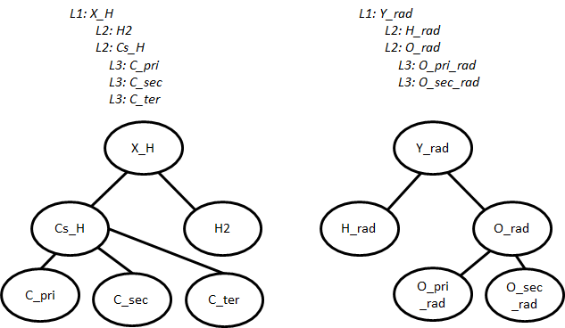

.. _introDatabase:

************
Introduction
************
This section describes some of the general characteristics of RMG's databases.

Group Definitions
-----------------
The main section in many of RMG's databases are the 'group' definitions. Groups are 
:ref:`adjacency lists <rmgpy.molecule.adjlist>`
that describe structures around the reacting atoms. Between the adjacency
list's index number and atom type, a starred number is inserted if the
atom is a reacting atom.

Because groups typically do not describe entire molecules, atoms may appear to 
be lacking full valency. When this occurs, the omitted bonds are allowed to be 
anything. An example of a primary carbon group from H-Abstraction is shown below.
The adjacency list defined on the left matches any of the three drawn structures
on the right (the numbers correspond to the index from the adjacency list).

.. image:: images/Group.png
	:scale: 70%
	:align: center

**Atom types** describe atoms in group definitions. The 
table below shows all atoms types in RMG.

+----------+-------------------+------------------------------------------------------------------------------------------------------------------+
|Atom Type |Chemical Element   |Bonding                                                                                                           |
+==========+===================+==================================================================================================================+
|R         |Any                |No requirements                                                                                                   |
+----------+-------------------+------------------------------------------------------------------------------------------------------------------+
|R!H       |Any except hydrogen|No requirements                                                                                                   |
+----------+-------------------+------------------------------------------------------------------------------------------------------------------+
|H         |Hydrogen           |No requirements                                                                                                   |
+----------+-------------------+------------------------------------------------------------------------------------------------------------------+
|C         |Carbon             |No requirements                                                                                                   |
+----------+-------------------+------------------------------------------------------------------------------------------------------------------+
|Ca        |Carbon             |Atomic carbon with two lone pairs and no bonds                                                                    |
+----------+-------------------+------------------------------------------------------------------------------------------------------------------+
|Cs        |Carbon             |Up to four single bonds                                                                                           |
+----------+-------------------+------------------------------------------------------------------------------------------------------------------+
|Csc       |Carbon             |Up to three single bonds, charged +1                                                                              |
+----------+-------------------+------------------------------------------------------------------------------------------------------------------+
|Cd        |Carbon             |One double bond (to any atom other than O or S), up to two single bonds                                           |
+----------+-------------------+------------------------------------------------------------------------------------------------------------------+
|Cdc       |Carbon             |One double bond, up to one single bond, charged +1                                                                |
+----------+-------------------+------------------------------------------------------------------------------------------------------------------+
|CO        |Carbon             |One double bond to an oxygen atom, up to two single bonds                                                         |
+----------+-------------------+------------------------------------------------------------------------------------------------------------------+
|CS        |Carbon             |One double bond to an sulfur atom, up to two single bonds                                                         |
+----------+-------------------+------------------------------------------------------------------------------------------------------------------+
|Cdd       |Carbon             |Two double bonds                                                                                                  |
+----------+-------------------+------------------------------------------------------------------------------------------------------------------+
|Ct        |Carbon             |One triple bond, up to one single bond                                                                            |
+----------+-------------------+------------------------------------------------------------------------------------------------------------------+
|Cb        |Carbon             |Two benzene bonds, up tp one single bond                                                                          |
+----------+-------------------+------------------------------------------------------------------------------------------------------------------+
|Cbf       |Carbon             |Three benzene bonds (fused aromatics)                                                                             |
+----------+-------------------+------------------------------------------------------------------------------------------------------------------+
|C2s       |Carbon             |One lone pair, up to two single bonds                                                                             |
+----------+-------------------+------------------------------------------------------------------------------------------------------------------+
|C2sc      |Carbon             |One lone pair, up to three single bonds, charged -1                                                               |
+----------+-------------------+------------------------------------------------------------------------------------------------------------------+
|C2d       |Carbon             |One lone pair, one double bond                                                                                    |
+----------+-------------------+------------------------------------------------------------------------------------------------------------------+
|C2dc      |Carbon             |One lone pair, one double bond, up to one single bond, charge -1                                                  |
+----------+-------------------+------------------------------------------------------------------------------------------------------------------+
|C2tc      |Carbon             |One lone pair, one triple bond, charged -1                                                                        |
+----------+-------------------+------------------------------------------------------------------------------------------------------------------+
|N         |Nitrogen           |No requirements                                                                                                   |
+----------+-------------------+------------------------------------------------------------------------------------------------------------------+
|N0sc      |Nitrogen           |Three lone pairs, up to one single bond, charged -2                                                               |
+----------+-------------------+------------------------------------------------------------------------------------------------------------------+
|N1s       |Nitrogen           |Two lone pairs, up to one single bond                                                                             |
+----------+-------------------+------------------------------------------------------------------------------------------------------------------+
|N1sc      |Nitrogen           |Two lone pairs, up to two single bonds, charged -1                                                                |
+----------+-------------------+------------------------------------------------------------------------------------------------------------------+
|N1dc      |Nitrogen           |Two lone pairs, one double bond, charged -1                                                                       |
+----------+-------------------+------------------------------------------------------------------------------------------------------------------+
|N3s       |Nitrogen           |One lone pair, up to three single bonds                                                                           |
+----------+-------------------+------------------------------------------------------------------------------------------------------------------+
|N3d       |Nitrogen           |One lone pair, one double bond, up to one single bond                                                             |
+----------+-------------------+------------------------------------------------------------------------------------------------------------------+
|N3t       |Nitrogen           |One lone pair, one triple bond                                                                                    |
+----------+-------------------+------------------------------------------------------------------------------------------------------------------+
|N3b       |Nitrogen           |One lone pair, two aromatic bonds                                                                                 |
+----------+-------------------+------------------------------------------------------------------------------------------------------------------+
|N5sc      |Nitrogen           |No lone pairs, up to four single bonds, charged +1                                                                |
+----------+-------------------+------------------------------------------------------------------------------------------------------------------+
|N5dc      |Nitrogen           |No lone pairs, one double bond, up to two single bonds, charged +1                                                |
+----------+-------------------+------------------------------------------------------------------------------------------------------------------+
|N5ddc     |Nitrogen           |No lone pairs, two double bonds, charged +1                                                                       |
+----------+-------------------+------------------------------------------------------------------------------------------------------------------+
|N5dddc    |Nitrogen           |No lone pairs, three double bonds, charged -1                                                                     |
+----------+-------------------+------------------------------------------------------------------------------------------------------------------+
|N5t       |Nitrogen           |No lone pairs, one triple bond, up to two single bonds                                                            |
+----------+-------------------+------------------------------------------------------------------------------------------------------------------+
|N5tc      |Nitrogen           |No lone pairs, one triple bond, up to one single bond, charged +1                                                 |
+----------+-------------------+------------------------------------------------------------------------------------------------------------------+
|N5b       |Nitrogen           |No lone pairs, two aromatic bonds, up to one single bond                                                          |
+----------+-------------------+------------------------------------------------------------------------------------------------------------------+
|O         |Oxygen             |No requirements                                                                                                   |
+----------+-------------------+------------------------------------------------------------------------------------------------------------------+
|Oa        |Oxygen             |Atomic oxygen with three lone pairs and no bonds                                                                  |
+----------+-------------------+------------------------------------------------------------------------------------------------------------------+
|O0sc      |Oxygen             |Three lone pairs, up to one single bond, charged -1                                                               |
+----------+-------------------+------------------------------------------------------------------------------------------------------------------+
|O0dc      |Oxygen             |Three lone pairs, one double bond, charged -2                                                                     |
+----------+-------------------+------------------------------------------------------------------------------------------------------------------+
|O2s       |Oxygen             |Two lone pairs, up to two single bonds                                                                            |
+----------+-------------------+------------------------------------------------------------------------------------------------------------------+
|O2sc      |Oxygen             |Two lone pairs, up to one single bond, charged +1                                                                 |
+----------+-------------------+------------------------------------------------------------------------------------------------------------------+
|O2d       |Oxygen             |Two lone pairs, one double bond                                                                                   |
+----------+-------------------+------------------------------------------------------------------------------------------------------------------+
|O4sc      |Oxygen             |One lone pair, up to three single bonds, charged +1                                                               |
+----------+-------------------+------------------------------------------------------------------------------------------------------------------+
|O4dc      |Oxygen             |One lone pair, one double bond, up to one single bond, charged +1                                                 |
+----------+-------------------+------------------------------------------------------------------------------------------------------------------+
|O4tc      |Oxygen             |One lone pair, one triple bond, charged +1                                                                        |
+----------+-------------------+------------------------------------------------------------------------------------------------------------------+
|Si        |Silicon            |No requirements                                                                                                   |
+----------+-------------------+------------------------------------------------------------------------------------------------------------------+
|Sis       |Silicon            |Up to four single bonds                                                                                           |
+----------+-------------------+------------------------------------------------------------------------------------------------------------------+
|Sid       |Silicon            |One double bond (not to O), up to two single bonds                                                                |
+----------+-------------------+------------------------------------------------------------------------------------------------------------------+
|SiO       |Silicon            |One double bond to an oxygen atom, up to two single bonds                                                         |
+----------+-------------------+------------------------------------------------------------------------------------------------------------------+
|Sidd      |Silicon            |Two double bonds                                                                                                  |
+----------+-------------------+------------------------------------------------------------------------------------------------------------------+
|Sit       |Silicon            |One triple bond, up to one single bond                                                                            |
+----------+-------------------+------------------------------------------------------------------------------------------------------------------+
|Sib       |Silicon            |Two benzene bonds, up tp one single bond                                                                          |
+----------+-------------------+------------------------------------------------------------------------------------------------------------------+
|Sibf      |Silicon            |Three benzene bonds (fused aromatics)                                                                             |
+----------+-------------------+------------------------------------------------------------------------------------------------------------------+
|S         |Sulfur             |No requirements                                                                                                   |
+----------+-------------------+------------------------------------------------------------------------------------------------------------------+
|Sa        |Sulfur             |Atomic sulfur with three lone pairs and no bonds                                                                  |
+----------+-------------------+------------------------------------------------------------------------------------------------------------------+
|S0sc      |Sulfur             |Three lone pairs, up to once single bond, charged -1                                                              |
+----------+-------------------+------------------------------------------------------------------------------------------------------------------+
|S2s       |Sulfur             |Two lone pairs, up to two single bonds                                                                            |
+----------+-------------------+------------------------------------------------------------------------------------------------------------------+
|S2sc      |Sulfur             |Two lone pairs, up to three single bonds, charged -1/+1                                                           |
+----------+-------------------+------------------------------------------------------------------------------------------------------------------+
|S2d       |Sulfur             |Two lone pairs, one double bond                                                                                   |
+----------+-------------------+------------------------------------------------------------------------------------------------------------------+
|S2dc      |Sulfur             |Two lone pairs, one to two double bonds, up to one single bond, charged -1                                        |
+----------+-------------------+------------------------------------------------------------------------------------------------------------------+
|S2tc      |Sulfur             |Two lone pairs, one triple bond, charged -1                                                                       |
+----------+-------------------+------------------------------------------------------------------------------------------------------------------+
|S4s       |Sulfur             |One lone pair, up to four single bonds                                                                            |
+----------+-------------------+------------------------------------------------------------------------------------------------------------------+
|S4sc      |Sulfur             |One lone pair, up to five single bonds, charged -1/+1                                                               |
+----------+-------------------+------------------------------------------------------------------------------------------------------------------+
|S4d       |Sulfur             |One lone pair, one double bond, up to two single bonds                                                            |
+----------+-------------------+------------------------------------------------------------------------------------------------------------------+
|S4dd      |Sulfur             |One lone pair, two double bonds                                                                                   |
+----------+-------------------+------------------------------------------------------------------------------------------------------------------+
|S4dc      |Sulfur             |One lone pair, one to three double bonds, up to three single bonds, charged -1/+1                                 |
+----------+-------------------+------------------------------------------------------------------------------------------------------------------+
|S4b       |Sulfur             |One lone pair, two aromatic bonds                                                                                 |
+----------+-------------------+------------------------------------------------------------------------------------------------------------------+
|S4t       |Sulfur             |One lone pair, one triple bond, up to one single bond                                                             |
+----------+-------------------+------------------------------------------------------------------------------------------------------------------+
|S4tdc     |Sulfur             |One lone pair, one to two triple bonds, up to two double bonds, up to two single bonds, charged -1/+1             |
+----------+-------------------+------------------------------------------------------------------------------------------------------------------+
|S6s       |Sulfur             |No lone pairs, up to six single bonds                                                                             |
+----------+-------------------+------------------------------------------------------------------------------------------------------------------+
|S6sc      |Sulfur             |No lone pairs, up to seven single bonds, charged -1/+1                                                            |
+----------+-------------------+------------------------------------------------------------------------------------------------------------------+
|S6d       |Sulfur             |No lone pairs, one double bond, up to four single bonds                                                           |
+----------+-------------------+------------------------------------------------------------------------------------------------------------------+
|S6dd      |Sulfur             |No lone pairs, two double bonds, up to two single bonds                                                           |
+----------+-------------------+------------------------------------------------------------------------------------------------------------------+
|S6ddd     |Sulfur             |No lone pairs, up to three double bonds                                                                           |
+----------+-------------------+------------------------------------------------------------------------------------------------------------------+
|S6dc      |Sulfur             |No lone pairs, one to to three double bonds, up to five single bonds, charged -1/-1                               |
+----------+-------------------+------------------------------------------------------------------------------------------------------------------+
|S6t       |Sulfur             |No lone pairs, one triple bond, up to three single bonds                                                          |
+----------+-------------------+------------------------------------------------------------------------------------------------------------------+
|S6td      |Sulfur             |No lone pairs, one triple bond, one double bond, up to one single bond                                            |
+----------+-------------------+------------------------------------------------------------------------------------------------------------------+
|S6tt      |Sulfur             |No lone pairs, two triple bonds                                                                                   |
+----------+-------------------+------------------------------------------------------------------------------------------------------------------+
|S6tdc     |Sulfur             |No lone pairs, one to two triple bonds, up to two double bonds, up to four single bonds, charged -1/-1            |
+----------+-------------------+------------------------------------------------------------------------------------------------------------------+
|He        |Helium             |No requirements, nonreactive                                                                                      |
+----------+-------------------+------------------------------------------------------------------------------------------------------------------+
|Ne        |Neon               |No requirements, nonreactive                                                                                      |
+----------+-------------------+------------------------------------------------------------------------------------------------------------------+
|Ar        |Argon              |No requirements, nonreactive                                                                                      |
+----------+-------------------+------------------------------------------------------------------------------------------------------------------+

Additionally, groups can also be defined as unions of other groups. For example,::

	label="X_H_or_Xrad_H",
	group=OR{X_H, Xrad_H}, 
    

Forbidden Groups
----------------
Forbidden groups can be defined to ban structures globally in RMG or to
ban pathways in a specific kinetic family.

Globally forbidden structures will ban all reactions containing either reactants
or products that are forbidden.  These groups are stored in in the file located at
``RMG-database/input/forbiddenStructures.py``. 

To ban certain specific pathways in the kinetics 
families, a `forbidden` group must be created, like the following group
in the ``intra_H_migration`` family ::

    forbidden(
        label = "bridged56_1254",
    group =
    """""""
    1 *1 C 1 {2,S} {6,S}
    2 *4 C 0 {1,S} {3,S} {7,S}
    3    C 0 {2,S} {4,S}
    4 *2 C 0 {3,S} {5,S} {8,S}
    5 *5 C 0 {4,S} {6,S} {7,S}
    6    C 0 {1,S} {5,S}
    7    C 0 {2,S} {5,S}
    8 *3 H 0 {4,S}
    """,
        shortDesc = u"""""",
        longDesc = 
    u"""
    
    """,
    )

Forbidden groups should be placed inside the groups.py file located inside the
specific kinetics family's folder ``RMG-database/input/kinetics/family_name/`` 
alongside normal group entries. The starred atoms in the forbidden group
ban the specified reaction recipe from occurring in matched products and reactants.

Hierarchical Trees
------------------
Groups are ordered into the nodes of a hierarchical trees which is written 
at the end of groups.py. The root node of each tree is the most general group with 
the reacting atoms required for the family. Descending from the root node are 
more specific groups. Each child node is a subset of the parent node above it.

A simplified example of the trees for H-abstraction is shown below. The indented
text shows the syntax in groups.py and a schematic is given underneath.

Individual groups only describe part of the reaction. To describe an entire reaction
we need one group from each tree, which we call **node templates** or simply templates. 
(C_pri, O_pri_rad), (H2, O_sec_rad), and (X_H, Y_rad) are all valid examples of templates. 
Templates can be filled in with kinetic parameters from the training set or rules.