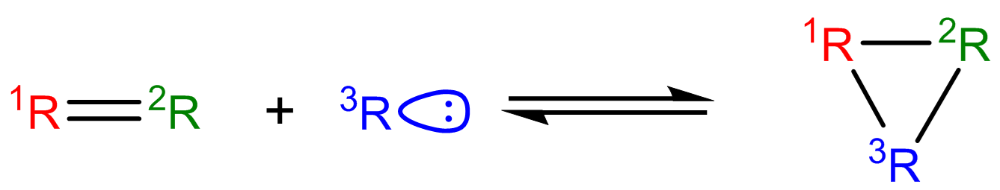

.. _kineticsDatabase:

*****************
Kinetics Database
*****************
This section describes the general usage of RMG's kinetic database. See :ref:`kinetic-database-modification` for 
instructions on modifying the database.

Pressure independent reaction rates in RMG are calculated using a modified 
Arrhenius equation, designating the reaction coefficient as :math:`k(T)` at 
temperature :math:`T`.

.. math:: k(T) = A\left(\frac{T}{T_0}\right)^ne^{-(E_0 + \alpha \Delta H_{rxn})/(RT)}

:math:`R` is the universal gas constant. The **kinetic parameters** determining 
the rate coefficient are:

* :math:`A`:	the pre-exponential A-factor 

* :math:`T_0`:	the reference temperature

* :math:`n`:	the temperature exponent

* :math:`E_0`:	the activation energy for a thermoneutral reaction (a barrier height intrinsic to the kinetics family)

* :math:`\alpha`:	the Evans-Polanyi coefficient (characterizes the position of the transition state along the reaction coordinate, :math:`0 \le \alpha \le 1`)

* :math:`\Delta H_{rxn}`: the enthalpy of reaction

When Evans-Polanyi corrections are used, :math:`\Delta H_{rxn}` is calculated
using RMG's thermo database, instead of being specified in the kinetic database.
When Evans-Polanyi corrections are not used, :math:`\Delta H_{rxn}` and :math:`\alpha`
are set to zero, and :math:`E_0` is the activation energy of the reaction.

Libraries
=========
Kinetic libraries delineate kinetic parameters for specific reactions. 
RMG always chooses to use kinetics from libraries over families. If multiple libraries
contain the same reaction, then precedence is given to whichever library is
listed first in the input.py file.

For combustion mechanisms, you should always use at least one small-molecule 
combustion library, such as the pre-packaged *BurkeH2O2* and/or *FFCM1*
for natural gas.
The reactions contained in these libraries are poorly estimated by kinetic 
families and are universally important to combustion systems.

Kinetic libraries should also be used in the cases where:

* A set of reaction rates were optimized together
* You know the reaction rate is not generalizable to similar species (perhaps due to catalysis or aromatic structures)
* No family exists for the class of reaction
* You are not confident about the accuracy of kinetic parameters

Below is a list of pre-packaged kinetics library reactions in RMG:

+-------------------------------------------------------------+------------------------------------------------------------------------------------------+
|Library                                                      |Description                                                                               |
+=============================================================+==========================================================================================+
|1989_Stewart_2CH3_to_C2H5_H                                  |Chemically Activated Methyl Recombination to Ethyl (2CH3 -> C2H5 + H)                     |
+-------------------------------------------------------------+------------------------------------------------------------------------------------------+
|2001_Tokmakov_H_Toluene_to_CH3_Benzene                       |H + Toluene = CH3 + Benzene                                                               |
+-------------------------------------------------------------+------------------------------------------------------------------------------------------+
|2005_Senosiain_OH_C2H2                                       |pathways on the OH + acetylene surface                                                    |
+-------------------------------------------------------------+------------------------------------------------------------------------------------------+
|2006_Joshi_OH_CO                                             |pathways on OH + CO = HOCO = H + CO2 surface                                              |
+-------------------------------------------------------------+------------------------------------------------------------------------------------------+
|2009_Sharma_C5H5_CH3_highP                                   |Cyclopentadienyl + CH3 in high-P limit                                                    |
+-------------------------------------------------------------+------------------------------------------------------------------------------------------+
|2015_Buras_C2H3_C4H6_highP                                   |Vinyl + 1,3-Butadiene and other C6H9 reactions in high-P limit                            |
+-------------------------------------------------------------+------------------------------------------------------------------------------------------+
|biCPD_H_shift                                                |Sigmatropic 1,5-H shifts on biCPD PES                                                     |
+-------------------------------------------------------------+------------------------------------------------------------------------------------------+
|BurkeH2O2inArHe                                              |Comprehensive H2/O2 kinetic model in Ar or He atmosphere                                  |
+-------------------------------------------------------------+------------------------------------------------------------------------------------------+
|BurkeH2O2inN2                                                |Comprehensive H2/O2 kinetic model in N2 atmosphere                                        |
+-------------------------------------------------------------+------------------------------------------------------------------------------------------+
|C2H4+O_Klipp2017                                             |C2H4 + O intersystem crossing reactions, probably important for all C/H/O combustion      |
+-------------------------------------------------------------+------------------------------------------------------------------------------------------+
|C10H11                                                       |Cyclopentadiene pyrolysis in the presence of ethene                                       |
+-------------------------------------------------------------+------------------------------------------------------------------------------------------+
|C3                                                           |Cyclopentadiene pyrolysis in the presence of ethene                                       |
+-------------------------------------------------------------+------------------------------------------------------------------------------------------+
|C6H5_C4H4_Mebel                                              |Formation Mechanism of Naphthalene and Indene                                             |
+-------------------------------------------------------------+------------------------------------------------------------------------------------------+
|Chernov                                                      |Soot Formation with C1 and C2 Fuels (aromatic reactions only)                             |
+-------------------------------------------------------------+------------------------------------------------------------------------------------------+
|CurranPentane                                                |Ignition of pentane isomers                                                               |
+-------------------------------------------------------------+------------------------------------------------------------------------------------------+
|Dooley                                                       |Methyl formate (contains several mechanisms)                                              |
+-------------------------------------------------------------+------------------------------------------------------------------------------------------+
|ERC-FoundationFuelv0.9                                       |Small molecule combustio (natural gas)                                                    |
+-------------------------------------------------------------+------------------------------------------------------------------------------------------+
|Ethylamine                                                   |Ethylamine pyrolysis and oxidation                                                        |
+-------------------------------------------------------------+------------------------------------------------------------------------------------------+
|FFCM1(-)                                                     |Foundational Fuel Chemistry Model Version 1.0 (excited species removed)                   |
+-------------------------------------------------------------+------------------------------------------------------------------------------------------+
|First_to_Second_Aromatic_Ring/2005_Ismail_C6H5_C4H6_highP    |Phenyl + 1,3-Butadiene and other C10H11 reactions in high-P limit                         |
+-------------------------------------------------------------+------------------------------------------------------------------------------------------+
|First_to_Second_Aromatic_Ring/2012_Matsugi_C3H3_C7H7_highP   |Propargyl + Benzyl and other C10H10 reactions in high-P limit                             |
+-------------------------------------------------------------+------------------------------------------------------------------------------------------+
|First_to_Second_Aromatic_Ring/2016_Mebel_C9H9_highP          |C9H9 reactions in high-P limit                                                            |
+-------------------------------------------------------------+------------------------------------------------------------------------------------------+
|First_to_Second_Aromatic_Ring/2016_Mebel_C10H9_highP         |C10H9 reactions in high-P limit                                                           |
+-------------------------------------------------------------+------------------------------------------------------------------------------------------+
|First_to_Second_Aromatic_Ring/2016_Mebel_Indene_CH3_highP    |CH3 + Indene in high-P limit                                                              |
+-------------------------------------------------------------+------------------------------------------------------------------------------------------+
|First_to_Second_Aromatic_Ring/2017_Buras_C6H5_C3H6_highP     |Phenyl + Propene and other C9H11 reactions in high-P limit                                |
+-------------------------------------------------------------+------------------------------------------------------------------------------------------+
|First_to_Second_Aromatic_Ring/2017_Mebel_C6H4C2H_C2H2_highP  |C10H7 HACA reactions in high-P limit                                                      |
+-------------------------------------------------------------+------------------------------------------------------------------------------------------+
|First_to_Second_Aromatic_Ring/2017_Mebel_C6H5_C2H2_highP     |C8H7 HACA reactions in high-P limit                                                       |
+-------------------------------------------------------------+------------------------------------------------------------------------------------------+
|First_to_Second_Aromatic_Ring/2017_Mebel_C6H5_C4H4_highP     |Phenyl + Vinylacetylene and other C10H9  reactions in high-P limit                        |
+-------------------------------------------------------------+------------------------------------------------------------------------------------------+
|First_to_Second_Aromatic_Ring/2017_Mebel_C6H5C2H2_C2H2_highP |C10H9 HACA reactions in high-P limit                                                      |
+-------------------------------------------------------------+------------------------------------------------------------------------------------------+
|First_to_Second_Aromatic_Ring/phenyl_diacetylene_effective   |Effective Phenyl + Diacetylene rates to Benzofulvenyl and 2-Napthyl                       |
+-------------------------------------------------------------+------------------------------------------------------------------------------------------+
|Fulvene_H                                                    |Cyclopentadiene pyrolysis in the presence of ethene                                       |
+-------------------------------------------------------------+------------------------------------------------------------------------------------------+
|GRI-HCO                                                      |The `HCO <=> H + CO` reaction                                                             |
+-------------------------------------------------------------+------------------------------------------------------------------------------------------+
|GRI-Mech3.0                                                  |Gas Research Institute natural gas mechanism optimized for 1 atm (discountinued Feb. 2000)|
+-------------------------------------------------------------+------------------------------------------------------------------------------------------+
|GRI-Mech3.0-N                                                |GRI-Mech3.0 including nitrogen chemistry (NOx from N2)                                    |
+-------------------------------------------------------------+------------------------------------------------------------------------------------------+
|Glarborg                                                     |Mechanisms by P. Glarborg, assorted by carbon number                                      |
+-------------------------------------------------------------+------------------------------------------------------------------------------------------+
|JetSurF2.0                                                   |Jet Surrogate Fuel model up tp C12 (excited species removed)                              |
+-------------------------------------------------------------+------------------------------------------------------------------------------------------+
|Klippenstein_Glarborg2016                                    |Methane oxidation at high pressures and intermediate temperatures                         |
+-------------------------------------------------------------+------------------------------------------------------------------------------------------+
|Mebel_C6H5_C2H2                                              |Pathways from benzene to naphthalene                                                      |
+-------------------------------------------------------------+------------------------------------------------------------------------------------------+
|Mebel_Naphthyl                                               |Reactions of naphthyl-1 and naphthyl-2                                                    |
+-------------------------------------------------------------+------------------------------------------------------------------------------------------+
|Methylformate                                                |Methyl formate                                                                            |
+-------------------------------------------------------------+------------------------------------------------------------------------------------------+
|Narayanaswamy                                                |Oxidation of substituted aromatic species (aromatic reactions only)                       |
+-------------------------------------------------------------+------------------------------------------------------------------------------------------+
|Nitrogen_Dean_and_Bozzelli                                   |Combustion Chemistry of Nitrogen                                                          |
+-------------------------------------------------------------+------------------------------------------------------------------------------------------+
|Nitrogen_Glarborg_Gimenez_et_al                              |High pressure C2H4 oxidation with nitrogen chemistry                                      |
+-------------------------------------------------------------+------------------------------------------------------------------------------------------+
|Nitrogen_Glarborg_Lucassen_et_al                             |Fuel-nitrogen conversion in the combustion of small amines                                |
+-------------------------------------------------------------+------------------------------------------------------------------------------------------+
|Nitrogen_Glarborg_Zhang_et_al                                |Premixed nitroethane flames at low pressure                                               |
+-------------------------------------------------------------+------------------------------------------------------------------------------------------+
|NOx                                                          |important NOx related reactions, e.g., thermal & prompt NO, N2O                           |
+-------------------------------------------------------------+------------------------------------------------------------------------------------------+
|NOx/LowT                                                     |Low temperature kinetics (~<1000K) for selected reactions from the NOx library            |
+-------------------------------------------------------------+------------------------------------------------------------------------------------------+
|OxygenSingTrip                                               |Reactions of singlet and triplet oxygen                                                   |
+-------------------------------------------------------------+------------------------------------------------------------------------------------------+
|SOx                                                          |important SOx related reactions, e.g., H-S, C-S, SOx                                      |
+-------------------------------------------------------------+------------------------------------------------------------------------------------------+
|Sulfur/DMDS                                                  |Dimethyl disulfide (CH3SSCH3)                                                             |
+-------------------------------------------------------------+------------------------------------------------------------------------------------------+
|Sulfur/DMS                                                   |Dimethyl disulfide (CH3SSCH3)                                                             |
+-------------------------------------------------------------+------------------------------------------------------------------------------------------+
|Sulfur/DTBS                                                  |Di-tert-butyl Sulfide (C4H9SSC4H9)                                                        |
+-------------------------------------------------------------+------------------------------------------------------------------------------------------+
|Sulfur/GlarborgBozzelli                                      |SO2 effect on moist CO oxidation with and without NO                                      |
+-------------------------------------------------------------+------------------------------------------------------------------------------------------+
|Sulfur/GlarborgH2S                                           |H2S oxidation at high pressures                                                           |
+-------------------------------------------------------------+------------------------------------------------------------------------------------------+
|Sulfur/GlarborgMarshall                                      |OCS chemistry                                                                             |
+-------------------------------------------------------------+------------------------------------------------------------------------------------------+
|Sulfur/GlarborgNS                                            |Interactions between nitrogen and sulfur species in combustion                            |
+-------------------------------------------------------------+------------------------------------------------------------------------------------------+
|Sulfur/Hexanethial_nr                                        |Hexyl sulfide (C6H13SC6H13) + hexadecane (C16H34)                                         |
+-------------------------------------------------------------+------------------------------------------------------------------------------------------+
|Sulfur/Sendt                                                 |Small sulfur molecule                                                                     |
+-------------------------------------------------------------+------------------------------------------------------------------------------------------+
|Sulfur/TP_Song                                               |Thiophene (C4H4S, aromatic)                                                               |
+-------------------------------------------------------------+------------------------------------------------------------------------------------------+
|Sulfur/Thial_Hydrolysis                                      |Thioformaldehyde (CH2S) and thioacetaldehyde (C2H4S) to COS and CO2                       |
+-------------------------------------------------------------+------------------------------------------------------------------------------------------+
|TEOS                                                         |Organic oxidized silicone                                                                 |
+-------------------------------------------------------------+------------------------------------------------------------------------------------------+
|c-C5H5_CH3_Sharma                                            |Cyclopentadienyl + CH3                                                                    |
+-------------------------------------------------------------+------------------------------------------------------------------------------------------+
|combustion_core                                              |Leeds University natural gas mechanism (contains versions 2-5)                            |
+-------------------------------------------------------------+------------------------------------------------------------------------------------------+
|fascella                                                     |Cyclopentadienyl + acetyl                                                                 |
+-------------------------------------------------------------+------------------------------------------------------------------------------------------+
|kislovB                                                      |Formation of indene in combustion                                                         |
+-------------------------------------------------------------+------------------------------------------------------------------------------------------+
|naphthalene_H                                                |Cyclopentadiene pyrolysis in the presence of ethene Part 1                                |
+-------------------------------------------------------------+------------------------------------------------------------------------------------------+
|vinylCPD_H                                                   |Cyclopentadiene pyrolysis in the presence of ethene Part 2                                |
+-------------------------------------------------------------+------------------------------------------------------------------------------------------+

.. _kineticsFamilies:

Families
========
Allowable reactions in RMG are divided up into classes called **reaction families**.
All reactions not listed in a kinetic library have their kinetic parameters 
estimated from the reaction families. 

Each reaction family contains the files:

* groups.py containing the recipe, group definitions, and hierarchical trees
* training.py containing a training set for the family
* rules.py containing kinetic parameters for rules

There are currently 45 reaction families in RMG:

**1+2_Cycloaddition**     

**1,2-Birad_to_alkene**     

.. image:: images/kinetics_families/1,2-Birad_to_alkene.png 
	:scale: 40% 

**1,2_Insertion_carbene**     

.. image:: images/kinetics_families/1,2_Insertion_carbene.png 
	:scale: 40%  

**1,2_Insertion_CO**     

.. image:: images/kinetics_families/1,2_Insertion_CO.png 
	:scale: 40% 

**1,2_shiftS**     

**1,3_Insertion_CO2**     

**1,3_Insertion_ROR**     

**1,3_Insertion_RSR**     

.. image:: images/kinetics_families/1,3_Insertion_RSR.png 
	:scale: 40% 

**1,4_Cyclic_birad_scission**     

**1,4_Linear_birad_scission**     

.. image:: images/kinetics_families/1,4_Linear_birad_scission.png 
	:scale: 40% 

**2+2_cycloaddition_CCO**     

.. image:: images/kinetics_families/2+2_cycloaddition_CCO.png 
	:scale: 40% 

**2+2_cycloaddition_Cd**     

.. image:: images/kinetics_families/2+2_cycloaddition_Cd.png 
	:scale: 40% 

**2+2_cycloaddition_CO**     

.. image:: images/kinetics_families/2+2_cycloaddition_CO.png 
	:scale: 40% 

**Birad_recombination**     

**Cyclic_Ether_Formation**     

.. image:: images/kinetics_families/Cyclic_Ether_Formation.png 
	:scale: 40% 

**Diels_alder_addition**     

.. image:: images/kinetics_families/Diels_alder_addition.png 
	:scale: 40% 

**Disproportionation**     

.. image:: images/kinetics_families/Disproportionation.png 
	:scale: 40% 

**H_Abstraction**     

.. image:: images/kinetics_families/H_Abstraction.png 
	:scale: 40% 

**H_shift_cyclopentadiene**     

.. image:: images/kinetics_families/H_shift_cyclopentadiene.png 
	:scale: 40% 

**HO2_Elimination_from_PeroxyRadical**     

.. image:: images/kinetics_families/HO2_Elimination_from_PeroxyRadical.png 
	:scale: 40% 

**Intra_Diels_alder**     

.. image:: images/kinetics_families/Intra_Diels_alder.png 
	:scale: 40% 

**Intra_Disproportionation**     

.. image:: images/kinetics_families/Intra_Disproportionation.png 
	:scale: 40% 

**intra_H_migration**     

.. image:: images/kinetics_families/intra_H_migration.png 
	:scale: 40% 

**intra_NO2_ONO_conversion**     

**intra_OH_migration**     

.. image:: images/kinetics_families/intra_OH_migration.png 
	:scale: 40% 

**Intra_R_Add_Endocyclic**     

**Intra_R_Add_Exocyclic**     

.. image:: images/kinetics_families/Intra_R_Add_Exocyclic.png 
	:scale: 40% 

**Intra_R_Add_ExoTetCyclic**     

.. image:: images/kinetics_families/Intra_R_Add_ExoTetCyclic.png 
	:scale: 40% 

**Intra_RH_Add_Endocyclic**     

.. image:: images/kinetics_families/Intra_RH_Add_Endocyclic.png 
	:scale: 40% 

**Intra_RH_Add_Exocyclic**     

**intra_substitutionCS_cyclization**     

**intra_substitutionCS_isomerization**     

**intra_substitutionS_cyclization**     

.. image:: images/kinetics_families/intra_substitutionS_cyclization.png 
	:scale: 40% 

**intra_substitutionS_isomerization**     

**ketoenol**     

.. image:: images/kinetics_families/ketoenol.png 
	:scale: 40% 

**Korcek_step1**     

.. image:: images/kinetics_families/Korcek_step1.png 
	:scale: 40% 

**Korcek_step2**     

.. image:: images/kinetics_families/Korcek_step2.png 
	:scale: 40% 

**lone_electron_pair_bond**     

.. image:: images/kinetics_families/lone_electron_pair_bond.png 
	:scale: 40% 

**Oa_R_Recombination**     

.. image:: images/kinetics_families/Oa_R_Recombination.png 
	:scale: 40% 

**R_Addition_COm**     

.. image:: images/kinetics_families/R_Addition_COm.png 
	:scale: 40% 

**R_Addition_CSm**     

.. image:: images/kinetics_families/R_Addition_CSm.png 
	:scale: 40% 

**R_Addition_MultipleBond**     

**R_Recombination**     

.. image:: images/kinetics_families/R_Recombination.png 
	:scale: 40% 

**Substitution_O**     

**SubstitutionS**     

Recipe
------
The recipe can be found near the top of groups.py and describes the changes in
bond order and radicals that occur during the reaction. Reacting atoms are
labelled with a starred number. Shown below is the recipe for the H-abstraction 
family.

.. image:: images/Recipe.png
	:scale: 65%
	:align: center

The table below shows the possible actions for recipes. The arguments are given 
in the curly braces as shown above. For the order of bond change in the 
Change_Bond action, a -1 could represent a triple bond changing to a double 
bond while a +1 could represent a single bond changing to a double bond. 

+------------+-----------------+---------------------+------------------+
|Action      |Argument1        |Argument2            |Argument3         |
+============+=================+=====================+==================+
|Break_Bond  |First bonded atom|Type of bond         |Second bonded atom|
+------------+-----------------+---------------------+------------------+
|Form_Bond   |First bonded atom|Type of bond         |Second bonded atom|
+------------+-----------------+---------------------+------------------+
|Change_Bond |First bonded atom|Order of bond change |Second bonded atom|
+------------+-----------------+---------------------+------------------+
|Gain_Radical|Specified atom   |Number of radicals   |                  |
+------------+-----------------+---------------------+------------------+
|Lose_Radical|Specified atom   |Number of radicals   |                  |
+------------+-----------------+---------------------+------------------+

Change_Bond order cannot be directly used on benzene bonds. During generation,
aromatic species are kekulized to alternating double and single bonds such that
reaction families can be applied. However, RMG cannot properly handle benzene bonds 
written in the kinetic group definitions.

Training Set vs Rules
---------------------
The training set and rules both contain trusted kinetics that are used to fill in
templates in a family. The **training set** contains kinetics for specific reactions,
which are then matched to a template. The kinetic **rules** contain kinetic 
parameters that do not necessarily correspond to a specific reaction, but have 
been generalized for a template.

When determining the kinetics for a reaction, a match for the template
is searched for in the kinetic database. The three cases in order
of decreasing reliability are:

#. Reaction match from training set
#. Node template exact match using either training set or rules
#. Node template estimate averaged from children nodes

Both training sets and reaction libraries use the observed rate, but rules must
first be divided by the degeneracy of the reaction. For example, the reaction
CH4 + OH --> H2O + CH3 has a reaction degeneracy of 4. If one performed an
experiment or obtained this reaction rate using Cantherm (applying the correct 
symmetry), the resultant rate parameters would be entered into libraries and
training sets unmodified. However a kinetic rule created for this reaction must
have its A-factor divided by 4 before being entered into the database. 

The reaction match from training set is accurate within the documented uncertainty for that
reaction. A template exact match is usually accurate within about one order
of magnitude. When there is no kinetics available for for the template in
either the training set or rules, the kinetics are averaged from the children
nodes as an estimate. In these cases, the kinetic parameters are much less reliable.
For more information on the estimation algorithm see :ref:`kinetics`. 

The training set can be modified in training.py and the rules can be modified in
rules.py. For more information on modification see :ref:`kinetic-training-set` and :ref:`kinetic-rules`.
