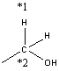

.. _databaseModification:

*********************
Database Modification
*********************
Note that the RMG-Py database is written in Python code where line indentations
determine the scope. When modifying the database, be sure to preserve all 
line indentations shown in the examples.

Modifying the Thermo Database
=============================

Creating Thermo Libraries
-------------------------

Adding Thermo Groups
--------------------

Adding Thermo to the Depository
-------------------------------

.. _kinetic-database-modification:

Modifying the Kinetics Database
===============================

For the casual user, it is recommended to use either a kinetic library or 
add to the training set instead of modifying the kinetic groups. 

Put kinetic parameters into a kinetic library when:

* A set of reaction rates were optimized together
* You know the reaction rate is not generalizable to similar species (perhaps due to catalysis or aromatic structures)
* No family exists for the class of reaction
* You are not confident about the accuracy of kinetic parameters

Put kinetic parameters into the training set when:

* You are confident on the accurcy of the kinetic parameter
* You wish for the reaction to be generalized to similar reactions in your mechanism

Adding Reaction Family
----------------------

There are several places in the RMG-database and RMG-Py source code where reaction family details are hard-coded. You should check all these when you create a new reaction family. Here are some of the places:

* ``RMG-database/input/kinetics/families/[family name]``
	* add folder for your family name
	* create ``groups.py``, ``rules.py`` and a template folder with species dictionary and ``reactions.py``.
	* fill the files with rate data that you plan to use.
	* Many tools exist to help with the conversion process:
		* ``convertKineticsLibraryToTrainingReactions.ipynb`` in ``RMG-database/scripts``
		* ``importChemkinLibrary.py`` in ``RMG-database/scripts``
* rmgpy.data.kinetics.family
	* ``applyRecipe``: swapping the atom labels (eg. `*1` and `*2`) around
	* ``getReactionPairs``: figuring out which species becomes which for flux analyses
	* ``__generateReactions``: correcting degeneracy eg. dividing by 2 for radical recombination
* rmgpy.data.kinetics.rules
	* ``processOldLibraryEntry``: determining units when importing RMG-Java database
	* ``getAllRules``: for radical recombination add reverse templates
* rmgpy.data.kinetics.groups
	* ``getReactionTemplate``: for radical recombination duplicate the template
* RMG-database/input/kinetics/families/recommended.py
	* allows the usage of the database with the recommended families. 

Creating Kinetics Libraries
---------------------------

To add a reaction library, simply create a folder bearing the library's name under
``RMG-database/input/kinetics/libraries``. You'll need to create two files:
``dictionary.txt`` and ``reactions.py``. The dictionary file contains the Adjacency lists
for all relevant species (can be generated using the `Molecule Search <http://rmg.mit.edu/molecule_search>`_
function of the rmg website, while the reactions file specifies the kinetics.
To conform to RMG's format, simply copy and modify an existing library.

At the top of the reactions file fill in the name and short (one line) and long descriptions.
The name must be identical to the folder's name. Then list the kinetics entries, each with a unique index number.

There are two flags relevant for pressure dependent library reactions that one should consider using:

1. **elementary_high_p**: Should be set to ``True`` for *elementary* unimolecular reactions (with only one reactant
and/or product) with a kinetics entry that has information about the high pressure kinetics, i.e., Troe or Lindemann,
PDepArrhenius or Chebyshev that are defined up to at least 100 bar, or Arrhenius that represents the high pressure limit
(i.e., not the measured rate at some low or medium experimental pressure). If set to ``True``, RMG will use the high pressure
limit rate when constructing pressure-dependent networks. The kinetics entry of the original library reaction will only be
updated if it is an Arrhenius type (will be replaced with either PDepArrhenius or Chebyshev, as specified in the
pressureDependent block of the input file). If set to ``False`` (the default value), RMG will not use the high pressure
limit rate in network exploration, and will not convert Arrhenius kinetics of library reactions that have no template
(a corresponding reaction family) into a pressure-dependent form.

2. **allow_pdep_route**: If set to ``True`` and RMG discovers a pressure-dependent reaction with the same reactants and products,
the latter *will* be considered in addition to the library reaction. This is useful for cases when more than one pathway connects
the same reactants and products, and some of these pathways are well-skipping reactions. If set to ``False`` (the default value),
similar network reactions will not be considered in the model generation.

The following formats are accepted as kinetics entries:

**Arrhenius** of the form :math:`k(T) = A \left( \frac{T}{T_0} \right)^n \exp \left( -\frac{E_\mathrm{a}}{RT} \right)`
(see `Arrhenius Class <http://reactionmechanismgenerator.github.io/RMG-Py/reference/kinetics/arrhenius.html>`_ for details)::

	entry(
        index = 1,
    	label = "H + O2 <=> O + OH",
    	degeneracy = 1,
    	kinetics = Arrhenius(A=(9.841e+13, 'cm^3/(mol*s)'), n=0, Ea=(15310, 'cal/mol'), T0=(1, 'K')),
    	shortDesc = u"This is a short description limited to one line, e.g. 'CBS-QB3'",
    	longDesc = u"""This is a long description, unlimited by number of lines.
    	These descriptions can be added to every kinetics type.""")

**MultiArrhenius** is the sum of multiple Arrhenius expressions (all apply to the same temperature range)
(see `MultiArrhenius Class <http://reactionmechanismgenerator.github.io/RMG-Py/reference/kinetics/multiarrhenius.html>`_ for details)::

	entry(
    	index = 2,
    	label = "O + H2 <=> H + OH",
    	degeneracy = 1,
		duplicate = True,
    	kinetics = MultiArrhenius(
        	arrhenius = [Arrhenius(A=(3.848e+12, 'cm^3/(mol*s)'), n=0, Ea=(7950, 'cal/mol'), T0=(1, 'K')),
            	Arrhenius(A=(6.687e+14, 'cm^3/(mol*s)'), n=0, Ea=(19180, 'cal/mol'), T0=(1, 'K'))]))

**ThirdBody** for pressure dependent reactions of the sort ``H2 + M <=> H + H + M``. ``efficiencies`` are optional and specify
the factor by which the rate is multiplies if the mentioned species is the third body collider. Note that for complex efficiency
behaviour, an efficiency of ``0`` can be set, and a seperate specific reaction can be defined
(see `ThirdBody Class <http://reactionmechanismgenerator.github.io/RMG-Py/reference/kinetics/thirdbody.html>`_ for details)::

	entry(
    	index = 3,
    	label = "H2 <=> H + H",
    	degeneracy = 1,
    	kinetics = ThirdBody(
        	arrheniusLow = Arrhenius(A=(4.58e+19, 'cm^3/(mol*s)'), n=-1.4, Ea=(104390, 'cal/mol'), T0=(1, 'K')),
        	efficiencies = {'[Ar]': 0, 'N#N': 1.01, '[H][H]': 2.55, 'O': 12.02, '[C-]#[O+]': 1.95, 'O=C=O': 3.83, 'C': 2.00, 'C=O': 2.50, 'CO': 3.00, 'CC': 3.00}))

	entry(
    	index = 4,
    	label = "H2 + Ar <=> H + H + Ar",
    	degeneracy = 1,
    	kinetics = Arrhenius(A=(5.176e+18, 'cm^3/(mol*s)'), n= 1.1, Ea=(104390, 'cal/mol'), T0=(1, 'K')))

**Troe** for pressure dependent reactions
(see `Troe Class <http://reactionmechanismgenerator.github.io/RMG-Py/reference/kinetics/troe.html>`_ for details)::

	entry(
    	index = 5,
    	label = "H + O2 <=> HO2",
    	degeneracy = 1,
    	kinetics = Troe(
        	arrheniusHigh = Arrhenius(A=(4.565e+12, 'cm^3/(mol*s)'), n=0.44, Ea=(0, 'cal/mol'), T0=(1, 'K')),
        	arrheniusLow = Arrhenius( A=(6.37e+20, 'cm^6/(mol^2*s)'), n = -1.72, Ea = (525, 'cal/mol'), T0 = (1, 'K')),
        	alpha=0.5, T3=(30, 'K'), T1=(90000, 'K'), T2=(90000, 'K'),
        	efficiencies = {'[Ar]': 0.6, '[He]': 0.71, 'N#N': 0.96, '[H][H]': 1.87, '[O][O]': 0.75, 'O': 15.81, '[C-]#[O+]': 1.90, 'O=C=O': 3.45, 'C': 2.00, 'C=O': 2.50, 'CO': 3.00, 'CC': 3.00}))

**Lindemann**
(see `Lindemann Class <http://reactionmechanismgenerator.github.io/RMG-Py/reference/kinetics/lindemann.html>`_ for details)::

	entry(
	    index = 6,
	    label = "CO + O <=> CO2",
	    degeneracy = 1,
	    kinetics = Lindemann(
	        arrheniusHigh = Arrhenius(A=(1.88e+11, 'cm^3/(mol*s)'), n=0, Ea=(2430, 'cal/mol'), T0=(1, 'K')),
	        arrheniusLow = Arrhenius(A = (1.4e+21, 'cm^6/(mol^2*s)'), n = -2.1, Ea = (5500, 'cal/mol'), T0 = (1, 'K')),
	        efficiencies = {'[Ar]': 0.87, '[He]': 2.50, 'O': 12.00, '[C-]#[O+]': 1.90, 'O=C=O': 3.80, 'C': 2.00, 'C=O': 2.50, 'CO': 3.00, 'CC': 3.00}))

**PDepArrhenius** where each Arrhenius expression corresponds to a different pressure, as specified.
Allowed pressure units are ``Pa``, ``bar``, ``atm``, ``torr``, ``psi``, ``mbar``
(see `PDepArrhenius Class <http://reactionmechanismgenerator.github.io/RMG-Py/reference/kinetics/pdeparrhenius.html>`_ for details)::

	entry(
	    index = 7,
	    label = "HCO <=> H + CO",
	    degeneracy = 1,
	    kinetics = PDepArrhenius(
	        pressures = ([1, 10, 20, 50, 100], 'atm'),
	        arrhenius = [
	            Arrhenius(A=(9.9e+11, 's^-1'), n=-0.865, Ea=(16755, 'cal/mol'), T0=(1, 'K')),
	            Arrhenius(A=(7.2e+12, 's^-1'), n=-0.865, Ea=(16755, 'cal/mol'), T0=(1, 'K')),
	            Arrhenius(A=(1.3e+13, 's^-1'), n=-0.865, Ea=(16755, 'cal/mol'), T0=(1, 'K')),
	            Arrhenius(A=(2.9e+13, 's^-1'), n=-0.865, Ea=(16755, 'cal/mol'), T0=(1, 'K')),
	            Arrhenius(A=(5.3e+13, 's^-1'), n=-0.865, Ea=(16755, 'cal/mol'), T0=(1, 'K'))]))

**MultiPDepArrhenius**
(see `MultiPDepArrhenius Class <http://reactionmechanismgenerator.github.io/RMG-Py/reference/kinetics/multipdeparrhenius.html>`_ for details)::

	entry(
	    index = 8,
	    label = "N2H2 <=> NNH + H",
	    degeneracy = 1,
	    duplicate = True,
	    kinetics = MultiPDepArrhenius(
	        arrhenius = [
	            PDepArrhenius(
	                pressures = ([0.1, 1, 10], 'atm'),
	                arrhenius = [
	                    Arrhenius(A=(5.6e+36, '1/s'), n=-7.75, Ea=(70250.4, 'cal/mol'), T0=(1, 'K')),
	                    Arrhenius(A=(1.8e+40, '1/s'), n=-8.41, Ea=(73390, 'cal/mol'), T0=(1, 'K')),
	                    Arrhenius(A=(3.1e+41, '1/s'), n=-8.42, Ea=(76043, 'cal/mol'), T0=(1, 'K'))]),
	            PDepArrhenius(
	                pressures = ([0.1, 1, 10], 'atm'),
	                arrhenius = [
	                    Arrhenius(A=(1.6e+37, '1/s'), n=-7.94, Ea=(70757, 'cal/mol'), T0=(1, 'K')),
	                    Arrhenius(A=(2.6e+40, '1/s'), n=-8.53, Ea=(72923, 'cal/mol'), T0=(1, 'K')),
	                    Arrhenius(A=(1.3e+44, '1/s'), n=-9.22, Ea=(77076, 'cal/mol'), T0=(1, 'K'))])]))

**Chebyshev**
(see `Chebyshev Class <http://reactionmechanismgenerator.github.io/RMG-Py/reference/kinetics/chebyshev.html>`_ for details)::

	entry(
	    index = 9,
	    label = "CH3 + OH <=> CH2(S) + H2O",
	    degeneracy = 1,
	    kinetics = Chebyshev(
	        coeffs = [
	            [12.4209, -0.799241, -0.299133, -0.0143012],
	            [0.236291, 0.856853, 0.246313, -0.0463755],
	            [-0.0827561, 0.0457236, 0.105699, 0.057531],
	            [-0.049145, -0.0760609, -0.0214574, 0.0247001],
	            [-0.00664556, -0.0412733, -0.0308561, -0.00959838],
	            [0.0111919, -0.00649914, -0.0106088, -0.0137528],
	        ],
	        kunits='cm^3/(mol*s)', Tmin=(300, 'K'), Tmax=(3000, 'K'), Pmin=(0.0013156, 'atm'), Pmax=(131.56, 'atm')))

Adding a specific collider
--------------------------

Only the ``Troe`` and ``Lindemann`` pressure dependent formats could be defined with a specific species as a third body collider, if needed. For example::

	entry(
	    index = 10,
	    label = "SO2 + O <=> SO3",
	    degeneracy = 1,
	    kinetics = Troe(
	        arrheniusHigh = Arrhenius(A=(3.7e+11, 'cm^3/(mol*s)'), n=0, Ea=(1689, 'cal/mol'), T0=(1, 'K')),
	        arrheniusLow = Arrhenius(A=(2.4e+27, 'cm^6/(mol^2*s)'), n=-3.6, Ea=(5186, 'cal/mol'), T0=(1, 'K')),
	        alpha = 0.442, T3=(316, 'K'), T1=(7442, 'K'), efficiencies={'O=S=O': 10, 'O': 10, 'O=C=O': 2.5, 'N#N': 0}))

	entry(
	    index = 11,
	    label = "SO2 + O (+N2) <=> SO3 (+N2)",
	    degeneracy = 1,
	    kinetics = Troe(
	        arrheniusHigh = Arrhenius(A=(3.7e+11, 'cm^6/(mol^2*s)'), n=0, Ea=(1689, 'cal/mol'), T0=(1, 'K')),
	        arrheniusLow = Arrhenius(A=(2.9e+27, 'cm^9/(mol^3*s)'), n=-3.58, Ea=(5206, 'cal/mol'), T0=(1, 'K')),
	        alpha=0.43, T3=(371, 'K'), T1=(7442, 'K'), efficiencies={}))

Adding New Kinetic Groups and Rate Rules
----------------------------------------

Decide on a Template
--------------------
First you need to know the template for your reaction to decide whether or not
to create new groups: 

#. Type your reaction into the kinetics search at http://rmg.mit.edu/database/kinetics/search/
#. Select the correct reaction
#. In the results search for "(RMG-Py rate rules)" and select that link. The kinetic family listed is the family of interest.
#. Scroll to the bottom and look at the end of the long description. There may be very long description of the averaging scheme, but the template for the reaction is the very last one listed:

.. image:: images/GroupSearch.png
	:align: center

Now you must determine whether the chosen template is appropriate.  A good rule
of thumb is to see if the all neighbours of the reacting atoms are as specified
as possible. For example, assume your species is ethanol

and RMG suggests the group::

	label = "C_sec",
	group = 
	"""
	1 *1 Cs  0 {2,S} {3,S} {4,S}
	2 *2 H   0 {1,S}
	3    R!H 0 {1,S}
	4    R!H 0 {1,S}
	""",

If you use the suggested groups you will not capture the effect of the alcohol 
group. Therefore it is better to make a new group. ::

	label = "C/H2/CsO",
	group = 
	"""
	1 *1 Cs  0 {2,S} {3,S} {4,S} {5,S}
	2 *2 H  0 {1,S}
	3    H  0 {1,S}
	4    O  0 {1,S}
	5    Cs 0 {1,S}
	""",

If you have determined the suggested groups is appropriate, skip to 
:ref:`kinetic-training-set` or :ref:`kinetic-rules`. Otherwise proceed to the 
next section for instructions on creating the new group.

Creating a New Group
--------------------

In the family's groups.py, you will need to add an entry of the format::

	entry(
		index = 61,
		label = "C_sec",
		group = 
	"""
	1 *1 Cs   0 {2,S} {3,S} {4,S} {5,S}
	2 *2 H   0 {1,S}
	3    C   0 {1,S}
	4    H   0 {1,S}
	5    R!H 0 {1,S}
	""",
		kinetics = None,
		reference = None,
		referenceType = "",
		shortDesc = u"""""",
		longDesc = u"""""",
	)

* The index can be any number not already present in the set
* The label is the name of the group.
* The group is the group adjacency list with the starred reacting atoms.
* The other attributes do not need to be filled for a group

Next, you must enter your new group into the tree. At the bottom of groups.py
you will find the trees. Place your group in the appropriate position. In the 
example given in the previous section, the new group would be added under the C_sec. ::

	L1: X_H
		L2: H2
		L2: Cs_H
			L3: C_pri
			L3: C_sec
				L4: C/H2/CsO
			L3: C_ter

.. _kinetic-rules:
			
Adding Kinetic Rules
--------------------
Rules give generalized kinetic parameters for a specific node template. In most
cases, your kinetic parameters describe a specific reaction in which case you
will want to add your reaction to the training set.
 
The rule must be added into rules.py in the form::

	entry(
		index = 150,
		label = "C/H/Cs3;O_rad/NonDeO",
		group1 = 
	"""
	1 *1 Cs  0 {2,S} {3,S} {4,S} {5,S}
	2 *2 H  0 {1,S}
	3    Cs 0 {1,S}
	4    Cs 0 {1,S}
	5    Cs 0 {1,S}
	""",
		group2 = 
	"""
	1 *3 O 1 {2,S}
	2    O 0 {1,S}
	""",
		kinetics = ArrheniusEP(
			A = (2800000000000.0, 'cm^3/(mol*s)', '*|/', 5),
			n = 0,
			alpha = 0,
			E0 = (16.013, 'kcal/mol', '+|-', 1),
			Tmin = (300, 'K'),
			Tmax = (1500, 'K'),
		),
		reference = None,
		referenceType = "",
		rank = 5,
		shortDesc = u"""Curran et al. [8] Rate expressions for H atom abstraction from fuels.""",
		longDesc = 
	u"""
	[8] Curran, H.J.; Gaffuri, P.; Pit z, W.J.; Westbrook, C.K. Combust. Flame 2002, 129, 253.
	Rate expressions for H atom abstraction from fuels.

	pg 257 A Comprehensive Modelling Study of iso-Octane Oxidation, Table 1. Radical:HO2, Site: tertiary (c)
	
	Verified by Karma James
	""",
	) 

* The index can be any number not already used in rules.py.
* The label is the name of the rule.
* The groups must have the adjacency list of the respective groups. Between them they should have all starred atoms from the recipe.
* The value and units of kinetic parameters must be given. 
	* Multiplicative uncertainty is given as ``'*\|/,' 5`` meaning within a factor of 5 
	* Additive uncertainty is given as ``'+\|/-', 2`` meaning plus or minus 2.
* Rank determines the priority of the rule when compared with other rules.
* The short description will appear in the annotated chemkin file.
* The long description only appears in the database.

.. _kinetic-training-set:

Adding Training Reactions
-------------------------

If you know the kinetics of a specific reaction, rather than a rate rule for a template, you can
add the kinetics to the database training set.  By default, RMG creates new rate rules from this 
training set, which in turn benefits the kinetics of similar reactions.  The new rate rules
are formed by matching the reaction to the most most specific template nodes within
the reaction's respective family. If you do not want the
training depository reactions to create new rate rules in the database, set the option for 
``kineticsDepositories`` within the ``database`` field in your input file to ::

    kineticsDepositories = ['!training'],

Currently, RMG's rate rule estimates overrides all kinetics depository kinetics, including training
reactions.  Unless the training reaction's rate rule ranks higher than the existing node, it 
will not be used.  If you want the training reaction to override the rate rule estimates, you should put the reaction into
a reaction library or seed mechanism.  

The easiest way to add training reactions to the database is via the RMG website.  First, search for 
the reaction using http://rmg.mit.edu/database/kinetics/search/ . This will automatically search 
the existing RMG database for the reaction, as well as identify the reaction family template
that this reaction matches.  If the reaction does not match any family, then it cannot be added to the 
training reactions.  Click the 'Create training rate from average' button underneath the kinetics plot 
for the reaction and edit the kinetics and reference descriptions for the reaction.  The atom labels
marking the reaction recipe actions (lose bond, add radical, etc.) will already be automatically 
labeled for you.  After editing the reaction data, write a short message for the reaction added under 
the 'Summary of changes' field, then click 'Save.'  You will need an account for the RMG website to 
make an entry.

.. note::

	If you are entering the reaction in the reverse direction of the family, you must still label the
	reactants and products with the atomLabels of the original reaction template.  Otherwise, RMG
	will not be able to locate the nodes in the group tree to match the reaction.
	
	Entries added in the reverse direction of the original template will use the current RMG job's 
	thermo database	to estimate the kinetics in the forward direction.  Therefore this value can differ
	depending on the order of thermo libraries used when running a job.
 
If adding the training reaction manually, first identify the reaction family of the reaction, then
go to the family's folder in ``RMG-database/input/kinetics/families/``.  Create a new kinetics entry
in the ``training.py`` file.  Make sure to apply the reaction recipe labels properly for the
reactants and products.

Pitfalls
--------
Be careful with the specificity when naming neighbouring atoms. On upper nodes,
you should try to be general so that you do not exclude reactions. 

Sibling nodes must be exclusive from one another so that there is no question
which group a molecule qualifies as. However, you do not need to be exhaustive and
list out every possibility.

Be sure to give errors whenever adding rules. If you don't know the uncertainty,
why do you trust the kinetics?

After you are done always check via populate reactions or the website, that your
modifications are behaving the way you expect.

Caveat regarding how rate rules are used by RMG and the rate parameters you input: because tunneling is
important for many chemical reactions, the rate of a reaction may not be easily represented by
a bi-Arrhenius fit. 3-parameter fits are more common. However, the resulting fit may report an
'activation energy' that is much different (possibly by 10+ kcals) than the the true barrier height. 
When RMG is assembling pressure-dependent networks, it will use barrier heights from rate rules. This can 
lead to very inaccurate rate calculations. To avoid this issue, try to ensure that your fitted arrhenius 
activation energy truly does reflect the reaction barrier height. 
