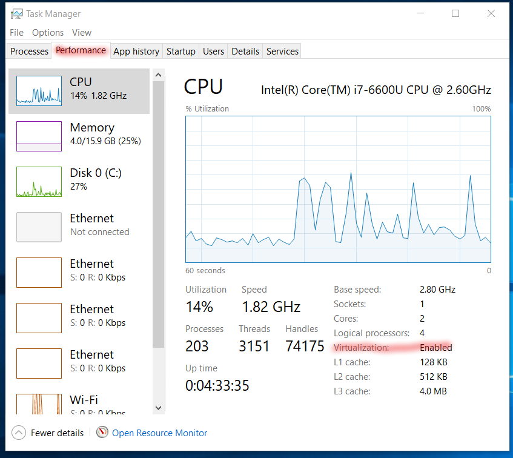
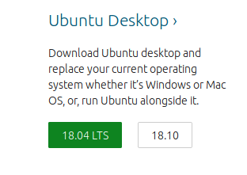

.. _virtualMachineSetup:

************************************************
Setting up a Linux Virtual Machine from Windows
************************************************

Checking if Virtualization Technology is Enabled
=================================================

While most PCs have CPUs that support running virtual machines (i.e. virtualization technology), it is possible that
this feature has been disabled in your BIOS settings. If this is the case, then you will have to enable this technology
in your BIOS settings.

First, check to see if virtualization technology is currently enabled on your computer by opening the Task Manager in
Windows 8/10. Click on the ``Performance`` tab--from here you can see if virtualization technology is enabled.

For Windows 7 or earlier you can download and run
`Microsoft's Virtualization Detection Tool <http://www.microsoft.com/en-us/download/details.aspx?id=592>`_.

If enabled, you can continue on with installing a virtual machine on your PC. If virtualization is currently disabled,
though, you will have to enable this from the BIOS setting on your computer. How to do this varies from PC to PC (we
recommend doing a quick google search for your make/model, as there are many instructions for this online), but the
basic steps are as follows:

1. Restart the PC. As soon as the PC turns back on, enter the BIOS settings (this usually involves pressing the ``F2``
   or ``F12`` keys, but will depend on your make/model). If you see the computer loading Windows then you have missed the
   opportunity, and should restart the PC to try again. If Secure Boot is enabled on your PC then there may be additional
   steps to reaching the BIOS settings (for example see these `instructions
   <https://www.laptopmag.com/articles/access-bios-windows-10>`_).

2. From the BIOS settings, find the section on virtualization, and enable the virtualization technology. Save these
   changes and restart the PC.

For more information, please see online tutorials like
`this one here <https://support.bluestacks.com/hc/en-us/articles/115003910391-How-can-I-enable-virtualization-VT-on-my-PC->`_.

**Note that changing your BIOS settings can be risky, so follow online tutorials carefully**. If you are unsure of what
to do even after looking for online tutorials, consider following the instructions for installing RMG inside the Linux
subsystem in Windows 10 (:ref:`linuxSubsystem`)

Downloading a Linux .iso File
================================

If this is your first time using a Linux operating system, we recommend using Ubuntu 18.04, as it is one of the most
popular Linux distributions out there, with plenty of support available online. Otherwise you are welcome to try out
any other Linux distribution you like (see `Linux DistroWatch`_).

.. _Linux DistroWatch: https://distrowatch.com/
.. _Ubuntu: https://www.ubuntu.com/#download

1. Go to the Ubuntu_ website and click on the download link for 18.04 LTS (Desktop, not Server). Note that newer
   versions of Ubuntu might be available, but we recommend downloading only the LTS (long term support) versions. Note that
   Ubuntu is completely free to download and use, so you do not need to make a donation if prompted.

2. The .iso file is typically around 2 GB in size, so the file will take a while to download. While this is happening,
   feel free to proceed with the remaining sections.

Choosing a VM Software
=========================

There a quite a few software options for running a virtual machine from Windows, including `VMware Workstation Pro`_
and `Oracle VirtualBox`_. VMware Workstation Pro is the recommended choice, though check to see if your institution has
access to it (since it is not free). If not, VirtualBox (which is free) runs well and will work just as fine. Use the
hyperlinks below to jump ahead to the setup instructions for the virtual machine software of your choice.

.. _VMware Workstation Pro: https://my.vmware.com/en/web/vmware/info/slug/desktop_end_user_computing/vmware_workstation_pro/15_0
.. _Oracle VirtualBox: https://www.virtualbox.org/wiki/Downloads

:ref:`WorkstationPro`

:ref:`VirtualBox`

.. _WorkstationPro:

Setting up a Linux Virtual Machine using Workstation Pro
==========================================================
1. Follow your institution's instructions for downloading VMware Workstation Pro and obtaining the required license key.

2. At the end of the installation process for Workstation Pro, remember to enter in the required license key.

    .. image:: images/VMware_license.png
        :align: center

3. From Workstation Pro click on the ``Create a New Virtual Machine`` icon.

    .. image:: images/VMware_new.png
        :align: center

4. Choose a typical installation.

    .. image:: images/VMware_typical.png
        :align: center

5. On the ``Guest Operating System Installation`` page, choose ``Installer disc image file (iso)`` and browse for the
   Ubuntu .iso file you downloaded previously. If found correctly you should see a message indicating that an Ubuntu
   operating system was detected.

    .. image:: images/VMware_iso.png
        :align: center

6. On the ``Specify Disk Capacity`` page create a disk with **no smaller than 50 GB**.

    .. image:: images/VMware_disk.png
        :align: center

7. At some point after finishing the install, you will want to go into the settings of the VM and increase the number
   of CPUs allocated to the VM as well as increasing the memory.

8. To continue with installing RMG, follow the instructions for Linux and Mac OSX systems.

.. _VirtualBox:

Setting up a Linux Virtual Machine using VirtualBox
==========================================================
1. Go to the `Oracle VirtualBox`_ website and click on the download link for "Windows hosts" (highlighted orange in the image below)

    .. image:: images/VirtualBoxDownload.png
        :align: center

2. Once the download is complete, launch the executable. Select the "Next" button a few times to install VirtualBox
   with the default settings. If prompted download any necessary drivers. After installation, launch VirtualBox.

    .. image:: images/VBoxInstall_1.png
        :align: center

    .. image:: images/VBoxInstall_2.png
        :align: center

    .. image:: images/VBoxInstall_3.png
        :align: center

    .. image:: images/VBoxInstall_4.png
        :align: center

    .. image:: images/VBoxInstall_5.png
        :align: center

    .. image:: images/VBoxInstall_6.png
        :align: center

3. From the VirtualBox Manager window, click on the blue star labeled "New" to begin creating your Linux virtual
   machine.

    .. image:: images/VBoxNew.png
        :align: center

4. Give your new virtual machine a name (it can be anything you want, so long as you can recognize it by its name).
   Make sure that the ``Type`` is set to ``Linux`` and that the version is set to ``Ubuntu (64-bit)``. Then click "Next".

    .. image:: images/VBox_VM_name.png
        :align: center

5. Move the slider for the memory size to the far right of the green section, giving your VM as much memory as you can
   without leaving too little for the host (Windows) OS.

    .. image:: images/VBox_memory.png
        :align: center

6. Create a virtual hard disk to store the data for your Linux VM by selecting ``Create a virtual hard disk now``.

    .. image:: images/VBox_create_hard_disk.png
        :align: center

7. Choose ``VDI`` as the virtual hard disk type.

    .. image:: images/VBox_VDI.png
        :align: center

8. Choose ``Dynamically allocated`` as the storage type, so that your virtual hard disk does not take up more space than
   it needs to.

    .. image:: images/VBox_dynamic_storage.png
        :align: center

9. Set the size of the virtual hard disk to be **no smaller than 50 GB**. If you chose ``dynamically allocated`` in the
   previous step the full 50 GB won't be used initially anyways.

    .. image:: images/VBox_disk_size.png
        :align: center

10. Click on the yellow gear labeled ``Settings``.

    .. image:: images/VBox_Settings.png
        :align: center

11. From the ``System`` menu (left column), go to the ``Processor`` tab and increase the number of CPUs all the way to
    the right side of the green region.

    .. image:: images/VBox_cpus.png
        :align: center

12. From the ``Display`` menu, go to the ``Screen`` tab and max out the video memory.

    .. image:: images/VBox_video_mem.png
        :align: center

13. From the ``Storage`` menu, click on the ``Adds optical drive`` icon (blue circle right next to ``Controller: IDE``
    to add the Ubuntu .iso file to the virtual machine.

    .. image:: images/VBox_IDE.png
        :align: center

    .. image:: images/VBox_optical_disk.png
        :align: center

    .. image:: images/VBox_browse_for_disk.png
        :align: center

    .. image:: images/VBox_choose_iso_1.png
        :align: center

14. Click "OK" to save all of the changes.

    .. image:: images/VBox_IDE_complete.png
        :align: center

15. Click on the green "Start" arrow to begin installing the Linux OS in your virtual machine

    .. image:: images/VBox_Start.png
        :align: center

    .. image:: images/VBox_Install_Ubuntu.png
        :align: center

    .. image:: images/VBox_Normal_Install.png
        :align: center

16. When you get to the page below, choose the option to ``Erase disk and install Ubuntu``. You can safely ignore the
    warning about this deleting all of your programs and data. This warning pertains ONLY to the blank virtual hard disk you
    created earlier. There is nothing you can do here that will delete your data on your host (Windows) system.

    .. image:: images/VBox_Erase_Disk_Okay.png
        :align: center

    .. image:: images/VBox_partitions.png
        :align: center

17. Continue with the installation, choosing a good username (we recommend choosing the same username as the one you use
    on your host OS or for your institution for example) and password (you may optionally select to login automatically on
    startup).

18. After installation is complete, the virtual machine should be up and running. To continue with installing RMG,
    follow the instructions either for binary (:ref:`anacondaUser`) or source installation (:ref:`anacondaDeveloper`)
    for the Linux Operating system.

