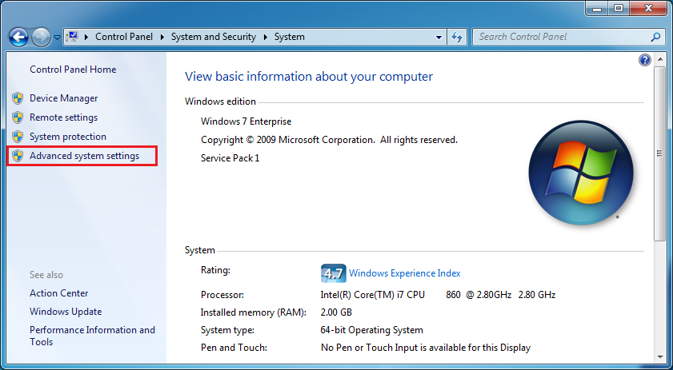
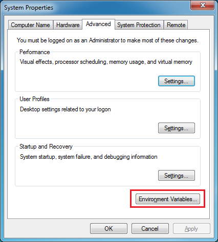

.. _windowsEnvironment:

************************************************
Setting up Windows Environment Variables for RMG
************************************************

Setting environment variables in Windows allows for easier shortcutting and usage of RMG scripts and packages.  

Setting the ``RMGPy`` variable
==============================

* If you have a search bar available in your start menu, search for "environment variables" and select "Edit environment variables for your account".  Alternatively, navigate to this settings window by first going to "Control Panel > System", then clicking "Advanced system settings".

* Once the "System Properties" window opens, click on "Environment Variables..." in the "Advanced" tab.

* Once the "Environment Variables" window opens, click on "New" under the "User variables".

.. image:: images/EnvironmentVariables.png
    :align: center

* Set a new variable with the name ``RMGPy`` with the appropriate value directed at your RMG path.

    
  If you installed the binary version of RMG, the environment value should be set to::

        C:\Anaconda\envs\rmg_env\Scripts\

  where ``C:\Anaconda`` can be replaced by wherever your Anaconda was installed.

  Your screen might look like this:

        .. image:: images/NewVariable.png
            :align: center

  If you are installing RMG by source, you can similarly set your ``RMGPy`` variable to the source directory, such as ::

        C:\Code\RMG-Py

* Click "Ok" on all screens to confirm the changes.

.. NOTE:: 
    If you set any new environment variables, you must close and reopen any command prompts previously open before the changes can take effect.

Optional: Setting a Permanent Anaconda Environment for RMG
==========================================================
If you use Anaconda solely for RMG, it may be more convenient to set your ``PATH`` variable
to be permanently directed to the RMG environment.  This will allow you to run RMG easily
without having to type ``activate rmg_env`` in the command prompt every time.

Similarly to setting the environment variable
for ``RMGPy``, go to "Edit environment variables for your account" and click edit on the ``PATH``
variable.  Replace the paths containing the Anaconda main directory with the RMG environment
in Anaconda.

For example a path such as ::

    C:\Anaconda\Scripts\

should be changed to::

    C:\Anaconda\envs\rmg_env\Scripts\

Note that ``C:\Anaconda`` should be wherever your Anaconda was installed.
