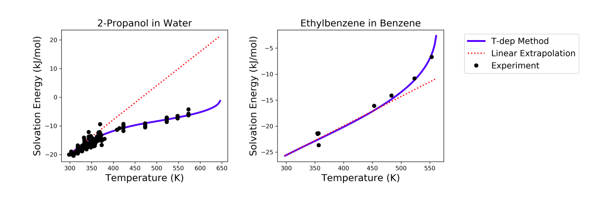

.. _liquids:

********************
Liquid Phase Systems
********************

To simulate liquids in RMG requires a module in your input file for liquid-phase::

    solvation(
        solvent='octane'
    )

Your reaction system will also be different (liquidReactor rather than simpleReactor)::

    liquidReactor(
        temperature=(500,'K'),
        initialConcentrations={
            "octane": (6.154e-3,'mol/cm^3'),
            "oxygen": (4.953e-6,'mol/cm^3')
        },
        terminationTime=(5,'s'),
        constantSpecies=['oxygen'],        
        sensitivity=['octane','oxygen'],
        sensitivityThreshold=0.001,

    )

To simulate the liquidReactor, one of the initial species / concentrations must be the solvent. If the solvent species does
not appear as the initial species, RMG run will stop and raise error. The solvent can be either reactive, or nonreactive.

In order for RMG to recognize the species as the solvent, it is important to use the latest version of the RMG-database, whose
solvent library contains solvent SMILES. If the latest database is used,  RMG can determine whether the species is the
solvent by looking at its molecular structure (SMILES or adjacency list).
If the old version of RMG-database without the solvent SMILES is used, then RMG can recognize the species as the solvent
only by its string name. This means that if the solvent is named "octane" in the solvation block and it is named "n-octane"
in the species and initialConcentrations blocks, RMG will not be able to recognize them as the same solvent species and raise
error because the solvent is not listed as one of the initial species.

For liquid phase generation, you can provide a list of species for which one concentration is held constant over time
(Use the keyword ``constantSpecies=[]`` with species labels separated by ``","``). To generate meaningful liquid phase oxidation mechanism, it is 
highly recommended to consider O2 as a constant species. To consider pyrolysis cases, it is still possible to obtain a mechanism without this option.
Expected results with ``Constant concentration`` option can be summarized with those 3 cases respectively presenting a generation with 0, 1 (oxygen only) 
and 2 constant species (oxygen and decane): 

.. image:: images/constantSPCeffect.png
	:align: center

As it creates a mass lost, it is recommended to avoid to put any products as a constant species.

For sensitivity analysis, RMG-Py must be compiled with the DASPK solver, which is done by default but has 
some dependency restrictions. (See :ref:`License Restrictions on Dependencies <dependenciesRestrictions>` for more details.) 
Like for the simpleReactor, the sensitivity and sensitivityThrehold are optional arguments for when the
user would like to conduct sensitivity analysis with respect to the reaction rate
coefficients for the list of species given for ``sensitivity``.  

Sensitivity analysis is conducted for the list of species given for ``sensitivity`` argument in the input file.  
The normalized concentration sensitivities with respect to the reaction rate coefficients dln(C_i)/dln(k_j) are saved to a csv file 
with the file name ``sensitivity_1_SPC_1.csv`` with the first index value indicating the reactor system and the second naming the index of the species 
the sensitivity analysis is conducted for.  Sensitivities to thermo of individual species is also saved as semi normalized sensitivities
dln(C_i)/d(G_j) where the units are given in 1/(kcal mol-1). The sensitivityThreshold is set to some value so that only
sensitivities for dln(C_i)/dln(k_j) > sensitivityThreshold  or dlnC_i/d(G_j) > sensitivityThreshold are saved to this file.  

Note that in the RMG job, after the model has been generated to completion, sensitivity analysis will be conducted
in one final simulation (sensitivity is not performed in intermediate iterations of the job).

Notes: sensitivity, sensitivityThreshold and constantSpecies are optionnal keywords.

Equation of state
=================
Specifying a liquidReactor will have two effects:

#. disable the ideal gas law renormalization and instead rely on the concentrations you specified in the input file to initialize the system.
#. prevent the volume from changing when there is a net stoichiometry change due to a chemical reaction (A = B + C).

Solvation thermochemistry
=========================

The next correction for liquids is solvation effects on the thermochemistry. By specifying a solvent in the input file, we load the solvent parameters to use.

The free energy change associated with the process of transferring a
molecule from the gas phase to the solvent phase at constant :math:`T` and :math:`P` is defined as the free
energy of solvation. Commonly, the standard state of the ideal gas and ideal solution at equal and dilute solute concentrations,
also known as the Ben-Naim standard state, is used for solvation free energy (:math:`\Delta G_{\rm solv}^{*}`) [BenNaim1987]_.
Solvation energy is added to the gas phase Gibbs free energy as a correction to estimate the free energy of the compound in a liquid phase:

.. math:: \Delta G_{\rm liquid}^{*} \approx \Delta G_{\rm f, gas}^{\circ} + \Delta G_{\rm solv}^{*}
	:label: liquid_phase_thermo

Many different methods have been developed for
computing solvation energies among which continuum dielectric and force
field based methods are popular. Not all of these methods are easy to
automate, and many are not robust i.e. they either fail or give
unreasonable results for certain solute-solvent pairs. CPU time and
memory (RAM) requirements are also important considerations. A fairly
accurate and fast method for computing :math:`\Delta G_{\rm solv}^{*}`, which is used in RMG, is the
LSER approach described below.

.. _useofthermolibrariesliquid:

Use of thermo libraries in liquid phase system
----------------------------------------------

As it is for gas phase simulation, thermo libraries listed in the input files are checked first to find thermo for a given species and return the first match.
As it exists two types of thermo libraries, (more details on :ref:`thermo libraries <thermoDatabase>`),
thermo of species matching a library in a liquid phase simulation is obtained following those two cases:

If library is a "liquid thermo library", thermo data are directly used without applying solvation on it.

If library is a "gas thermo library", thermo data are extracted and then corrections are applied on it using the :ref:`LSER method <lserToEstimateThermo>`
for this specific species-solvent system. 

.. note::
	Gas phase libraries can be declared first, liquid thermo libraries will still be tested first but the order will be respected if several liquid libraries are provided. 

.. _lserToEstimateThermo:

Use of Abraham LSER to estimate thermochemistry at 298 K
---------------------------------------------------------

The Abraham LSER provides an estimate of the the partition coefficient (:math:`K`)  of a solute (component 2)
between the vapor phase and a particular solvent (component 1) at 298 K:

.. math:: \log_{10} K = c + eE + sS + aA + bB + lL
	:label: AbModelEqn

where the partition coefficient is the ratio of the equilibrium concentrations of the solute in liquid and vapor phases

.. math:: K = \frac{c_{\rm 2, liquid}}{c_{\rm 2, gas}}
	:label: AbModelEqn

The Abraham model is used in RMG to estimate :math:`\Delta G_{\rm solv}^{*}` which is related to the :math:`K` of a solute according to the following expression:

.. math:: \Delta G_{\rm solv}^{*}({\rm 298 K}) = -RT \ln K \\
	= -2.303RT \log_{10} K
	:label: partition

The variables in the Abraham model represent solute (`E, S, A, B, V, L`) and solvent descriptors (`c, e, s, a, b, v, l`) 
for different interactions. The `sS` term is attributed to electrostatic interactions between the 
solute and the solvent (dipole-dipole interactions related to solvent dipolarity and the dipole-induced 
dipole interactions related to the polarizability of the solvent) [Vitha2006]_, [Abraham1999]_, [Jalan2010]_. The 
`lL` term accounts for the contribution from cavity formation and dispersion (dispersion interactions are 
known to scale with solute volume [Vitha2006]_, [Abraham1999]_. The `eE` term, like the `sS` term, 
accounts for residual contributions from dipolarity/polarizability related interactions for solutes 
whose blend of dipolarity/polarizability differs from that implicitly built into the `S` parameter [Vitha2006]_, [Abraham1999]_, [Jalan2010]_. 
The `aA` and `bB` terms account for the contribution of hydrogen bonding between the solute and 
the surrounding solvent molecules. H-bonding interactions require two terms as the solute (or solvent) 
can act as acceptor (donor) and vice versa. The descriptor `A` is a measure of the solute's ability 
to donate a hydrogen bond (acidity) and the solvent descriptor `a` is a measure of the solvent's ability 
to accept a hydrogen bond. A similar explanation applies to the `bB` term [Vitha2006]_, [Abraham1999]_, [Poole2009]_.

The enthalpy change associated with solvation at 298 K can be calculated from the Mintz LSER. Mintz et al. ([Mintz2007]_,
[Mintz2007a]_, [Mintz2007b]_, [Mintz2007c]_, [Mintz2007d]_, [Mintz2008]_, [Mintz2008a]_, [Mintz2009]_)
have developed a linear correlation similar to the Abraham model for estimating :math:`\Delta H_{\rm solv}^{*}`:

.. math:: \Delta H_{\rm solv}^{*}({\rm 298 K}) = c' + a'A+ b'B+ e'E+ s'S+ l'L
	:label: mintz

where `A, B, E, S` and `L` are the same solute descriptors used in the Abraham model for the estimation of
:math:`\Delta G_{\rm solv}^{*}`. The lowercase coefficients `c', a', b', e', s'` and `l'` depend only on the solvent and were obtained
by fitting to experimental data.

The solvent descriptors (`c, e, s, a, b, l, c', a', b', e', s', l'`) are largely treated as regressed empirical coefficients.
Parameters are provided in RMG's database for the following solvents:

#. acetonitrile
#. benzene
#. butanol
#. carbontet
#. chloroform
#. cyclohexane
#. decane
#. dibutylether
#. dichloroethane
#. dimethylformamide
#. dimethylsulfoxide
#. dodecane
#. ethanol
#. ethylacetate
#. heptane
#. hexadecane
#. hexane
#. isooctane
#. nonane
#. octane
#. octanol
#. pentane
#. toluene
#. undecane
#. water

Estimation of :math:`\Delta G_{\rm solv}^{*}` at other temperatures: linear extrapolation
------------------------------------------------------------------------------------------

To estimate :math:`\Delta G_{\rm solv}^{*}` at temperatures other than 298 K, a simple linear extrapolation can be employed.
For this approach, the enthalpy and entropy of solvation are assumed to be independent of temperature.
The entropy of solvation, :math:`\Delta S_{\rm solv}^{*}(\rm 298 K)`, is calculated from :math:`\Delta G_{\rm solv}^{*}(\rm 298 K)` and
:math:`\Delta H_{\rm solv}^{*}(\rm 298 K)` estimated from the Abraham and Mintz LSERs.

.. math:: \Delta S_{\rm solv}^{*}({\rm 298 K}) = \frac{\Delta H_{\rm solv}^{*}({\rm 298 K}) - \Delta G_{\rm solv}^{*}({\rm 298 K})}{\rm 298 K}
	:label: entropy_298K

Then :math:`\Delta G_{\rm solv}^{*}` at other temperatures is approximated by simple extrapolation assuming linear temperature dependence.

.. math:: \Delta G_{\rm solv}^{*}(T) = \Delta H_{\rm solv}^{*}({\rm 298 K}) - T\Delta S_{\rm solv}^{*}({\rm 298 K})
	:label: linear_extrapolation

This method provides a rapid, first-order approximation of the temperature dependence of solvation free energy. However,
since the actual solvation enthalpy and entropy vary with temperature, this approximation will deviate at temperatures
far away from 298 K. Looking at several experimental data, this approximation seems reasonable up to ~ 400 K.

Estimation of :math:`\Delta G_{\rm solv}^{*}` at other temperatures: temperature-dependent model
-------------------------------------------------------------------------------------------------

This method uses a piecewise function of K-factor to estimate more accurate temperature dependent solvation free energy.
The K-factor at infinite dilution (:math:`K_{2,1}^{\infty}`), also known as the vapor-liquid equilibrium ratio, is
defined as the ratio of the equilibrium mole fractions of the solute (component 2) in the gas and the liquid phases
of the solvent (component 1):

.. math:: K_{2,1}^{\infty} = \frac{y_{2}}{x_{2}}
	:label: linear_extrapolation

Recently, Chung et al. ([Chung2020]_) has shown that the following piecewise function combining two separate correlations
([Japas1989]_, [Harvey1996]_) can accurately predict the K-factor from room temperature up to the critical temperature
of the solvent

.. math:: {\rm For}\ \ T \leqslant 0.75T_{\rm c}:\ \ \ \ \ \ \ \ \ T_{\rm r}\ln K_{2,1}^{\infty} = A + B(1-T_{\rm r})^{0.355} + C(T_{\rm r})^{0.59}\exp (1-T_{\rm r})
	:label: piecewise_function_1

.. math:: {\rm For}\ \ 0.75T_{\rm c} \leqslant T < T_{\rm c}:\ \ \ \ \ \ \ \ \ \ T_{\rm r}\ln K_{2,1}^{\infty} = D(\frac{\rho_{1}^{\rm l}}{\rho_{\rm c, 1}}-1)
	:label: piecewise_function_2

where :math:`A, B, C, D` are empirical parameters unique for each solvent-solute pair, :math:`T_{\rm c}` is the critical
temperature of the solvent, :math:`T_{\rm r}` is the reduced temperature (:math:`T_{\rm r} = \frac{T}{T_{\rm c}}`),
:math:`\rho_{1}^{\rm l}` is the saturated liquid phase density of the solvent, and :math:`\rho_{\rm c, 1}` is the critical
density of the solvent. The transition temperature, :math:`0.75T_{\rm c}`, has been empirically chosen. All calculations
are performed at the solvent's saturation pressures such that K-factor is only a function of temperature.

Solvation free energy can be calculated from K-factor from the following relation

.. math:: \Delta G_{\rm solv}^{*} = RT\ln \left(\frac{K_{2,1}^{\infty} \rho_{1}^{\rm g}}{\rho_{1}^{\rm l}}\right)
	:label: Kfactor_dGsolv_conversion

where :math:`\rho_{1}^{\rm g}` is the saturated gas phase density of the solvent.

To solve for the four empirical parameters (A, B, C, D), we need four equations. The first two can be obtained by
enforcing the continuity in values and temperature gradient of the piecewise function at the transition temperature. The
last two can be obtained by making the K-factor value and its temperature gradient at 298 K match with those
estimated from the solvation free energy and enthalpy at 298 K. These lead to the following four linearly independent
equations to solve:

.. math:: {\rm At\ } T = {\rm 298 K} :\ \ \ \ \ \ \ \ \ \ \ \ \ \ \ \ \ \ \ \ \ \ \ \ A + B(1-T_{\rm r})^{0.355} + C(T_{\rm r})^{0.59}\exp{(1-T_{\rm r})} =T_{\rm r} \ln{K_{2,1}^{\infty}(298\ \rm K)}
	:label: condition1

.. math:: {\rm At\ } T = {\rm 298 K}:\ \ \ \ \ -\frac{0.355B}{T_{\rm c}}(1-T_{\rm r})^{-0.645} + \frac{C\exp{(1-T_{\rm r})}}{T_{\rm c}}\left(0.59(T_{\rm r})^{-0.41} - (T_{\rm r}^{*})^{0.59}\right) = \frac{{\rm d}\left(T_{\rm r} \ln{K_{2,1}^{\infty}}\right)}{{\rm d}T}\Big|_{T=298\ {\rm K}}
	:label: condition2

.. math:: {\rm At\ } T = 0.75T_{\rm c}:\ \ \ \ \ \ \ \ \ \ \ \ \ \ \ \ \ \ \ \ \ \ \ \ \ \ \ \ A + B(1-T_{\rm r})^{0.355} + C(T_{\rm r})^{0.59}\exp{(1-T_{\rm r})} = D\Big(\frac{\rho_{1}^{\rm l}}{\rho_{\rm c,1}} - 1 \Big)
	:label: condition3

.. math:: {\rm At\ } T = 0.75T_{\rm c}:\ \ \ \ \ \ \ \ \ \ \ \ \ -\frac{0.355B}{T_{\rm c}}(1-T_{\rm r})^{-0.645} + \frac{C\exp{(1-T_{\rm r})}}{T_{\rm c}}\left(0.59(T_{\rm r})^{-0.41} - (T_{\rm r})^{0.59}\right) = \frac{D}{\rho_{\rm c, 1}} \frac{{\rm d}\rho_{1}^{\rm l}}{{\rm d}T}\Big|_{T=0.75T_{\rm c}}
	:label: condition4

The temperature dependent liquid phase and gas phase densities of solvents can be evaluated at the solvent's saturation
pressure using CoolProp [Bell2014]_. CoolProp is an open source fluid modeling software based on Helmholtz energy equations
of state. It provides accurate estimations of fluid properties over the wide ranges of temperature and pressure for a variety
of fluids. With known solvents' densities, one can easily find the empirical parameters of the piecewise functions
by solving the linear equations above without using any experimental data.

This method has been tested for 47 solvent-solute pairs over a wide range of temperature, and the mean absolute error of
solvation free energies has been found to be 1.6 kJ/mol [Chung2020]_. Sample plots comparing the predictions made by this
temperature dependent method and the linear extrapolation method are shown below. The experimental data are obtained from the
Dortmund Databank integrated in SpringerMaterials [DDBST2014]_.

A sample ipython notebook script for temperature dependent K-factor and solvation free energy calculations can be found
under ``$RMG-Py/ipython/temperature_dependent_solvation_free_energy.ipynb``. These calculations are also available on
a web browser from the RMG website: `Solvation Search <https://rmg.mit.edu/database/solvation/search/>`_.

However not every solvent listed in the RMG solvent database is available in CoolProp. Here is a list of solvents
that are available in CoolProp and therefore are available for temperature dependent solvation calculations:

#. benzene
#. cyclohexane
#. decane
#. dichloroethane
#. dodecane
#. ethanol
#. heptane
#. hexane
#. nonane
#. octane
#. pentane
#. toluene
#. undecane
#. water

Current status of temperature dependent :math:`\Delta G_{\rm solv}^{*}` in RMG liquid reactor
----------------------------------------------------------------------------------------------

Currently, RMG uses the linear extrapolation method to estimate solvation free energy at temperatures other than 298 K.
The work is in progress to implement the temperature dependent solvation free energy estimation for available solvents.

Group additivity method for solute descriptor estimation
--------------------------------------------------------

Group additivity is a convenient way of estimating the thermochemistry for thousands of species sampled 
in a typical mechanism generation job. Use of the Abraham Model in RMG requires a similar approach 
to estimate the solute descriptors (`A, B, E, L,` and `S`). Platts et al. ([Platts1999]_) proposed such a scheme 
employing a set of 81 molecular fragments for estimating `B, E, L, V` and `S` and another set of 51 fragments for 
the estimation of `A`. These fragments are implemented in RMG but are limited to the compounds containing H, C,
O, N, and S. The value of a given descriptor for a molecule is obtained by summing the contributions from each
fragment found in the molecule and the intercept associated with that descriptor.

.. _diffusionLimited:

Diffusion-limited kinetics
==========================
The next correction for liquid-phase reactions is to ensure that bimolecular reactions do not exceed their diffusion
limits. The theory behind diffusive limits in the solution phase for bimolecular reactions is well established
([Rice1985]_) and has been extended to reactions of any order ([Flegg2016]_). The effective rate constant of a
diffusion-limited reaction is given by:

.. math::   k_{\mathrm{eff}} = \frac {k_{\mathrm{diff}} k_{\mathrm{int}}}{k_{\mathrm{diff}} + k_{\mathrm{int}}}
   :label: diffusive_limit

where :math:`k_\mathrm{int}` is the intrinsic reaction rate, and :math:`k_\mathrm{diff}` is the diffusion-limited rate, which is given
by:

.. math:: k_{\mathrm{diff}} = \left[\prod_{i=2}^N\hat{D}_i^{3/2}\right]\frac{4\pi^{\alpha+1}}{\Gamma(\alpha)}\left(\frac{\sigma}{\sqrt{\Delta_N}}\right)^{2\alpha}
   :label: smoluchowski

where :math:`\alpha=(3N-5)/2` and

.. math:: \hat{D}_i = D_i + \frac{1}{\sum_m^{i-1}D_m^{-1}}
   :label: diff1

.. math:: \Delta_N = \frac{\sum_{i=1}^N D_i^{-1}}{\sum_{i>m}(D_iD_m)^{-1}}
   :label: diff2

:math:`D_i` are the individual diffusivities and :math:`\sigma` is the Smoluchowski radius, which would usually be fitted to
experiment, but RMG approximates it as the sum of molecular radii. RMG uses the McGowan method for estimating
radii, and diffusivities are estimated with the Stokes-Einstein equation using experimental solvent 
viscosities (:math:`\eta(T)`):

.. math:: D_{i} = \frac{k_{B}T}{6\pi\,\eta\,r_{i}}
   :label: StokesEinstein

.. math:: \sigma = \sum_{i=1}^N r_{i}
   :label: Smoluchowski_radius

.. math:: r_{i} = \frac{\left(100\frac{3}{4}\frac{V_{i}}{\pi N_{A}}\right)^{1/3}}{100}
   :label: Raidus_from_McGowan_Volume

where :math:`k_B` is the Boltzmann constant, :math:`N_A` is the Avogadro number, :math:`r_i` is the individual molecular
radius in meters, and :math:`V_i` is the individual McGowan volume in cm3/mol divided by 100, which is equivalent to the
Abraham solute parameter, :math:`V`.

In a unimolecular to bimolecular reaction, for example, the forward rate
constant (:math:`k_f`) can be slowed down if the reverse rate (:math:`k_{r,\mathrm{eff}}`) is diffusion-limited
since the equilibrium constant (:math:`K_{eq}`) is not affected by diffusion limitations. In cases
where both the forward and the reverse reaction rates are multimolecular, the forward rate coefficients limited in the
forward and reverse directions are calculated and the limit with the smaller forward rate coefficient is used.  

The viscosity of the solvent is calculated Pa.s using the solvent specified in the command line 
and a correlation for the viscosity using parameters :math:`A, B, C, D, E`:

.. math:: \ln \eta = A + \frac{B}{T} + C\log T + DT^E
    :label: viscosity
       
To build accurate models of liquid phase chemical reactions you will also want to modify your kinetics libraries or correct gas-phase rates for intrinsic barrier solvation corrections (coming soon).

.. _exampleLiquidPhase:

Example liquid-phase input file, no constant species
=====================================================
This is an example of an input file for a liquid-phase system::

    # Data sources
    database(
        thermoLibraries = ['primaryThermoLibrary'],
        reactionLibraries = [],
        seedMechanisms = [],
        kineticsDepositories = ['training'],
        kineticsFamilies = 'default',
        kineticsEstimator = 'rate rules',
    )

    # List of species
    species(
        label='octane',
        reactive=True,
        structure=SMILES("C(CCCCC)CC"),
    )

    species(
        label='oxygen',
        reactive=True,
        structure=SMILES("[O][O]"),
    )

    # Reaction systems
    liquidReactor(
        temperature=(500,'K'),
        initialConcentrations={
            "octane": (6.154e-3,'mol/cm^3'),
            "oxygen": (4.953e-6,'mol/cm^3')
        },
        terminationTime=(5,'s'),
    )

    solvation(
        solvent='octane'
    )

    simulator(
        atol=1e-16,
        rtol=1e-8,
    )

    model(
        toleranceKeepInEdge=1E-9,
        toleranceMoveToCore=0.01,
        toleranceInterruptSimulation=0.1,
        maximumEdgeSpecies=100000
    )

    options(
        units='si',
        generateOutputHTML=False,
        generatePlots=False,
        saveSimulationProfiles=True,
    )

Example liquid-phase input file, with constant species
=======================================================
This is an example of an input file for a liquid-phase system with constant species::

    # Data sources
    database(
        thermoLibraries = ['primaryThermoLibrary'],
        reactionLibraries = [],
        seedMechanisms = [],
        kineticsDepositories = ['training'],
        kineticsFamilies = 'default',
        kineticsEstimator = 'rate rules',
    )

    # List of species
    species(
        label='octane',
        reactive=True,
        structure=SMILES("C(CCCCC)CC"),
    )

    species(
        label='oxygen',
        reactive=True,
        structure=SMILES("[O][O]"),
    )

    # Reaction systems
    liquidReactor(
        temperature=(500,'K'),
        initialConcentrations={
            "octane": (6.154e-3,'mol/cm^3'),
            "oxygen": (4.953e-6,'mol/cm^3')
        },
        terminationTime=(5,'s'),
        constantSpecies=['oxygen'],
    )

    solvation(
        solvent='octane'
    )

    simulator(
        atol=1e-16,
        rtol=1e-8,
    )

    model(
        toleranceKeepInEdge=1E-9,
        toleranceMoveToCore=0.01,
        toleranceInterruptSimulation=0.1,
        maximumEdgeSpecies=100000
    )

    options(
        units='si',
        generateOutputHTML=False,
        generatePlots=False,
        saveSimulationProfiles=True,
    )

.. [BenNaim1987] \ A. Ben-Naim. "Solvation Thermodynamics." *Plenum Press* (1987).

.. [Vitha2006] \ M. Vitha and P.W. Carr. "The chemical interpretation and practice of linear solvation energy relationships in chromatography." *J. Chromatogr. A.* **1126(1-2)**, p. 143-194 (2006).

.. [Abraham1999] \ M.H. Abraham et al. "Correlation and estimation of gas-chloroform and water-chloroformpartition coefficients by a linear free energy relationship method." *J. Pharm. Sci.* **88(7)**, p. 670-679 (1999).

.. [Jalan2010] \ A. Jalan et al. "Predicting solvation energies for kinetic modeling." *Annu. Rep.Prog. Chem., Sect. C* **106**, p. 211-258 (2010).

.. [Poole2009] \ C.F. Poole et al. "Determination of solute descriptors by chromatographic methods." *Anal. Chim. Acta* **652(1-2)** p. 32-53 (2009).

.. [Platts1999] \ J. Platts and D. Butina. "Estimation of molecular linear free energy relation descriptorsusing a group contribution approach." *J. Chem. Inf. Comput. Sci.* **39**, p. 835-845 (1999).

.. [Mintz2007] \ C. Mintz et al. "Enthalpy of solvation correlations for gaseous solutes dissolved inwater and in 1-octanol based on the Abraham model." *J. Chem. Inf. Model.* **47(1)**, p. 115-121 (2007).

.. [Mintz2007a] \ C. Mintz et al. "Enthalpy of solvation corrections for gaseous solutes dissolved in benzene and in alkane solvents based on the Abraham model." *QSAR Comb. Sci.* **26(8)**, p. 881-888 (2007).

.. [Mintz2007b] \ C. Mintz et al. "Enthalpy of solvation correlations for gaseous solutes dissolved in toluene and carbon tetrachloride based on the Abraham model." *J. Sol. Chem.* **36(8)**, p. 947-966 (2007).

.. [Mintz2007c] \ C. Mintz et al. "Enthalpy of solvation correlations for gaseous solutes dissolved indimethyl sulfoxide and propylene carbonate based on the Abraham model." *Thermochim. Acta* **459(1-2)**, p, 17-25 (2007).

.. [Mintz2007d] \ C. Mintz et al. "Enthalpy of solvation correlations for gaseous solutes dissolved inchloroform and 1,2-dichloroethane based on the Abraham model." *Fluid Phase Equilib.* **258(2)**, p. 191-198 (2007).

.. [Mintz2008] \ C. Mintz et al. "Enthalpy of solvation correlations for gaseous solutes dissolved inlinear alkanes (C5-C16) based on the Abraham model." *QSAR Comb. Sci.* **27(2)**, p. 179-186 (2008).

.. [Mintz2008a] \ C. Mintz et al. "Enthalpy of solvation correlations for gaseous solutes dissolved inalcohol solvents based on the Abraham model." *QSAR Comb. Sci.* **27(5)**, p. 627-635 (2008).

.. [Mintz2009] \ C. Mintz et al. "Enthalpy of solvation correlations for organic solutes and gasesdissolved in acetonitrile and acetone." *Thermochim. Acta* **484(1-2)**, p. 65-69 (2009).

.. [Chung2020] \ Y. Chung et al. "Temperature dependent vapor-liquid equilibrium and solvation free energy estimation from minimal data." *AIChE Journal* **66(6)**, e16976 (2020).

.. [Japas1989] \ M.L. Japas and J.M.H. Levelt Sengers. "Gas solubility and Henry's law near the solvent's critical point." *AIChE Journal* **35(5)**, p. 705-713 (1989).

.. [Harvey1996] \ A.H. Harvey. "Semiempirical correlation for Henry's constants over large temperature ranges." *AIChE Journal* **42(5)**, p. 1491-1494 (1996).

.. [Bell2014] \ I.H. Bell et al. "Pure and pseudo-pure fluid thermophysical property evaluation and the open source thermophysical property library CoolProp." *Industrial & Engineering Chemistry Research* **53(6)**, p. 2498-2508 (2014).

.. [DDBST2014] \ "Dortmund Data Bank Software and Separation Technology GmbG, <Version 2014 03>." *Dortmund Data Bank integrated in SpringerMaterials* (2014). `<https://materials.springer.com.>`_.

.. [Rice1985] \ S.A. Rice. "Diffusion-limited reactions." In *Comprehensive Chemical Kinetics*, EditorsC.H. Bamford, C.F.H. Tipper and R.G. Compton. **25**, (1985).

.. [Flegg2016] \ M.B. Flegg. "Smoluchowski reaction kinetics for reactions of any order." *SIAM J. Appl. Math.* **76(4)**, p. 1403-1432 (2016).
