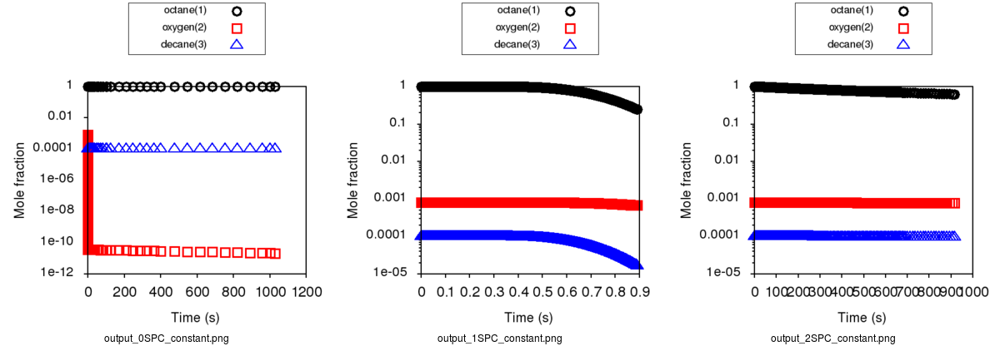

.. _liquids:

********************
Liquid Phase Systems
********************

To simulate liquids in RMG requires a module in your input file for liquid-phase::

    solvation(
        solvent='octane'
    )

Your reaction system will also be different (liquidReactor rather than simpleReactor)::

    liquidReactor(
        temperature=(500,'K'),
        initialConcentrations={
            "octane": (6.154e-3,'mol/cm^3'),
            "oxygen": (4.953e-6,'mol/cm^3')
        },
        terminationTime=(5,'s'),
        constantSpecies=['oxygen'],        
        sensitivity=['octane','oxygen'],
        sensitivityThreshold=0.001,

    )

To simulate the liquidReactor, one of the initial species / concentrations must be the solvent. If the solvent species does
not appear as the initial species, RMG run will stop and raise error. The solvent can be either reactive, or nonreactive.

In order for RMG to recognize the species as the solvent, it is important to use the latest version of the RMG-database, whose
solvent library contains solvent SMILES. If the latest database is used,  RMG can determine whether the species is the
solvent by looking at its molecular structure (SMILES or adjacency list).
If the old version of RMG-database without the solvent SMILES is used, then RMG can recognize the species as the solvent
only by its string name. This means that if the solvent is named "octane" in the solvation block and it is named "n-octane"
in the species and initialConcentrations blocks, RMG will not be able to recognize them as the same solvent species and raise
error because the solvent is not listed as one of the initial species.

For liquid phase generation, you can provide a list of species for which one concentration is held constant over time
(Use the keyword ``constantSpecies=[]`` with species labels separated by ``","``). To generate meaningful liquid phase oxidation mechanism, it is 
highly recommended to consider O2 as a constant species. To consider pyrolysis cases, it is still possible to obtain a mechanism without this option.
Expected results with ``Constant concentration`` option can be summarized with those 3 cases respectively presenting a generation with 0, 1 (oxygen only) 
and 2 constant species (oxygen and decane): 

As it creates a mass lost, it is recommended to avoid to put any products as a constant species.

For sensitivity analysis, RMG-Py must be compiled with the DASPK solver, which is done by default but has 
some dependency restrictions. (See :ref:`License Restrictions on Dependencies <dependenciesRestrictions>` for more details.) 
Like for the simpleReactor, the sensitivity and sensitivityThrehold are optional arguments for when the
user would like to conduct sensitivity analysis with respect to the reaction rate
coefficients for the list of species given for ``sensitivity``.  

Sensitivity analysis is conducted for the list of species given for ``sensitivity`` argument in the input file.  
The normalized concentration sensitivities with respect to the reaction rate coefficients dln(C_i)/dln(k_j) are saved to a csv file 
with the file name ``sensitivity_1_SPC_1.csv`` with the first index value indicating the reactor system and the second naming the index of the species 
the sensitivity analysis is conducted for.  Sensitivities to thermo of individual species is also saved as semi normalized sensitivities
dln(C_i)/d(G_j) where the units are given in 1/(kcal mol-1). The sensitivityThreshold is set to some value so that only
sensitivities for dln(C_i)/dln(k_j) > sensitivityThreshold  or dlnC_i/d(G_j) > sensitivityThreshold are saved to this file.  

Note that in the RMG job, after the model has been generated to completion, sensitivity analysis will be conducted
in one final simulation (sensitivity is not performed in intermediate iterations of the job).

Notes: sensitivity, sensitivityThreshold and constantSpecies are optionnal keywords.

Equation of state
=================
Specifying a liquidReactor will have two effects:

#. disable the ideal gas law renormalization and instead rely on the concentrations you specified in the input file to initialize the system.
#. prevent the volume from changing when there is a net stoichiometry change due to a chemical reaction (A = B + C).

Solvation thermochemistry
=========================

The next correction for liquids is solvation effects on the thermochemistry. By specifying a solvent in the input file, we load the solvent parameters to use.

The free energy change associated with the process of transferring a
molecule from the gas phase to the solvent phase is defined as the free
energy of solvation (ΔGsolv). RMG calculates liquid/solvated phase free energy of species
by adding the free energy of solvation to the gas phase free energy:

.. math:: ΔG_{liq} = ΔG_{gas} + ΔG_{solv}
	:label: liquidPhaseΔG

Many different methods have been developed for
computing solvation energies among which continuum dielectric and force
field based methods are popular. Not all of these methods are easy to
automate, and many are not robust i.e. they either fail or give
unreasonable results for certain solute-solvent pairs. CPU time and
memory (RAM) requirements are also important considerations. A fairly
accurate and fast method for computing ΔGsolv, which is used in RMG, is the
LSER approach described below. For certain solvents whose thermophysical
properties can be calculated by CoolProp module, RMG can estimate the temperature
dependence of ΔGsolv more accurately by combining two correlations. The details are explained below.

.. _useofthermolibrariesliquid:

Use of thermo libraries in liquid phase system
----------------------------------------------

As it is for gas phase simulation, thermo libraries listed in the input files are checked first to find thermo for a given species and return the first match.
As it exists two types of thermo libraries, (more details on :ref:`thermo libraries <thermoDatabase>`),
thermo of species matching a library in a liquid phase simulation is obtained following those two cases:

If library is a "liquid thermo library", thermo data are directly used without applying solvation on it.

If library is a "gas thermo library", thermo data are extracted and then corrections are applied on it using the :ref:`LSER method <lserToEstimateThermo>`
for this specific species-solvent system. 

.. note::
	Gas phase libraries can be declared first, liquid thermo libraries will still be tested first but the order will be respected if several liquid libraries are provided. 

.. _lserToEstimateThermo:

Use of Abraham and Mintz LSERs to estimate thermochemistry at 298 K
-------------------------------------------------------------------

The Abraham LSER provides an estimate of the the partition coefficient (more specifically, the 
log (base 10) of the partition coefficient) of a solute between the vapor phase and a particular solvent 
(`K`\ :sub:`vs`\ ) (also known as gas-solvent partition coefficient) at 298 K:

.. math:: \log K_{vs} = c + eE + sS + aA + bB + lL
	:label: AbModelEqn

The Abraham model is used in RMG to estimate ΔG which is related to the `K`\ :sub:`vs`\  of a solute according to the following expression:

.. math:: ΔG_{solv} = -RT \ln K_{vs} \\
	= -2.303RT \log K_{vs}
	:label: partition

The variables in the Abraham model represent solute (`E, S, A, B, V, L`) and solvent descriptors (`c, e, s, a, b, v, l`) 
for different interactions. The `sS` term is attributed to electrostatic interactions between the 
solute and the solvent (dipole-dipole interactions related to solvent dipolarity and the dipole-induced 
dipole interactions related to the polarizability of the solvent) [Vitha2006]_, [Abraham1999]_, [Jalan2010]_. The 
`lL` term accounts for the contribution from cavity formation and dispersion (dispersion interactions are 
known to scale with solute volume [Vitha2006]_, [Abraham1999]_. The `eE` term, like the `sS` term, 
accounts for residual contributions from dipolarity/polarizability related interactions for solutes 
whose blend of dipolarity/polarizability differs from that implicitly built into the `S` parameter [Vitha2006]_, [Abraham1999]_, [Jalan2010]_. 
The `aA` and `bB` terms account for the contribution of hydrogen bonding between the solute and 
the surrounding solvent molecules. H-bonding interactions require two terms as the solute (or solvent) 
can act as acceptor (donor) and vice versa. The descriptor `A` is a measure of the solute's ability 
to donate a hydrogen bond (acidity) and the solvent descriptor `a` is a measure of the solvent's ability 
to accept a hydrogen bond. A similar explanation applies to the `bB` term [Vitha2006]_, [Abraham1999]_, [Poole2009]_.

Recently, Mintz et al. ([Mintz2007]_, [Mintz2007a]_, [Mintz2007b]_, [Mintz2007c]_, [Mintz2007d]_, [Mintz2008]_, [Mintz2008a]_, [Mintz2009]_) have developed linear correlations similar to the Abraham model for estimating ΔHsolv at 298 K:

.. math:: ΔH_{solv}(298 K) = c' + a'A+ b'B+ e'E+ s'S+ l'L
	:label: mintz

where `A, B, E, S` and `L` are the same solute descriptors used in the Abraham model for the estimation of ΔGsolv. The lowercase coefficients `c', a', b', e', s'` and `l'` depend only on the solvent and were obtained by fitting to experimental data. In RMG, this equation and together with ΔGsolv(298 K) can be used to calculate ΔSsolv(298 K):

.. math:: ΔS_{solv}(298 K) = \frac{ΔH_{solv}(298 K) - ΔG_{solv}(298 K)}{298 K}
	:label: ΔS_at_298K

The solvent descriptors (`c, e, s, a, b, l, c', a', b', e', s', l'`) are largely treated as regressed empirical coefficients. Parameters are provided in RMG's database for the following solvents:

#. acetonitrile
#. benzene
#. butanol
#. carbontet
#. chloroform
#. cyclohexane
#. decane
#. dibutylether
#. dichloroethane
#. dimethylformamide
#. dimethylsulfoxide
#. dodecane
#. ethanol
#. ethylacetate
#. heptane
#. hexadecane
#. hexane
#. isooctane
#. nonane
#. octane
#. octanol
#. pentane
#. toluene
#. undecane
#. water

Group additivity method for solute descriptor estimation
--------------------------------------------------------

Group additivity is a convenient way of estimating the thermochemistry for thousands of species sampled 
in a typical mechanism generation job. Use of the Abraham Model in RMG requires a similar approach 
to estimate the solute descriptors (`A, B, E, L,` and `S`). Platts et al. ([Platts1999]_) proposed such a scheme employing a set of 81 molecular fragments for estimating `B, E, L, V` and `S` and another set of 51 fragments for the estimation of `A`. Only those fragments containing C, H and O are implemented in order to match RMG's existing capabilities. The value of a given descriptor for a molecule is obtained by summing the contributions from each fragment found in the molecule and the intercept associated with that descriptor.

Estimation of ΔGsolv at temperatures higher than 298 K
------------------------------------------------------

For estimating ΔGsolv at temperatures other than 298 K, RMG implements two different methods depending on whether the solvent's thermophysical
properties can be calculated via CoolProp. (details about CoolProp is written in Method 2)

**Method 1: Linear T-dependence of ΔGsolv**

For the solvents not available in CoolProp, ΔHsolv and ΔSsolv are assumed to be independent of temperature, and ΔGsolv at other temperature is found by the following extrapolation:

.. math:: ΔG_{solv}(T) = ΔH_{solv}(298 K) - TΔS_{solv}(298 K)
	:label: linear_ΔG_T-dependence

|
| **Method 2: Combined correlations to predict nonlinear T-dependence of ΔGsolv**

If the solvents are available in CoolProp, a more accurate method combining two correlations is used to predict nonlinear temperature dependence of ΔGsolv.
In 1989, Japas and Levelt Sengers ([Japas1989]_) derived a simple relationship between K-factor (:math:`K^{∞}_{2,1}`) and the solvent's density
based on the asymptotic behavior of the temperature derivative. Their work showed that near the solvent's critical point,
the following linear relation between :math:`T \ln K^{∞}_{2,1}` and the solvent's density holds:

.. math:: T \ln K^{∞}_{2,1} = D(ρ^{l}_{1} - ρ_{c,1})
	:label: Japas&LeveltSengers

where :math:`ρ^{l}_{1}`, :math:`ρ_{c,1}`, and `D` represent the molar density of the solvent at T, the critical molar density of the solvent,
and the empirical parameter respectively. The subscripts `1` and `2` each represent the solvent and solute. K-factor is defined as the ratio of solute’s equilibrium mole fractions in the
gas phase (:math:`y_{2}`) and the solvent phase (:math:`x_{2}`) for an infinitely dilute binary mixture, and it is directly
related to ΔGsolv:

.. math:: K^{∞}_{2,1}(T) = \frac{y_{2}}{x_{2}}
	:label: K-factor_definition

.. math:: ΔG_{solv}(T) = RT \ln{(\frac{K^{∞}_{2,1}(T)P^{vap}_{1}(T)}{RTρ^{l}_{1}(T)})}
	:label: ΔG_and_K-factor_relationship

where :math:`P^{vap}_{1}` is the vapor pressure of the solvent. A number of studies ([Harvey1990]_, [Plyasunova2004]_) have
revealed that this asymptotic linear behavior is ubiquitos in dilute mixtures and can be extended to relatively lower temperature
regions. This relationship is incredibly simple in that it only requires two points to find the slope.
Harvey ([Harvey1996]_) later proposed a 3-parameter correlation including additional terms to describe low temperature behavior:

.. math:: T \ln K^{∞}_{2,1} = A + B(1 - \frac{T}{T_{c,1}})^{0.355} + CT^{0.59}\exp{(1 - \frac{T}{T_{c,1}})}
	:label: Harvey

where :math:`T_{c,1}` represents the solvent's critical temperature and `A`, `B`, and `C` represent the empirical parameters.
The two correlations by Japas & Levelt Sengers and Harvey were evaluated, and a comparison with several experimental
data showed that using Harvey's correlation for low temperature region and Japas & Levelt Sengers' correlation for
high temperature region provided the most accurate estimations. The transition temperature between the low and high temperature
regions is determined as the point 35% away from 298 K to :math:`T_{c,1}`. The final combined correlations are:

For :math:`298 K ≤ T < T_{tran}` :

.. math:: T \ln K^{∞}_{2,1} = A + B(1 - \frac{T}{T_{c,1}})^{0.355} + CT^{0.59}\exp{(1 - \frac{T}{T_{c,1}})}

For :math:`T_{tran} ≤ T < T_{c,1}` :

.. math:: T \ln K^{∞}_{2,1} = D(ρ^{l}_{1} - ρ_{c,1})

The parameters (`A, B, C, D`) are obtained by imposing the following equality constraints:

| 1) @ 298 K:  :math:`T \ln K^{∞}_{2,1}` (Harvey) :math:`=`  :math:`T \ln K^{∞}_{2,1}` (Abraham LSER)
|
| 2) @ 298 K:  :math:`\frac{d(T \ln K^{∞}_{2,1})}{dT}` (Harvey) :math:`=`  :math:`\frac{d(T \ln K^{∞}_{2,1})}{dT}` (Mintz LSER)
|
| 3) @ :math:`T_{tran}` :  :math:`T \ln K^{∞}_{2,1}` (Harvey) :math:`-`  :math:`T \ln K^{∞}_{2,1}` (Japas & LeveltSengers) = 0
|
| 4) @ :math:`T_{tran}` :  :math:`\frac{d(T \ln K^{∞}_{2,1})}{dT}` (Harvey) :math:`-`  :math:`\frac{d(T \ln K^{∞}_{2,1})}{dT}` (Japas & LeveltSengers) = 0

The temperature derivatives of the Harvey's correlation are calculated algebraically while the temperature derivatives from
the Mintz LSER and Japas & Levelt Sengers' correlation are estimated using the finite difference method:

    Harvey:  :math:`\frac{d(T \ln K^{∞}_{2,1})}{dT} =` :math:`-\frac{0.355B}{T_{c,1}} (1 - \frac{T}{T_{c,1}})^{-0.645} +` :math:`C\exp{(1 - \frac{T}{T_{c,1}})} (0.59T^{-0.41} -`  :math:`\frac{T^{0.59}}{T_{c,1}}` :math:`)`

    Mintz LSER and Japas & Levelt Sengers:  :math:`\frac{d(T \ln K^{∞}_{2,1})}{dT} ≈ \frac{T \ln K^{∞}_{2,1}@(T+ΔT) - T \ln K^{∞}_{2,1}@(T)}{ΔT}`

After all the parameters are determined, :math:`K^{∞}_{2,1}` is converted into ΔGsolv using Equation (8). The ΔGsolv
comparison among the experimental data, the linear T-dependence method, and the combined correlation method are shown in the figure below
for two different solution systems.

.. image:: images/dGsolvComparison.PNG
	:align: center

where the experimental data for the ethylene in water system is obtained from Harvey ([Harvey1996]_) and the experimental
data from the ethylbenzene in benzene system is obtained from Kesselman et al. ([Kesselman1968]_), Kutsarov et al. ([Kutsarov1993]_),
and Al-Ghamdi et al. ([AlGhamdi2001]_). The figure above shows that the combined correlation (method 2) is able to predict
ΔGsolv more accurately than the linear T-dependence (method 1) can. However, for the ethylbenzene in benzene, method 1 is
also able to estimate fairly accurate ΔGsolv values at all temperature range.

| In order to use this combined correlation method, it is required that the molar volume and vapor pressure of the solvent can be calculated at
| any temperature. Recently, Bell et al. ([Bell2014]_) developed an open-source thermophysical property libraries CoolProp, which can provide
| thermodynamic and transport properties for 122 working fluids. The equations of state implemented in CoolProp can provide highly accurate
| pure fluid models. Among the 25 solvents in RMG's database, the following 14 solvents can be found in CoolProp:

#. benzene
#. cyclohexane
#. decane
#. dichloroethane
#. dodecane
#. ethanol
#. heptane
#. hexane
#. nonane
#. octane
#. pentane
#. toluene
#. undecane
#. water

For the solvents listed above, CoolProp can directly compute the partition coefficient (`K`\ :sub:`vs`\ ) at any temperature,
allowing RMG to directly compute ΔGsolv from the following expression:

.. math:: ΔG_{solv}(T) = -RT \ln K_{vs}(T)
	:label: partition2

|

**Caution on the liquid reactor thermo output file**

When the method 1 of ΔGsolv estimation is used, :math:`ΔH_{solv}(298 K)` and :math:`ΔS_{solv}(298 K)` are added to gas
phase enthalpy (:math:`H(T)`) and entropy (:math:`S(T)`) as constant terms, and the final thermo output would correspond to:

.. math:: C_{P, liquid}(T) = C_{P, gas}(T)
.. math:: H_{liquid}(T)= = H_{gas}(T) + ΔH_{solv}(298K)
.. math:: S_{liquid}(T) = S_{gas}(T) + ΔS_{solv}(298K)
.. math:: G_{liquid}(T) = H_{liquid}(T) - TS_{liquid}(T)

Notice that the final heat capacity is the gas phase heat capacity in this case. Because the heat capacity is not used
in the liquid phase reactor, this does not affect the simulation result.

| When the method 2 of ΔGsolv estimation is used, the liquid phase free energy is first computed by adding ΔGsolv to Ggas:

.. math:: G_{liquid}(T) = G_{gas}(T) + ΔG_{solv}(T)

Then, the NASA polynomial is fitted to the resulting :math:`G_{liquid}(T)` for the temperature range of 298 K to the
critical temperature of the solvent. Because the NASA polynomial is originally designed for gas phase thermo,
the :math:`G_{liquid}` values estimated from the fitted NASA model deviate a little from the :math:`G_{liquid}` values
before the fitting as shown below when the temperature is too close to the critical temperature of the solvent.

.. image:: images/dGLiquidFitted.PNG
	:align: center

Also, because the NASA polynomial is a heat capacity model that should be fitted to the heat capacity data
rather than the free energy data, the resulting enthalpy, entropy, and heat capacity from the fitted NASA model may contain
some error. The users should be aware that only the liquid phase free energy in the thermo output file is accurate in this case
and the enthalpy, entropy, and heat capacity may have some error. Moreover, the output thermo values are only valid from
298 K to the critical temperature of the solvent. Yet, because the heat capacity, enthalpy, and entropy are not used
in the liquid phase reactor, these error do not affect the simulation result. Only the free energy is used to calculate the
equilibrium constant and the reverse reaction rates.

Pressure effect on ΔGsolv
-------------------------

For liquid phase reactions, all the solvent's properties and solvation ΔGsolv are evaluated along the solvent's saturation curve
and thus are only functions of temperature. Majer et al. ([Majer2008]_) showed that the pressure effect is much greater for
the solutes with greater molar volumes. However, their result also indicates that unless the pressure is higher than
the solvent's vapor pressure by 2 or greater orders of magnitude, the pressure effect on ΔGsolv is negligible even for
relatively big solutes. Thus, pressure effect is neglected for liquid phase reactions in RMG.

Diffusion-limited kinetics
==========================
The next correction for liquid-phase reactions is to ensure that bimolecular reactions do not exceed their diffusion limits. The theory behind diffusive limits in solution phase reactions is well established ([Rice1985]_) and the effective rate constant of a bimolecular reaction is given as:

.. math::   k_{\textrm{eff}} = \frac {4\pi R\mathcal{D} k_{\textrm{int}}}{4\pi R\mathcal{D} + k_{\textrm{int}}}
   :label: diffusive_limit

where `k`\ :sub:`int` is the intrinsic reaction rate, `R` is the sum of radii of the reactants and 
`D` is the sum of the diffusivities of the reacting species. RMG uses the McGowan method for estimating 
radii, and diffusivities are estimated with the Stokes-Einstein equation using experimental solvent 
viscosities (`\eta` (T)).  In a unimolecular to bimolecular reaction, for example, the forward rate 
constant (`k`\ :sub:`f`\ ) can be slowed down if the reverse rate (`k`\ :sub:`r, eff`\ ) is diffusion 
limited since the equilibrium constant (`K`\ :sub:`eq`\ ) is not affected by diffusion limitations. In cases 
where both the forward and the reverse reaction rates are bimolecular, both diffusive limits are 
estimated and RMG uses the direction with the larger magnitude.

The viscosity of the solvent is calculated Pa.s using the solvent specified in the command line 
and a correlation for the viscosity using parameters `A, B, C, D, E`:

.. math:: \ln \eta = A + \frac{B}{T} + C\log T + DT^E
    :label: viscosity
       
To build accurate models of liquid phase chemical reactions you will also want to modify your kinetics libraries or correct gas-phase rates for intrinsic barrier solvation corrections (coming soon).

.. _exampleLiquidPhase:

Example liquid-phase input file, no constant species
====================================================
This is an example of an input file for a liquid-phase system::

    # Data sources
    database(
        thermoLibraries = ['primaryThermoLibrary'],
        reactionLibraries = [],
        seedMechanisms = [],
        kineticsDepositories = ['training'],
        kineticsFamilies = 'default',
        kineticsEstimator = 'rate rules',
    )

    # List of species
    species(
        label='octane',
        reactive=True,
        structure=SMILES("C(CCCCC)CC"),
    )

    species(
        label='oxygen',
        reactive=True,
        structure=SMILES("[O][O]"),
    )

    # Reaction systems
    liquidReactor(
        temperature=(500,'K'),
        initialConcentrations={
            "octane": (6.154e-3,'mol/cm^3'),
            "oxygen": (4.953e-6,'mol/cm^3')
        },
        terminationTime=(5,'s'),
    )

    solvation(
        solvent='octane'
    )

    simulator(
        atol=1e-16,
        rtol=1e-8,
    )

    model(
        toleranceKeepInEdge=1E-9,
        toleranceMoveToCore=0.01,
        toleranceInterruptSimulation=0.1,
        maximumEdgeSpecies=100000
    )

    options(
        units='si',
        saveRestartPeriod=None,
        generateOutputHTML=False,
        generatePlots=False,
        saveSimulationProfiles=True,
    )

Example liquid-phase input file, with constant species
======================================================
This is an example of an input file for a liquid-phase system with constant species::

    # Data sources
    database(
        thermoLibraries = ['primaryThermoLibrary'],
        reactionLibraries = [],
        seedMechanisms = [],
        kineticsDepositories = ['training'],
        kineticsFamilies = 'default',
        kineticsEstimator = 'rate rules',
    )

    # List of species
    species(
        label='octane',
        reactive=True,
        structure=SMILES("C(CCCCC)CC"),
    )

    species(
        label='oxygen',
        reactive=True,
        structure=SMILES("[O][O]"),
    )

    # Reaction systems
    liquidReactor(
        temperature=(500,'K'),
        initialConcentrations={
            "octane": (6.154e-3,'mol/cm^3'),
            "oxygen": (4.953e-6,'mol/cm^3')
        },
        terminationTime=(5,'s'),
        constantSpecies=['oxygen'],
    )

    solvation(
        solvent='octane'
    )

    simulator(
        atol=1e-16,
        rtol=1e-8,
    )

    model(
        toleranceKeepInEdge=1E-9,
        toleranceMoveToCore=0.01,
        toleranceInterruptSimulation=0.1,
        maximumEdgeSpecies=100000
    )

    options(
        units='si',
        saveRestartPeriod=None,
        generateOutputHTML=False,
        generatePlots=False,
        saveSimulationProfiles=True,
    )

.. [Vitha2006] \ M. Vitha and P.W. Carr. "The chemical interpretation and practice of linear solvation energy relationships in chromatography." *J. Chromatogr. A.* **1126(1-2)**, p. 143-194 (2006).

.. [Abraham1999] \ M.H. Abraham et al. "Correlation and estimation of gas-chloroform and water-chloroformpartition coefficients by a linear free energy relationship method." *J. Pharm. Sci.* **88(7)**, p. 670-679 (1999).

.. [Jalan2010] \ A. Jalan et al. "Predicting solvation energies for kinetic modeling." *Annu. Rep.Prog. Chem., Sect. C* **106**, p. 211-258 (2010).

.. [Poole2009] \ C.F. Poole et al. "Determination of solute descriptors by chromatographic methods." *Anal. Chim. Acta* **652(1-2)** p. 32-53 (2009).

.. [Platts1999] \ J. Platts and D. Butina. "Estimation of molecular linear free energy relation descriptorsusing a group contribution approach." *J. Chem. Inf. Comput. Sci.* **39**, p. 835-845 (1999).

.. [Mintz2007] \ C. Mintz et al. "Enthalpy of solvation correlations for gaseous solutes dissolved inwater and in 1-octanol based on the Abraham model." *J. Chem. Inf. Model.* **47(1)**, p. 115-121 (2007).

.. [Mintz2007a] \ C. Mintz et al. "Enthalpy of solvation corrections for gaseous solutes dissolved in benzene and in alkane solvents based on the Abraham model." *QSAR Comb. Sci.* **26(8)**, p. 881-888 (2007).

.. [Mintz2007b] \ C. Mintz et al. "Enthalpy of solvation correlations for gaseous solutes dissolved in toluene and carbon tetrachloride based on the Abraham model." *J. Sol. Chem.* **36(8)**, p. 947-966 (2007).

.. [Mintz2007c] \ C. Mintz et al. "Enthalpy of solvation correlations for gaseous solutes dissolved indimethyl sulfoxide and propylene carbonate based on the Abraham model." *Thermochim. Acta* **459(1-2)**, p, 17-25 (2007).

.. [Mintz2007d] \ C. Mintz et al. "Enthalpy of solvation correlations for gaseous solutes dissolved inchloroform and 1,2-dichloroethane based on the Abraham model." *Fluid Phase Equilib.* **258(2)**, p. 191-198 (2007).

.. [Mintz2008] \ C. Mintz et al. "Enthalpy of solvation correlations for gaseous solutes dissolved inlinear alkanes (C5-C16) based on the Abraham model." *QSAR Comb. Sci.* **27(2)**, p. 179-186 (2008).

.. [Mintz2008a] \ C. Mintz et al. "Enthalpy of solvation correlations for gaseous solutes dissolved inalcohol solvents based on the Abraham model." *QSAR Comb. Sci.* **27(5)**, p. 627-635 (2008).

.. [Mintz2009] \ C. Mintz et al. "Enthalpy of solvation correlations for organic solutes and gasesdissolved in acetonitrile and acetone." *Thermochim. Acta* **484(1-2)**, p. 65-69 (2009).

.. [Rice1985] \ S.A. Rice. "Diffusion-limited reactions". In *Comprehensive Chemical Kinetics*, EditorsC.H. Bamford, C.F.H. Tipper and R.G. Compton. **25**, (1985).

.. [Japas1989] \ M.L. Japas and J.M.H. Levelt Sengers. "Gas solubility and Henry's law near the solvent's critical point." *AIChE Journal.* **35**, p. 705-713 (1989).

.. [Bell2014] \ I.H. Bell et al. "Pure and pseudo-pure fluid thermophysical property evaluation and the open-source thermophysical property library CoolProp." *Ind. Eng. Chem. Res.* **53**, p. 2498-2508 (2014).

.. [Harvey1990] \ A.H. Harvey et al. "Limiting vs. apparent critical behavior of Henry's constants and K factors." *AIChE Journal.* **36**, p. 1901-1904 (1990).

.. [Plyasunova2004] \ A.V. Plyasunova et al. "Prediction of the Krichevskii parameter for volatile nonelectrolytes in water." *Fluid Phase Equilib.* **222-223**, p. 19-24 (2004).

.. [Harvey1996] \ A. H. Harvey. "Semiempirical correlation for Henry's constants over large temperature ranges." *AIChE Journal.* **42(5)**, p. 1491-1494 (1996).

.. [Majer2008] \ V. Majer et al. "Henry's law constant and related coefficients for aqueous hydrocarbons, CO2 and H2S over a wide range of temperature and pressure." *Fluid Phase Equilib.* **272**, p. 65-74 (2008).

.. [Kesselman1968] \ W. D. Kesselman el al. "Vapor-liquid equilibrium data for benzene-alkylbenzene systems." *J. Chem. Eng. Data* **13**, p. 34-36 (1968).

.. [Kutsarov1993] \ R. K. Kutsarov et al. "Liquid-vapor phase equilibrium of binary C6-C8 aromatic hydrocarbon systems." *Zh. Prikl. Khim.* **66** p. 567-573 (1993).

.. [AlGhamdi2001] \ A. M. Al-Ghamdi and V. N. Kabadi. "High temperature VLE for benzene-ethylbenzene system." *J. Chem. Eng. Data* **46** p. 1330-1332 (2001).