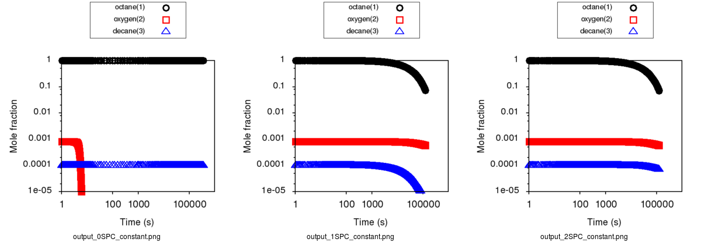

.. _surfaces:

*****************************************************
Heterogeneous Catalysis Systems and Surface Reactions
*****************************************************

Need to describe:
 * input file
     * surfacereactor - done, waiting for review
         * surface site density - done, waiting for review
     *  binding energies - done, waiting for review
 * how to represent adsorbates
     * atom types (X, Xv, Xo) - done, waiting for review
     * van der Waals (same chemgraph, no bond) - done, waiting for review
 * reaction family set (how to choose them in input file, with and without gas phase) - done, waiting for review
 * reaction libraries - done, waiting for review

theory:
* linear scaling relationships - done, waiting for review

other things to update:
* table of atom types in users/rmg/database/introduction.rst 
* table of atom types in reference/molecule/atomtype.rst

Several surface specific features need to be considered when setting up an input file for RMG-Cat reaction mechanism generation, as they cause certain aspects of it to deviate from the standard gas-phase RMG input file.

Firstly, RMG-Cat can model constant temperature and volume systems for surface reactions. The temperature, initial pressure, initial mole fractions of the reactant species, initial surface coverages, catalytic surface area to volume ratio in the reactor and surface site density are defined for each individual reaction system in the input file. As for the simple reactor model in RMG, the initial mole fractions are defined using the label for the species in the species block. It can include gas-phase and/or adsorbed species. The surface site density is the amount of active catalytic sites per unit surface, and varies depending on the catalyst in question.

The following is an example of a surface reactor system for catalytic combustion of methane over a Pt catalyst::

    surfaceReactor(
        temperature=(800,'K'),
        initialPressure=(1.0, 'bar'),
        initialGasMoleFractions={
            "CH4": 0.0500,
            "O2": 0.1995,
            "N2": 0.7505,
        },
        initialSurfaceCoverages={
            "X": 1.0,
        },
        surfaceVolumeRatio=(1.0e4, 'm^-1'),
        surfaceSiteDensity=(2.72e-9, 'mol/cm^2'),
        terminationConversion = { "CH4":0.9,}
        terminationRateRatio=0.01
    )

It is also required to provide the adsorption energies of C, N, O and H on the surface being investigated in the input file for RMG-Cat to generate a mechanism. This enables application of linear scaling relations, see below (add: link to LSR chapter). The following is an example where the default binding energies of the four atoms on Pt(111) have been added in the input file database module::

    bindingEnergies = { # default values for Pt(111)
                       'H':(-2.479, 'eV/molecule'),
                       'O':(-3.586, 'eV/molecule'),
                       'C':(-6.750, 'eV/molecule'),
                       'N':(-4.352, 'eV/molecule'),
                       }
                       

Adsorbate representation
========================
Adsorbates are represented using chemical graph theory (ChemGraph), such that atoms are represented by nodes and bonds between them by edges. This way each adsorbate is represented by an adjacency list (add: link to main rmg adjacency list documentation).
Specific to RMG-Cat is the metal-adsorbate bond for adsorbates. Firstly, there needs to be a species representation for the binding site in the RMG-Cat input file. This can be added as follows::

    species(
        label='X',
        reactive=True,
        structure=adjacencyList("1 X u0"),
    )

The surface binding sites 'X' can either be vacant, 'Xv', or occupied, 'Xo' in which case it has a molecule adsorbed on it.

Adsorbates in RMG-Cat can currently have one or two surface binding sites, and can be bound to the sites with single, double, triple or quadruple bonds. The following is an example for the adjacency list of adsorbed methoxy with one binding site::

    structure=adjacencyList("
    1 X  u0 p0 c0 {3,S}
    2 C  u0 p0 c0 {3,S} {4,S} {5,S} {6,S}
    3 O  u0 p2 c0 {1,S} {2,S}
    4 H  u0 p0 c0 {2,S}
    5 H  u0 p0 c0 {2,S}
    6 H  u0 p0 c0 {2,S}
    "),
    
Additionally, the adsorbates in RMG-Cat can be physisorbed (have a van der Waals bond to the surface). The adjacency lists for physisorbed species are structured the same way as for other adsorbates, except that there is no bond edge for the binding site. Following is an adjacency list for physisorbed methane::

    structure=adjacencyList("
    1 X  u0 p0 c0
    2 C  u0 p0 c0 {3,S} {4,S} {5,S} {6,S}
    3 H  u0 p0 c0 {2,S}
    4 H  u0 p0 c0 {2,S}
    5 H  u0 p0 c0 {2,S}
    6 H  u0 p0 c0 {2,S}
    "),

This implementation currently does not distinguish between different binding sites on a given facet. Instead, the lowest energy binding site for a given adsorbate is assumed, consistent with the mean-field approach of the kinetics ([Goldsmith2017]_).

Use of thermo libraries for surface reaction systems
-------------------------------------------------------
For surface species, thermo libraries provided in the input files are checked first for an exact match of a given adsorbate, and those thermodynamic properties are used. In order to predict the thermodynamic properties for species that are not in the database, RMG-Cat uses a precompiled adsorption correction with the thermodynamic properties of the gas-phase precursor ([Goldsmith2017]_).

Following is an example for how a thermo library for species adsorbed on platinum is provided in the input file database module::

    thermoLibraries=['surfaceThermoPt']
    
This can be added along with other gas-phase reaction libraries for coupling of gas-phase and surface reactions, but all of the libraries are in the folder ``RMG-database/input/thermo/libraries/`` in the latest version.

The folder ``RMG-database/input/thermo/groups/`` contains the adsorption corrections for the change in thermodynamic properties of a species upon adsorption from the gas-phase. Currently the database has adsorption corrections for nickel (adsorptionNi.py) and platinum (adsorptionPt.py).

An example of an adsorption correction entry is shown below::

    entry(
        index = 40,
        label = "C-*R3",
        group =
    """
    1 X  u0 p0 c0 {2,S}
    2 C  u0 p0 c0 {1,S} {3,[S,D]} {4,[S,D]}
    3 R  u0 px c0 {2,[S,D]}
    4 R  u0 px c0 {2,[S,D]}
    """,
        thermo=ThermoData(
            Tdata=([300, 400, 500, 600, 800, 1000, 1500], 'K'),
            Cpdata=([-0.45, 0.61, 1.42, 2.02, 2.81, 3.26, 3.73], 'cal/(mol*K)'),
            H298=(-41.64, 'kcal/mol'),
            S298=(-32.73, 'cal/(mol*K)'),
        ),
        shortDesc=u"""Came from CH3 single-bonded on Pt(111)""",
        longDesc=u"""Calculated by Katrin Blondal at Brown University using statistical mechanics (files: compute_NASA_for_Pt-adsorbates.ipynb and compute_NASA_for_Pt-gas_phase.ipynb). Based on DFT calculations by Jelena Jelic at KIT.
                DFT binding energy: -1.770 eV.
                Linear scaling parameters: ref_adatom_C = -6.750 eV, psi = -0.08242 eV, gamma_C(X) = 0.250.

       CR3
       |
    ***********
    """
    )

Here, R in the label 'C-*R3' represents any atom, where the H atoms in methyl have been replaced by wild cards. This enables RMG-Cat to determine which species in the thermo database is the closest match for the adsorbate in question, using a hierachical tree for functional groups. This is defined at the bottom of the adsorption corrections files, e.g.::

    tree(
    """
    L1: R*
        L2: R*single_chemisorbed
            L3: C*
                L4: Cq*
                L4: C#*R
                    L5: C#*CR3
                    L5: C#*NR2
                    L5: C#*OR
                L4: C=*R2
                    L5: C=*RCR3
                    L5: C=*RNR2
                    L5: C=*ROR
                L4: C=*(=R)
                    L5: C=*(=C)
                    L5: C=*(=NR)
                L4: C-*R3
                    L5: C-*R2CR3
                    ...

When RMG-Cat has found the closest match, it reads the corresponding adsorption correction from the database and uses it with the thermo of the original adsorbate's gas-phase precursor to estimate its enthalpy, entropy and heat capacity.

Reaction families and libraries for surface reaction systems
------------------------------------------------------------
In the latest version of the RMG database, surface reaction families have been added. These include adsorption/desorption, bond fission and H abstraction ([Goldsmith2017]_). For surface reaction families to be considered in the mechanism generation, the 'surface' kinetics family keyword needs to be included in the database section of the input file as follows::

    kineticsFamilies =['surface','default']
    
This allows for RMG-Cat to consider both surface and gas reaction families. If inlcuding only surface reactions is desired, that can be attained by removing the 'default' keyword.

For surface reactions proposed by reaction families that do not have an exact match in the internal database of reactions, Arrhenius parameters are estimated according to a set of rules specific to that reaction family. The estimation rules are derived automatically from the database of known rate coefficients and formulated as Brønsted-Evans-Polanyi relationships ([Goldsmith2017]_).

The user can provide a surface reaction library containing a set of preferred rate coefficients for the mechanism. Just like for gas-phase reaction libraries, values in the provided reaction library are automatically used for the respective proposed reactions. The reactions in the reaction library are not required to be a part of the predefined reaction families ([Goldsmith2017]_).

Following is an example where a mechanism for catalytic partial oxidation of methane on platinum by Quiceno et al. ([Deutschmann2006]_) is provided as a reaction library in the database section of the input file::

    reactionLibraries = [('Surface/CPOX_Pt/Deutschmann2006', False)]   

Gas-phase reaction libraries should be included there as well for accurate coupled gas-phase/surface mechanism generation.

The following is a list of the current pre-packaged surface reaction libraries in RMG-Cat:

+-------------------------------------------------------------+------------------------------------------------------------------------------------------+
|Library                                                      |Description                                                                               |
+=============================================================+==========================================================================================+
|Surface/Deutschmann_Ni                                       |Steam- and CO2-Reforming as well as Oxidation of Methane over Nickel-Based Catalysts|
+-------------------------------------------------------------+------------------------------------------------------------------------------------------+
|Surface/CPOX_Pt/Deutschmann2006                              |High-temperature catalytic partial oxidation of methane over platinum                                                               |
+-------------------------------------------------------------+---------------------------------------------------------------------
---------------------+

Linear scaling relations
==========================
In surface reaction mechanism generation with RMG-Cat, linear scaling relations are used to investigate surface reaction systems occurring on surfaces that do not have DFT-based values in the database ([Mazeau2019]_). This is especially useful for alloy catalysts as conducting DFT calculations for such systems is impractical. Linear scaling relations for heterogeneous catalysis are based on the finding of Abild-Pedersen et al. ([Abild2007]_) that the adsorption energies of hydrogen-containing molecules of carbon, oxygen, sulfur, and nitrogen on transition metal surfaces scale linearly with the adsorption energy of the surface-bonded atom. Using this linear relationship, the energy of a species (`AH`\ :sub:`x`\ ) on any metal M2 can be estimated from the known energy on metal M1, :math:`\Delta E_{M1}^{AH_x}`, and the adsorption energies of atom A on the two metals M1 and M2 as follows:

.. math:: \Delta E_{M2}^{AH_x}=\Delta E_{M1}^{AH_x}+\gamma(x)(\Delta E_{M2}^A - \Delta E_{M1}^A),    
    :label: LSReqn
    
where

.. math:: \gamma (x)=(x_{max}-x)/x_{max}, 
    :label: gammaeqn

is the is the slope of the linear relationship between (`AH`\ :sub:`x`\ ) and A, and (`x`\ :sub:`max`\ ) is the maximum number of hydrogen atoms that can bond to the central atom A.
Since the adsorption energy of (`AH`\ :sub:`x`\ ) is proportional to adsorption energies on different metals, full calculations for every reaction intermediate on every metal are not necessary. Therefore, having this implemented in RMG-Cat allows for independent model generation for any metal surface. By effect it enables the expedient, high-throughput screening of catalysts for any surface catalyzed reaction of interest ([Mazeau2019]_).

Example input file: methane steam reforming
-------------------------------------------------------

This is a simple input file steam reforming of methane 

.. literalinclude:: ../../../../examples/rmg/catalysis/methane_steam/input.py

Example input file: methane oxidation
--------------------------------------------------------

This is an input file for catalytic partial oxidation (CPOX) of methane

.. literalinclude:: ../../../../examples/rmg/catalysis/ch4_o2/input.py

.. [Goldsmith2017] \ C.F. Goldsmith and R.H. West. "Automatic Generation of Microkinetic Mechanisms for Heterogeneous Catalysis." *J. Phys. Chem. C.* **121(18)**, p. 9970–9981 (2017).

.. [Deutschmann2006] \ R. Quiceno, J. Pérez-Ramírez, J. Warnatz and O. Deutschmann. "Modeling the high-temperature catalytic partion oxidation of methane over platinum gauze: Detailed gas-phase and surface chemistries coupled with 3D flow field simulations." *Appl. Catal., A* **303(2)**, p. 166-176 (2006).

.. [Mazeau2019] \ E.J. Mazeau, P. Satupte, K. Blondal, C.F. Goldsmith and R.H. West. "Linear Scaling Relationships and Sensitivity Analyses in RMG-Cat." *Unpublished*.

.. [Abild2007] \ F. Abild-Pedersen, J. Greeley, F. Studt, J. Rossmeisl, T.R. Munter, P.G. Moses, E. Skúlason, T. Bligaard, and J.K. Nørskov. "Scaling Properties of Adsorption Energies for Hydrogen-Containing Molecules on Transition-Metal Surfaces." *Phys. Rev. Lett.* **99(1)**, p. 4-7 (2007).

Phys. Rev. Lett. 99, 016105 – Published 6 July 2007

The text below here is just copied from the Liquids page
--------------------------------------------------------
To simulate liquids in RMG requires a module in your input file for liquid-phase::

    solvation(
        solvent='octane'
    )

Your reaction system will also be different (liquidReactor rather than simpleReactor)::

    liquidReactor(
        temperature=(500,'K'),
        initialConcentrations={
            "octane": (6.154e-3,'mol/cm^3'),
            "oxygen": (4.953e-6,'mol/cm^3')
        },
        terminationTime=(5,'s'),
        constantSpecies=['oxygen'],
        sensitivity=['octane','oxygen'],
        sensitivityThreshold=0.001,

    )

To simulate the liquidReactor, one of the initial species / concentrations must be the solvent. If the solvent species does
not appear as the initial species, RMG run will stop and raise error. The solvent can be either reactive, or nonreactive.

In order for RMG to recognize the species as the solvent, it is important to use the latest version of the RMG-database, whose
solvent library contains solvent SMILES. If the latest database is used,  RMG can determine whether the species is the
solvent by looking at its molecular structure (SMILES or adjacency list).
If the old version of RMG-database without the solvent SMILES is used, then RMG can recognize the species as the solvent
only by its string name. This means that if the solvent is named "octane" in the solvation block and it is named "n-octane"
in the species and initialConcentrations blocks, RMG will not be able to recognize them as the same solvent species and raise
error because the solvent is not listed as one of the initial species.

For liquid phase generation, you can provide a list of species for which one concentration is held constant over time
(Use the keyword ``constantSpecies=[]`` with species labels separated by ``","``). To generate meaningful liquid phase oxidation mechanism, it is
highly recommended to consider O2 as a constant species. To consider pyrolysis cases, it is still possible to obtain a mechanism without this option.
Expected results with ``Constant concentration`` option can be summarized with those 3 cases respectively presenting a generation with 0, 1 (oxygen only)
and 2 constant species (oxygen and decane):

As it creates a mass lost, it is recommended to avoid to put any products as a constant species.

For sensitivity analysis, RMG-Py must be compiled with the DASPK solver, which is done by default but has
some dependency restrictions. (See :ref:`License Restrictions on Dependencies <dependenciesRestrictions>` for more details.)
Like for the simpleReactor, the sensitivity and sensitivityThrehold are optional arguments for when the
user would like to conduct sensitivity analysis with respect to the reaction rate
coefficients for the list of species given for ``sensitivity``.

Sensitivity analysis is conducted for the list of species given for ``sensitivity`` argument in the input file.
The normalized concentration sensitivities with respect to the reaction rate coefficients dln(C_i)/dln(k_j) are saved to a csv file
with the file name ``sensitivity_1_SPC_1.csv`` with the first index value indicating the reactor system and the second naming the index of the species
the sensitivity analysis is conducted for.  Sensitivities to thermo of individual species is also saved as semi normalized sensitivities
dln(C_i)/d(G_j) where the units are given in 1/(kcal mol-1). The sensitivityThreshold is set to some value so that only
sensitivities for dln(C_i)/dln(k_j) > sensitivityThreshold  or dlnC_i/d(G_j) > sensitivityThreshold are saved to this file.

Note that in the RMG job, after the model has been generated to completion, sensitivity analysis will be conducted
in one final simulation (sensitivity is not performed in intermediate iterations of the job).

Notes: sensitivity, sensitivityThreshold and constantSpecies are optionnal keywords.

Equation of state
=================
Specifying a liquidReactor will have two effects:

#. disable the ideal gas law renormalization and instead rely on the concentrations you specified in the input file to initialize the system.
#. prevent the volume from changing when there is a net stoichiometry change due to a chemical reaction (A = B + C).

Solvation thermochemistry
=========================

The next correction for liquids is solvation effects on the thermochemistry. By specifying a solvent in the input file, we load the solvent parameters to use.

The free energy change associated with the process of transferring a
molecule from the gas phase to the solvent phase is defined as the free
energy of solvation (ΔG). Many different methods have been developed for
computing solvation energies among which continuum dielectric and force
field based methods are popular. Not all of these methods are easy to
automate, and many are not robust i.e. they either fail or give
unreasonable results for certain solute-solvent pairs. CPU time and
memory (RAM) requirements are also important considerations. A fairly
accurate and fast method for computing ΔG, which is used in RMG, is the
LSER approach described below.

.. _useofthermolibrariesliquid:

Use of thermo libraries in liquid phase system
----------------------------------------------

As it is for gas phase simulation, thermo libraries listed in the input files are checked first to find thermo for a given species and return the first match.
As it exists two types of thermo libraries, (more details on :ref:`thermo libraries <thermoDatabase>`),
thermo of species matching a library in a liquid phase simulation is obtained following those two cases:

If library is a "liquid thermo library", thermo data are directly used without applying solvation on it.

If library is a "gas thermo library", thermo data are extracted and then corrections are applied on it using the :ref:`LSER method <lserToEstimateThermo>`
for this specific species-solvent system.

.. note::
	Gas phase libraries can be declared first, liquid thermo libraries will still be tested first but the order will be respected if several liquid libraries are provided.

.. _lserToEstimateThermo:

Use of Abraham LSER to estimate thermochemistry
-----------------------------------------------

The Abraham LSER provides an estimate of the the partition coefficient (more specifically, the
log (base 10) of the partition coefficient) of a solute between the vapor phase and a particular solvent
(`K`\ :sub:`vs`\ ) (also known as gas-solvent partition coefficient) at 298 K:

.. math:: \log K_{vs} = c + eE + sS + aA + bB + lL
	:label: AbModelEqn

The Abraham model is used in RMG to estimate ΔG which is related to the `K`\ :sub:`vs`\  of a solute according to the following expression:

.. math:: ΔG = -RT \ln K_{vs} \\
	= -2.303RT \log K_{vs}
	:label: partition

The variables in the Abraham model represent solute (`E, S, A, B, V, L`) and solvent descriptors (`c, e, s, a, b, v, l`)
for different interactions. The `sS` term is attributed to electrostatic interactions between the
solute and the solvent (dipole-dipole interactions related to solvent dipolarity and the dipole-induced
dipole interactions related to the polarizability of the solvent) [Vitha2006]_, [Abraham1999]_, [Jalan2010]_. The
`lL` term accounts for the contribution from cavity formation and dispersion (dispersion interactions are
known to scale with solute volume [Vitha2006]_, [Abraham1999]_. The `eE` term, like the `sS` term,
accounts for residual contributions from dipolarity/polarizability related interactions for solutes
whose blend of dipolarity/polarizability differs from that implicitly built into the `S` parameter [Vitha2006]_, [Abraham1999]_, [Jalan2010]_.
The `aA` and `bB` terms account for the contribution of hydrogen bonding between the solute and
the surrounding solvent molecules. H-bonding interactions require two terms as the solute (or solvent)
can act as acceptor (donor) and vice versa. The descriptor `A` is a measure of the solute's ability
to donate a hydrogen bond (acidity) and the solvent descriptor `a` is a measure of the solvent's ability
to accept a hydrogen bond. A similar explanation applies to the `bB` term [Vitha2006]_, [Abraham1999]_, [Poole2009]_.

The solvent descriptors (`c, e, s, a, b, l`) are largely treated as regressed empirical coefficients. Parameters are provided in RMG's database for the following solvents:

#. acetonitrile
#. benzene
#. butanol
#. carbontet
#. chloroform
#. cyclohexane
#. decane
#. dibutylether
#. dichloroethane
#. dimethylformamide
#. dimethylsulfoxide
#. dodecane
#. ethanol
#. ethylacetate
#. heptane
#. hexadecane
#. hexane
#. isooctane
#. nonane
#. octane
#. octanol
#. pentane
#. toluene
#. undecane
#. water

Group additivity method for solute descriptor estimation
--------------------------------------------------------

Group additivity is a convenient way of estimating the thermochemistry for thousands of species sampled
in a typical mechanism generation job. Use of the Abraham Model in RMG requires a similar approach
to estimate the solute descriptors (`A, B, E, L,` and `S`). Platts et al. ([Platts1999]_) proposed such a scheme employing a set of 81 molecular fragments for estimating `B, E, L, V` and `S` and another set of 51 fragments for the estimation of `A`. Only those fragments containing C, H and O are implemented in order to match RMG's existing capabilities. The value of a given descriptor for a molecule is obtained by summing the contributions from each fragment found in the molecule and the intercept associated with that descriptor.

Mintz model for enthalpy of solvation
-------------------------------------

For estimating ΔG at temperatures other than 298 K, the enthalpy change associated with solvation, ΔH must be calculated separately and, along with ΔS, assumed to be independent of temperature. Recently, Mintz et al. ([Mintz2007]_, [Mintz2007a]_, [Mintz2007b]_, [Mintz2007c]_, [Mintz2007d]_, [Mintz2008]_, [Mintz2008a]_, [Mintz2009]_) have developed linear correlations similar to the Abraham model for estimating ΔH:

.. math:: ΔH(298 K) = c' + a'A+ b'B+ e'E+ s'S+ l'L
	:label: mintz

where `A, B, E, S` and `L` are the same solute descriptors used in the Abraham model for the estimation of ΔG. The lowercase coefficients `c', a', b', e', s'` and `l'` depend only on the solvent and were obtained by fitting to experimental data. In RMG, this equation is implemented and together with ΔG(298 K) can be used to find ΔS(298 K). From this data, ΔG at other temperatures is found by extrapolation.

.. _diffusionLimited:

Diffusion-limited kinetics
==========================
The next correction for liquid-phase reactions is to ensure that bimolecular reactions do not exceed their diffusion
limits. The theory behind diffusive limits in the solution phase for bimolecular reactions is well established
([Rice1985]_) and has been extended to reactions of any order ([Flegg2016]_). The effective rate constant of a
diffusion-limited reaction is given by:

.. math::   k_{\textrm{eff}} = \frac {k_{\textrm{diff}} k_{\textrm{int}}}{k_{\textrm{diff}} + k_{\textrm{int}}}
   :label: diffusive_limit

where `k`\ :sub:`int` is the intrinsic reaction rate, and `k`\ :sub:`diff` is the diffusion-limited rate, which is given
by:

.. math:: k_{\textrm{diff}} = \left[\prod_{i=2}^N\hat{D}_i^{3/2}\right]\frac{4\pi^{\alpha+1}}{\Gamma(\alpha)}\left(\frac{\sigma}{\sqrt{\Delta_N}}\right)^{2\alpha}
   :label: smoluchowski

where `α=(3N-5)/2` and

.. math:: \hat{D}_i = D_i + \frac{1}{\sum_m^{i-1}D_m^{-1}}
   :label: diff1

.. math:: \Delta_N = \frac{\sum_{i=1}^N D_i^{-1}}{\sum_{i>m}(D_iD_m)^{-1}}
   :label: diff2

`D`\ :sub:`i` are the individual diffusivities and `σ` is the Smoluchowski radius, which would usually be fitted to
experiment, but RMG approximates it as the sum of molecular radii. RMG uses the McGowan method for estimating
radii, and diffusivities are estimated with the Stokes-Einstein equation using experimental solvent
viscosities (`\eta` (T)). In a unimolecular to bimolecular reaction, for example, the forward rate
constant (`k`\ :sub:`f`\ ) can be slowed down if the reverse rate (`k`\ :sub:`r, eff`\ ) is diffusion-limited
since the equilibrium constant (`K`\ :sub:`eq`\ ) is not affected by diffusion limitations. In cases
where both the forward and the reverse reaction rates are multimolecular, the forward rate coefficients limited in the
forward and reverse directions are calculated and the limit with the smaller forward rate coefficient is used.

The viscosity of the solvent is calculated Pa.s using the solvent specified in the command line
and a correlation for the viscosity using parameters `A, B, C, D, E`:

.. math:: \ln \eta = A + \frac{B}{T} + C\log T + DT^E
    :label: viscosity

To build accurate models of liquid phase chemical reactions you will also want to modify your kinetics libraries or correct gas-phase rates for intrinsic barrier solvation corrections (coming soon).

.. _exampleLiquidPhase:

Example liquid-phase input file, no constant species
=====================================================
This is an example of an input file for a liquid-phase system::

    # Data sources
    database(
        thermoLibraries = ['primaryThermoLibrary'],
        reactionLibraries = [],
        seedMechanisms = [],
        kineticsDepositories = ['training'],
        kineticsFamilies = 'default',
        kineticsEstimator = 'rate rules',
    )

    # List of species
    species(
        label='octane',
        reactive=True,
        structure=SMILES("C(CCCCC)CC"),
    )

    species(
        label='oxygen',
        reactive=True,
        structure=SMILES("[O][O]"),
    )

    # Reaction systems
    liquidReactor(
        temperature=(500,'K'),
        initialConcentrations={
            "octane": (6.154e-3,'mol/cm^3'),
            "oxygen": (4.953e-6,'mol/cm^3')
        },
        terminationTime=(5,'s'),
    )

    solvation(
        solvent='octane'
    )

    simulator(
        atol=1e-16,
        rtol=1e-8,
    )

    model(
        toleranceKeepInEdge=1E-9,
        toleranceMoveToCore=0.01,
        toleranceInterruptSimulation=0.1,
        maximumEdgeSpecies=100000
    )

    options(
        units='si',
        saveRestartPeriod=None,
        generateOutputHTML=False,
        generatePlots=False,
        saveSimulationProfiles=True,
    )

Example liquid-phase input file, with constant species
=======================================================
This is an example of an input file for a liquid-phase system with constant species::

    # Data sources
    database(
        thermoLibraries = ['primaryThermoLibrary'],
        reactionLibraries = [],
        seedMechanisms = [],
        kineticsDepositories = ['training'],
        kineticsFamilies = 'default',
        kineticsEstimator = 'rate rules',
    )

    # List of species
    species(
        label='octane',
        reactive=True,
        structure=SMILES("C(CCCCC)CC"),
    )

    species(
        label='oxygen',
        reactive=True,
        structure=SMILES("[O][O]"),
    )

    # Reaction systems
    liquidReactor(
        temperature=(500,'K'),
        initialConcentrations={
            "octane": (6.154e-3,'mol/cm^3'),
            "oxygen": (4.953e-6,'mol/cm^3')
        },
        terminationTime=(5,'s'),
        constantSpecies=['oxygen'],
    )

    solvation(
        solvent='octane'
    )

    simulator(
        atol=1e-16,
        rtol=1e-8,
    )

    model(
        toleranceKeepInEdge=1E-9,
        toleranceMoveToCore=0.01,
        toleranceInterruptSimulation=0.1,
        maximumEdgeSpecies=100000
    )

    options(
        units='si',
        saveRestartPeriod=None,
        generateOutputHTML=False,
        generatePlots=False,
        saveSimulationProfiles=True,
    )

.. [Vitha2006] \ M. Vitha and P.W. Carr. "The chemical interpretation and practice of linear solvation energy relationships in chromatography." *J. Chromatogr. A.* **1126(1-2)**, p. 143-194 (2006).

.. [Abraham1999] \ M.H. Abraham et al. "Correlation and estimation of gas-chloroform and water-chloroformpartition coefficients by a linear free energy relationship method." *J. Pharm. Sci.* **88(7)**, p. 670-679 (1999).

.. [Jalan2010] \ A. Jalan et al. "Predicting solvation energies for kinetic modeling." *Annu. Rep.Prog. Chem., Sect. C* **106**, p. 211-258 (2010).

.. [Poole2009] \ C.F. Poole et al. "Determination of solute descriptors by chromatographic methods." *Anal. Chim. Acta* **652(1-2)** p. 32-53 (2009).

.. [Platts1999] \ J. Platts and D. Butina. "Estimation of molecular linear free energy relation descriptorsusing a group contribution approach." *J. Chem. Inf. Comput. Sci.* **39**, p. 835-845 (1999).

.. [Mintz2007] \ C. Mintz et al. "Enthalpy of solvation correlations for gaseous solutes dissolved inwater and in 1-octanol based on the Abraham model." *J. Chem. Inf. Model.* **47(1)**, p. 115-121 (2007).

.. [Mintz2007a] \ C. Mintz et al. "Enthalpy of solvation corrections for gaseous solutes dissolved in benzene and in alkane solvents based on the Abraham model." *QSAR Comb. Sci.* **26(8)**, p. 881-888 (2007).

.. [Mintz2007b] \ C. Mintz et al. "Enthalpy of solvation correlations for gaseous solutes dissolved in toluene and carbon tetrachloride based on the Abraham model." *J. Sol. Chem.* **36(8)**, p. 947-966 (2007).

.. [Mintz2007c] \ C. Mintz et al. "Enthalpy of solvation correlations for gaseous solutes dissolved indimethyl sulfoxide and propylene carbonate based on the Abraham model." *Thermochim. Acta* **459(1-2)**, p, 17-25 (2007).

.. [Mintz2007d] \ C. Mintz et al. "Enthalpy of solvation correlations for gaseous solutes dissolved inchloroform and 1,2-dichloroethane based on the Abraham model." *Fluid Phase Equilib.* **258(2)**, p. 191-198 (2007).

.. [Mintz2008] \ C. Mintz et al. "Enthalpy of solvation correlations for gaseous solutes dissolved inlinear alkanes (C5-C16) based on the Abraham model." *QSAR Comb. Sci.* **27(2)**, p. 179-186 (2008).

.. [Mintz2008a] \ C. Mintz et al. "Enthalpy of solvation correlations for gaseous solutes dissolved inalcohol solvents based on the Abraham model." *QSAR Comb. Sci.* **27(5)**, p. 627-635 (2008).

.. [Mintz2009] \ C. Mintz et al. "Enthalpy of solvation correlations for organic solutes and gasesdissolved in acetonitrile and acetone." *Thermochim. Acta* **484(1-2)**, p. 65-69 (2009).

.. [Rice1985] \ S.A. Rice. "Diffusion-limited reactions." In *Comprehensive Chemical Kinetics*, EditorsC.H. Bamford, C.F.H. Tipper and R.G. Compton. **25**, (1985).

.. [Flegg2016] \ M.B. Flegg. "Smoluchowski reaction kinetics for reactions of any order." *SIAM J. Appl. Math.* **76(4)**, p. 1403-1432 (2016).
