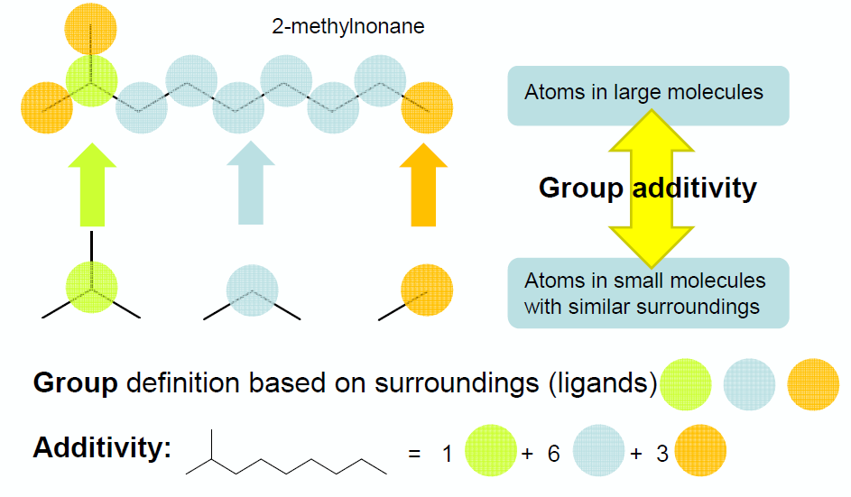
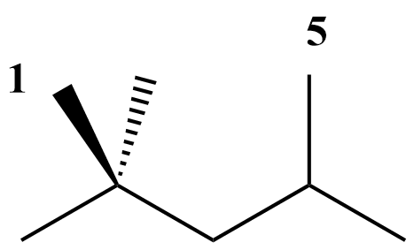
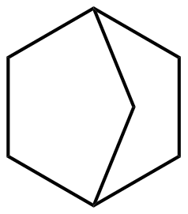
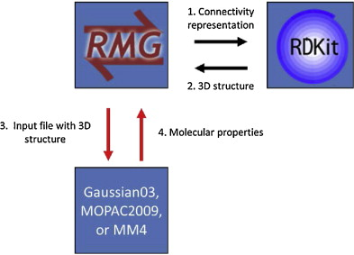

.. _thermo:

**************************
Thermochemistry Estimation
**************************

This section gives in-depth descriptions of the methods used for determining thermochemistry of 
species.

Thermochemistry of species is obtained via three possible ways:

#. Species thermochemistry libraries
#. Group contribution methods
#. On-the-fly Quantum-chemical calculation of Thermochemical Properties (QMTP)

Species thermochemistry libraries
====================================
These databases contain thermochemical parameters for species. 
In these databases each entry contains an unambiguous definition of the species 
(through the adjacency list representation), 
along with a values for the thermochemistry in a format that allows 
the evaluation of each thermodynamic variable as a function of temperature.

RMG is shipped with a number of species thermochemistry libraries, located in the
'libraries' folder of RMG-database. More information on these species thermochemistry libraries can be found in
:ref:`thermoDatabase`.

Group contribution methods
=============================
When the thermochemistry of a species is not present in one of the available
species thermochemistry libraries, RMG needs to estimate thermochemistry. One way
to do so, is by using group contribution methods that estimate the thermochemistry 
of a molecule based on the sub-molecular fragments present in the molecule. 
The Benson group additivity framework is such an example of a group contribution method 
that has proven to provide accurate estimates of the ideal gas thermochemistry 
for a large range of molecules.

Benson's Group Additivity approach ([Benson]_), divides a molecule into functional 
groups, and the contribution of each functional group to the overall thermochemistry is 
included. For example, the molecule 2-methylnonane consists of three types of groups:

* 1 tertiary carbon atom
* 6 secondary carbon atoms
* 3 primary carbon atoms

	
Thermochemistry for the molecule X is calculated by summing up the values for each
of the contributions :math:`C_{i}`. E.g.:

.. math::

	\Delta_fH_{298}^{o}(X) = \sum_{i}GAV(C_{i})
 
The term 'group additive value' (GAV) denotes a polyvalent (ligancy > 1) monoatomic central atom 
:math:`C_{i}` surrounded by its nearest-neighbor ligands.
 
Values for each central atomtype (e.g. "tertiary carbon atom") and its surrounding ligands can be found in the thermo
group database, named group.py, of RMG. More information can be found here: :ref:`thermoDatabase`.

NNIs
----
Besides the main group-centered (GAV) contributions, non-next-nearest
neighbor interactions (NNI) may also be important to take into account. NNIs are interactions between
atoms separated by at least 2 atoms, such as alkane 1,4-gauche, alkane 1,5 (cf. figure), alkene 1,4-gauche, 
alkene single and double cis, ene-yne cis and ortho interactions. 

As a result, thermochemistry of the molecule X is determined as :

.. math::

	\Delta_fH_{298}^{o}(X) = \sum_{i}GAV(C_{i}) + \sum_{j}NNI_{j}

RMG contains a database with NNIs, named gauche.py and int15.py. More information on the nature on the available NNIs, and corresponding values 
can be found here: :ref:`thermoDatabase`.

Ring Strain
-----------
To account for ring strain, ring strain corrections (RSC) were
introduced. Because there is no obvious relation between the
RSC and the ring structure, a specific RSC is required for every
type of ring. For example, due to the significant ring strained induced in norbornane (cf. figure), a
ring correction (RSC) needs to be added to the sum of the GAVs of the individual carbon atoms:

As a result, thermochemistry of the molecule X is determined as :

.. math::

	\Delta_fH_{298}^{o}(X) = \sum_{i}GAV(C_{i}) + RSC

RMG contains a database with single-ring corrections, 'ring.py' and polycyclic ring corrections,
'polycyclic.py'. More information on the nature on the available NNIs, and corresponding values 
can be found here: :ref:`thermoDatabase`.

Hydrogen Bond Increment (HBI) method
------------------------------------
Lay et al. [Lay]_ introduced the hydrogen bond increment (HBI) method to
predict thermochemical properties of radicals. In contrast to Benson’s method,
the HBI method does not use the group-additivity concept. The HBI
enthalpy of formation of a radical (R*) is calculated from the enthalpy
of formation of the corresponding parent molecule (R-H) by adding a
HBI to account for the loss of a hydrogen atom. Hence, for
standard enthalpies of formation the HBI is defined as

.. math::

	HBI = \Delta_fH_{298}^{o}(R^*) - \Delta_fH_{298}^{o}(R-H)
    	= BDE(R-H) - \Delta_fH_{298}^{o}(H*)

with BDE the bond dissociation enthalpy of the R-H bond at the radical position.
Similar expressions are valid for the entropy and heat capacity.

As a result the thermochemistry of the radical is calculated as follows:

.. math::

	\Delta_fH_{298}^{o}(R^*) = HBI(\Delta_fH_{298}^{o}) + \Delta_fH_{298}^{o}(R-H)
	
	C_{p}^{o}(R^*) = HBI(C_{p}^{o}) + C_{p}^{o}(R-H)
	
	S_{298}^{o}(R^*) = HBI(S_{298}^{o}) + S_{298}^{o}(R-H)

The HBI method is the default method use to estimate thermochemistry of radicals. Thus, 
the effect of resonance stabilization on the enthalpy of the radical will be accounted for
through the corresponding HBI. For example, the HBI labeled as "C=CC=CCJ" will account
for the resonance present in 1,4-pentadien-3-yl radical.

RMG contains a database for with HBIs, named radical.py. More information on the nature on the available HBIs, and corresponding values 
can be found here: :ref:`thermoDatabase`.

On-the-fly Quantum-chemical calculation of Thermochemical Properties (QMTP)
===========================================================================
An interface for performing on-the-fly quantum and force field calculations 
has been developed and integrated into RMG to complement the species thermochemistry databases and
group contribution methods [Magoon and Green]_. This interface is particularly interesting for the estimation of
thermochemistry of molecules that are not present in one of the species thermochemistry databases,
and which cannot be estimated with sufficient accuracy using the Benson group additivity framework. This
pertains specifically to polycyclic fused ring containing species, whose ring strain cannot be modeled using
the available ring corrections in RMG's ring strain correction databases.

The QMTP interface involves a number of steps, summarized in the figure below.

In a first step the connectivity representation is converted into a three-dimensional structure of the molecule
through the generation of 3D coordinates for the atoms in the molecule. This is accomplished using 
a combination of a distance geometry method, followed by a optimization using the UFF force field available in
RDKit [RDKit]_. Next, an input file is created containing the 3D atomic coordinates along with a number of keywords. This file is sent to a computational chemistry package, either OpenMopac or Gaussian,
that calculates the thermochemistry of the given molecule "on-the-fly". The keywords specify the type of calculation, and the level-of-theory. 
Finally, the calculated thermochemistry data is sent back to RMG.

The QMTP calculation creates a folder 'QMfiles' that contains a number of files that are created during the process.
The filename of these files is a combination of the InChI key of the molecule, and a specific filename extension, e.g.

WEEGYLXZBRQIMU-UHFFFAOYSA.out is the output file produced by the QM package for the molecule cineole (SMILES: CC12CCC(CC1)C(C)(C)O2),
represented by the InChI key WEEGYLXZBRQIMU-UHFFFAOYSA.

The table belows shows an overview of the used file extensions and their meaning.

.. table::

    ======================================= ========================================
    File extension                          Meaning
    ======================================= ========================================
    .mop					                MOPAC input
    .out		              				MOPAC output
    .gjf									Gaussian input		              				
    .log									Gaussian output						         
    .arc						            MOPAC input created by MOPAC
    .crude.mol					            Mol file using crude, unrefined
    .refined.mol		              		Mol file using UFF refined geometry
    .symm						            SYMMETRY input
    .thermo					            	thermochemistry output file
    ======================================= ========================================

For efficiency reasons, RMG minimizes the number of QMTP calculations. As a result, prior to initializing 
a QMTP routine, RMG checks whether the output files of a specific QMTP calculation are not already
present in the QMfiles folder. It does so by comparing the InChI key of the given species to the filenames
of the files in the QMfiles folder. If none of the InChI keys of the files correspond to the InChI key of 
the given species, RMG will initiate a new QMTP calculation. 

Supported QM packages, and levels of theory
-------------------------------------------

The following table shows an overview of the computational chemistry packages
and levels of theory that are currently  supported in the QMTP interface of RMG.

The MM4 force field software originates from Allinger and Lii. [Allinger]_.

.. table::

    ======================================= ========================================
    QM Package                              Supported Levels of Theory
    ======================================= ========================================
    OpenMopac				                semi-empirical (PM3, PM6, PM7)
    Gaussian03		              			semi-empirical (PM3)
    MM4						                molecular mechanics (MM4)
    ======================================= ========================================
 	
	
Symmetry and Chirality
======================

Symmetry
--------

The notion of symmetry is an essential part of molecules. 
Molecular symmetry refers to the indistinguishable orientations of a molecule.
This is macroscopically quantified as a decrease of the entropy S by a term  :math:`-R * ln(\sigma)`
with R the universal gas constant and :math:`\sigma` the global symmetry number, 
corresponding to the number of indistinguishable orientations of the molecule.

In RMG, :math:`\sigma` is calculated  as the product of contributions of three symmetry center types : atoms, bonds and axes, cf. below.

.. math::

	\sigma = \prod_{i}\sigma_{atom,i}.\prod_{j}\sigma_{bond,j}.\prod_{k}\sigma_{axis,k}

More information can be found in the Ph.D Thesis of Joanna Yu [Yu]_.

For molecules whose thermochemistry is calculated through group contribution techniques, the
rotational symmetry number is calculated through graph algorithms of RMG based on the above equation. If 
the thermochemistry is calculated through the QMTP process, the external, rotational symmetry number is calculatedµ
using the open-source software SYMMETRY "Brute Force Symmetry Analyzer" [Patchkovskii]_. This program uses the optimized
three-dimensional geometry and calculates the corresponding point group. 

Chirality
---------

RMG does not take stereochemistry into account, effectively assuming a racemic mixture of mirror image enantiomers. 
As a result, a chirality contribution of :math:`+R * ln(2)` is included in the entropy of the molecule.

Chirality for molecules whose thermochemistry is determiend using group contribution techniques is detected 
using graph algorithms similar to those used for determining the symmetry number. If the thermochemistry is calculated through the QMTP process, chirality is detected using
the point group information obtained via the software SYMMETRY.

Chiral molecules belong to point groups that lack a superposable mirror image 
(i.e. point groups lacking :math:`\sigma_h`, :math:`\sigma_d`, :math:`\sigma_v`, and :math:`S_n`
symmetry elements).
	
References
============================================

.. [Benson] Benson, Sidney William. "Thermochemical kinetics." (1976)

.. [Lay] Lay, T.; Bozzelli, J.; Dean, A.; Ritter, E. J. Phys. Chem. 1995, 99,14514-14527

.. [Magoon and Green] Magoon, Gregory R., and William H. Green. "Design and implementation of a next-generation software interface for on-the-fly quantum and force field calculations in automated reaction mechanism generation." Computers & Chemical Engineering 52 (2013): 35-45.

.. [Allinger] Allinger, N. L., & Lii, J.-H. (2008). MM4(2008) and MM4(2003).

.. [Patchkovskii] Patchkovskii, S. (2003). SYMMETRY, http://www.cobalt.chem.ucalgary.ca/ps/symmetry/.

.. [Yu] "Estimation method for the thermochemical properties of polycyclic aromatic molecules" (Ph.D), Joanna Yu, M.I.T (2005)

.. [RDKit] Landrum, G. (2012). RDKit, http://rdkit.org.
